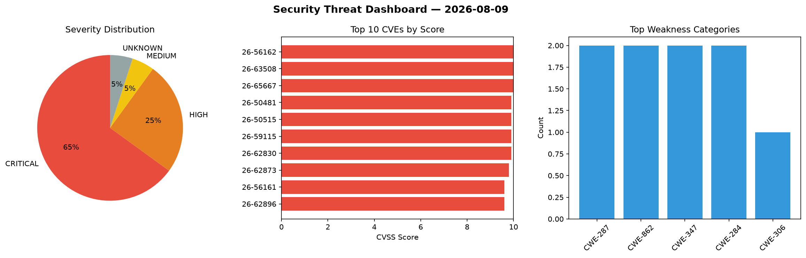
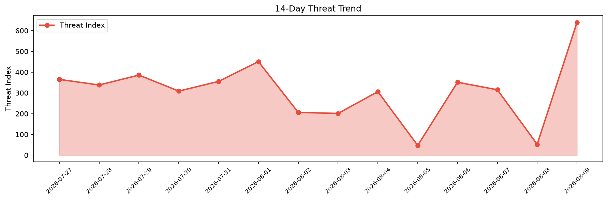

# Security Scan Report — 2026-08-09

**Scan ID:** `5350c1b973` | **CVEs:** 20 | **Threat Index:** 639.8

## Threat Overview

| Metric | Value |
|--------|-------|
| Threat Index | 639.8 |
| Critical CVEs | 13 |
| CRITICAL | 13 |
| HIGH | 5 |
| MEDIUM | 1 |
| UNKNOWN | 1 |

## Delta vs Yesterday

| Metric | Today | Yesterday | Change |
|--------|-------|-----------|--------|
| total_cves | 20 | 20 | ➡️ 0.0% |
| threat_index | 639.8 | 52.4 | 📈 1121.0% |
| critical_count | 13 | 0 | ➡️ 0% |

## Top Weakness Categories

| CWE | Count |
|-----|-------|
| CWE-287 | 2 |
| CWE-862 | 2 |
| CWE-347 | 2 |
| CWE-284 | 2 |
| CWE-306 | 1 |

## CVE Details

| CVE ID | Score | Severity | Description |
|--------|-------|----------|-------------|
| CVE-2026-56162 | 10.0 | CRITICAL | Improper authentication in Azure SQL Database allows an unauthorized attacker to... |
| CVE-2026-63508 | 10.0 | CRITICAL | Missing authentication for critical function in Microsoft Planetary Computer Pro... |
| CVE-2026-65667 | 10.0 | CRITICAL | Missing authorization in Microsoft Teams allows an unauthorized attacker to elev... |
| CVE-2026-50481 | 9.9 | CRITICAL | Modification of assumed-immutable data (maid) in Azure Active Directory allows a... |
| CVE-2026-50515 | 9.9 | CRITICAL | Deserialization of untrusted data in Azure Service Bus allows an authorized atta... |
| CVE-2026-59115 | 9.9 | CRITICAL | '.../...//' in Microsoft Entra Provisioning Service (SyncFabric) allows an autho... |
| CVE-2026-62830 | 9.9 | CRITICAL | Missing authorization in Azure SRE Agent allows an authorized attacker to elevat... |
| CVE-2026-62873 | 9.8 | CRITICAL | Improper verification of cryptographic signature in Microsoft 365 Admin Center a... |
| CVE-2026-56161 | 9.6 | CRITICAL | Improper access control in Azure Logic Apps allows an authorized attacker to dis... |
| CVE-2026-62896 | 9.6 | CRITICAL | Improper authentication in Microsoft Teams allows an authorized attacker to elev... |
| CVE-2026-70332 | 9.6 | CRITICAL | Improper neutralization of input during web page generation ('cross-site scripti... |
| CVE-2026-59118 | 9.3 | CRITICAL | Improper authorization in Microsoft Power Apps allows an unauthorized attacker t... |
| CVE-2026-68823 | 9.1 | CRITICAL | Exposed dangerous method or function in Azure Confidential Ledger allows an auth... |
| CVE-2026-49163 | 8.8 | HIGH | Improper limitation of a pathname to a restricted directory ('path traversal') i... |
| CVE-2026-65668 | 8.8 | HIGH | Improper access control in Microsoft Purview eDiscovery allows an authorized att... |