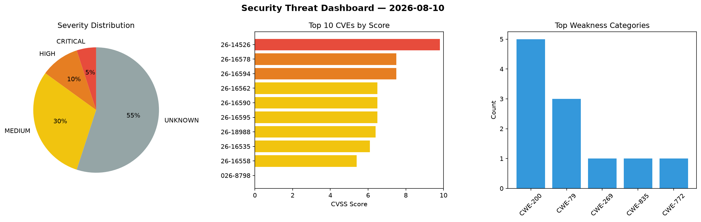
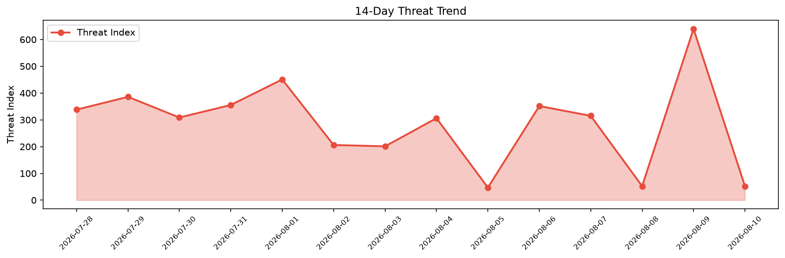

# Security Scan Report — 2026-08-10

**Scan ID:** `11e31a63fd` | **CVEs:** 20 | **Threat Index:** 52.0

## Threat Overview

| Metric | Value |
|--------|-------|
| Threat Index | 52.0 |
| Critical CVEs | 1 |
| CRITICAL | 1 |
| MEDIUM | 1 |
| UNKNOWN | 18 |

## Delta vs Yesterday

| Metric | Today | Yesterday | Change |
|--------|-------|-----------|--------|
| total_cves | 20 | 20 | ➡️ 0.0% |
| threat_index | 52.0 | 639.8 | 📉 -91.9% |
| critical_count | 1 | 13 | 📉 -92.3% |

## Top Weakness Categories

| CWE | Count |
|-----|-------|
| CWE-269 | 1 |
| CWE-79 | 1 |
| CWE-835 | 1 |
| CWE-772 | 1 |

## CVE Details

| CVE ID | Score | Severity | Description |
|--------|-------|----------|-------------|
| CVE-2026-14526 | 9.8 | CRITICAL | The AI Copilot – Content Generator plugin for WordPress is vulnerable to authori... |
| CVE-2026-18988 | 6.4 | MEDIUM | The Easy Accordion plugin for WordPress is vulnerable to Stored Cross-Site Scrip... |
| CVE-2026-8798 | 0.0 | UNKNOWN | In Bouncy Castle for Java FIPS (BC-FJA) before bc-fips 2.1.3, the native entropy... |
| CVE-2026-13505 | 0.0 | UNKNOWN | In Bouncy Castle for Java FIPS (BC-FJA) before bc-fips 1.0.2.7 (1.0.X series), 2... |
| CVE-2026-16267 | 0.0 | UNKNOWN | The Newsletters WordPress plugin before 4.16 does not restrict the classes allow... |
| CVE-2026-16269 | 0.0 | UNKNOWN | The Newsletters WordPress plugin before 4.16 does not strictly compare its API a... |
| CVE-2026-16282 | 0.0 | UNKNOWN | The Appointment Hour Booking  WordPress plugin before 1.5.88 does not validate a... |
| CVE-2026-16535 | 0.0 | UNKNOWN | The Link Library WordPress plugin before 7.9.4 does not sanitise and escape a pa... |
| CVE-2026-16558 | 0.0 | UNKNOWN | The YMC Filter WordPress plugin before 3.12.8 does not sanitize and escape a lay... |
| CVE-2026-16559 | 0.0 | UNKNOWN | The YMC Filter WordPress plugin before 3.12.9 does not sanitize SVG files upload... |
| CVE-2026-16562 | 0.0 | UNKNOWN | The WP Statistics  WordPress plugin before 14.16.10 does not perform a capabilit... |
| CVE-2026-16574 | 0.0 | UNKNOWN | The Dokan: AI Powered WooCommerce Multivendor Marketplace Solution  WordPress pl... |
| CVE-2026-16578 | 0.0 | UNKNOWN | The Admin Safety Guard — Login Security, Limit Logins, 2FA & Brute Force Protect... |
| CVE-2026-16589 | 0.0 | UNKNOWN | The WP Directory Kit WordPress plugin before 1.5.5 does not sanitize and escape ... |
| CVE-2026-16590 | 0.0 | UNKNOWN | The WP Directory Kit WordPress plugin before 1.5.5 does not perform authorizatio... |