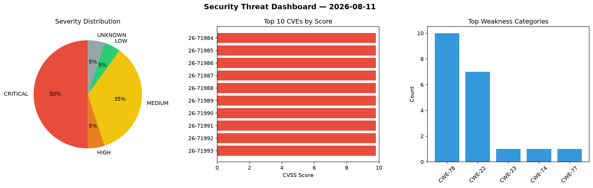
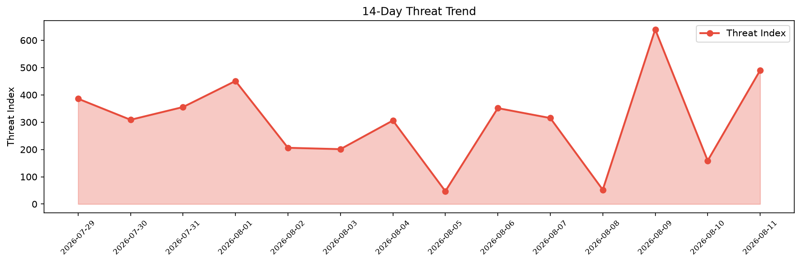

# Security Scan Report — 2026-08-11

**Scan ID:** `ad3c1e8883` | **CVEs:** 20 | **Threat Index:** 490.2

## Threat Overview

| Metric | Value |
|--------|-------|
| Threat Index | 490.2 |
| Critical CVEs | 10 |
| CRITICAL | 10 |
| HIGH | 1 |
| MEDIUM | 7 |
| LOW | 1 |
| UNKNOWN | 1 |

## Delta vs Yesterday

| Metric | Today | Yesterday | Change |
|--------|-------|-----------|--------|
| total_cves | 20 | 20 | ➡️ 0.0% |
| threat_index | 490.2 | 159.0 | 📈 208.3% |
| critical_count | 10 | 1 | 📈 900.0% |

## Top Weakness Categories

| CWE | Count |
|-----|-------|
| CWE-78 | 10 |
| CWE-22 | 7 |
| CWE-23 | 1 |
| CWE-74 | 1 |
| CWE-77 | 1 |

## CVE Details

| CVE ID | Score | Severity | Description |
|--------|-------|----------|-------------|
| CVE-2026-71984 | 9.8 | CRITICAL | MSI Radix AXE6600 router firmware version v781521 contains a command injection v... |
| CVE-2026-71985 | 9.8 | CRITICAL | MSI Radix AXE6600 router firmware version v781521 contains a command injection v... |
| CVE-2026-71986 | 9.8 | CRITICAL | MSI Radix AXE6600 router firmware version v781521 contains a command injection v... |
| CVE-2026-71987 | 9.8 | CRITICAL | MSI Radix AXE6600 router firmware version v781521 contains a command injection v... |
| CVE-2026-71988 | 9.8 | CRITICAL | MSI Radix AXE6600 router firmware version v781521 contains a command injection v... |
| CVE-2026-71989 | 9.8 | CRITICAL | MSI Radix AXE6600 router firmware version v781521 contains a command injection v... |
| CVE-2026-71990 | 9.8 | CRITICAL | MSI Radix AXE6600 router firmware version v781521 contains a command injection v... |
| CVE-2026-71991 | 9.8 | CRITICAL | MSI Radix AXE6600 router firmware version v781521 contains a command injection v... |
| CVE-2026-71992 | 9.8 | CRITICAL | MSI Radix AXE6600 router firmware version v781521 contains a command injection v... |
| CVE-2026-71993 | 9.8 | CRITICAL | MSI Radix AXE6600 router firmware version v781521 contains a command injection v... |
| CVE-2026-10595 | 7.5 | HIGH | A path traversal vulnerability exists in parisneo/lollms version 2.1.0, specific... |
| CVE-2026-19323 | 5.3 | MEDIUM | A security flaw has been discovered in azer react-analyzer-mcp up to 335f2a3585f... |
| CVE-2026-19325 | 5.3 | MEDIUM | A security vulnerability has been detected in IncomeStreamSurfer roo-code-memory... |
| CVE-2026-19327 | 5.3 | MEDIUM | A flaw has been found in abracadabra50 claude-sesh 1.0.0. This issue affects the... |
| CVE-2026-19328 | 5.3 | MEDIUM | A vulnerability has been found in aktsmm skill-ninja-mcp-server 0.1.0. Impacted ... |