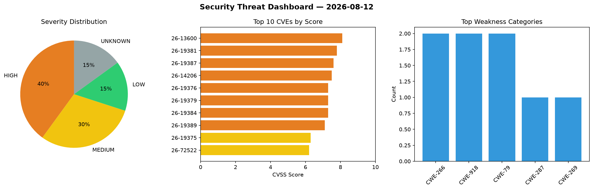
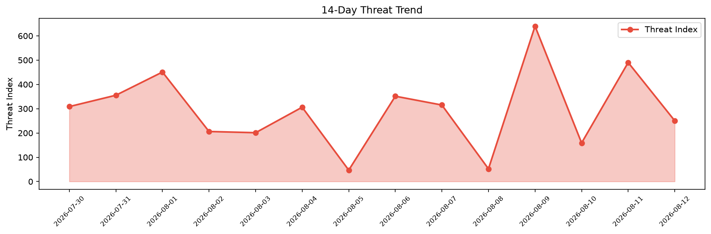

# Security Scan Report — 2026-08-12

**Scan ID:** `f874e3686a` | **CVEs:** 20 | **Threat Index:** 250.4

## Threat Overview

| Metric | Value |
|--------|-------|
| Threat Index | 250.4 |
| Critical CVEs | 0 |
| HIGH | 8 |
| MEDIUM | 6 |
| LOW | 3 |
| UNKNOWN | 3 |

## Delta vs Yesterday

| Metric | Today | Yesterday | Change |
|--------|-------|-----------|--------|
| total_cves | 20 | 20 | ➡️ 0.0% |
| threat_index | 250.4 | 490.2 | 📉 -48.9% |
| critical_count | 0 | 10 | 📉 -100.0% |

## Top Weakness Categories

| CWE | Count |
|-----|-------|
| CWE-266 | 2 |
| CWE-918 | 2 |
| CWE-79 | 2 |
| CWE-287 | 1 |
| CWE-269 | 1 |

## CVE Details

| CVE ID | Score | Severity | Description |
|--------|-------|----------|-------------|
| CVE-2026-13600 | 8.1 | HIGH | The AutoNetTV Relay WordPress plugin before 3.0.14 does not perform any capabili... |
| CVE-2026-19381 | 7.8 | HIGH | A security flaw has been discovered in Kingston FURY CTRL RGB Control Software 2... |
| CVE-2026-19387 | 7.6 | HIGH | A heap out-of-bounds write vulnerability was found in the GStreamer gst-plugins-... |
| CVE-2026-14206 | 7.5 | HIGH | The HT Contact Form  WordPress plugin before 2.9.3 does not perform any authoriz... |
| CVE-2026-19376 | 7.3 | HIGH | A vulnerability has been found in Uasoft Badaso 3.0.0-alpha. This vulnerability ... |
| CVE-2026-19379 | 7.3 | HIGH | A vulnerability was determined in EFM ipTIME AX8004M 15.09.0. Impacted is the fu... |
| CVE-2026-19384 | 7.3 | HIGH | A weakness has been identified in SourceCodester Simple Doctors Appointment Syst... |
| CVE-2026-19389 | 7.1 | HIGH | Multiple integer overflow and underflow vulnerabilities were found in the GStrea... |
| CVE-2026-19375 | 6.3 | MEDIUM | A vulnerability was detected in dmitriiweb article-scraper-mcp 1.0.0. This vulne... |
| CVE-2026-72522 | 6.2 | MEDIUM | libexpat before 2.8.3 has an out-of-bounds read and resultant infinite loop beca... |
| CVE-2026-12570 | 5.5 | MEDIUM | A vulnerability in keras-team/keras versions <= 3.15.0 allows for a denial of se... |
| CVE-2026-13701 | 4.8 | MEDIUM | The Advanced Excerpt WordPress plugin before 4.5 does not sanitise and escape on... |
| CVE-2026-19383 | 4.7 | MEDIUM | A security vulnerability has been detected in saithink/saigroup SaiAdmin up to 5... |
| CVE-2026-19378 | 4.3 | MEDIUM | A vulnerability was found in code-projects Task Management System 1.0. This issu... |
| CVE-2026-19380 | 2.3 | LOW | A vulnerability was identified in Mullvad wireguard.sys 0.10.1. The affected ele... |