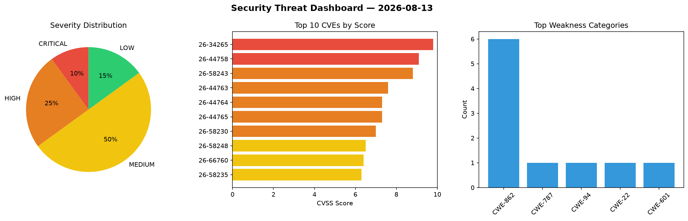
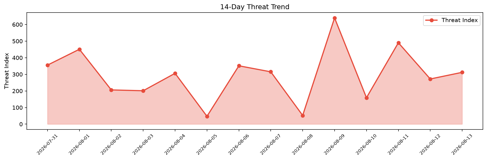

# Security Scan Report — 2026-08-13

**Scan ID:** `4a1071f553` | **CVEs:** 20 | **Threat Index:** 312.0

## Threat Overview

| Metric | Value |
|--------|-------|
| Threat Index | 312.0 |
| Critical CVEs | 2 |
| CRITICAL | 2 |
| HIGH | 5 |
| MEDIUM | 10 |
| LOW | 3 |

## Delta vs Yesterday

| Metric | Today | Yesterday | Change |
|--------|-------|-----------|--------|
| total_cves | 20 | 20 | ➡️ 0.0% |
| threat_index | 312.0 | 272.0 | 📈 14.7% |
| critical_count | 2 | 0 | ➡️ 0% |

## Top Weakness Categories

| CWE | Count |
|-----|-------|
| CWE-862 | 6 |
| CWE-787 | 1 |
| CWE-94 | 1 |
| CWE-22 | 1 |
| CWE-601 | 1 |

## CVE Details

| CVE ID | Score | Severity | Description |
|--------|-------|----------|-------------|
| CVE-2026-34265 | 9.8 | CRITICAL | SAP NetWeaver Application Server ABAP allows an unauthenticated attacker to expl... |
| CVE-2026-44758 | 9.1 | CRITICAL | SAP Manufacturing Integration and Intelligence (MII) allows an attacker with hig... |
| CVE-2026-58243 | 8.8 | HIGH | SAP ABAP Development Tools does not perform necessary authorization checks for c... |
| CVE-2026-44763 | 7.6 | HIGH | SAP Manufacturing Integration and Intelligence allows a privileged attacker to e... |
| CVE-2026-44764 | 7.3 | HIGH | Due to a Missing Authorization Check vulnerability in SAP Manufacturing Integrat... |
| CVE-2026-44765 | 7.3 | HIGH | Due to a Missing Authorization Check vulnerability in SAP Manufacturing Integrat... |
| CVE-2026-58230 | 7.0 | HIGH | SAP Approuter does not sufficiently validate certain token content under specifi... |
| CVE-2026-58248 | 6.5 | MEDIUM | SAP BusinessObjects Business Intelligence Platform (Web Intelligence) allows a l... |
| CVE-2026-66760 | 6.4 | MEDIUM | SAP Approuter does not correctly validate client certificates in certain callbac... |
| CVE-2026-58235 | 6.3 | MEDIUM | SAP NetWeaver Application Server Java (Adobe Document Service) uses outdated ope... |
| CVE-2026-58237 | 5.9 | MEDIUM | WebSocket of SAP Approuter does not perform sufficient authorization checks in c... |
| CVE-2026-58238 | 5.9 | MEDIUM | SAP Approuter does not sufficiently handle certain requests under specific condi... |
| CVE-2026-58236 | 5.5 | MEDIUM | SAP NetWeaver Application Server ABAP and ABAP Platform allow an attacker with h... |
| CVE-2026-40130 | 5.3 | MEDIUM | SAP SAPSPrint Service has memory corruption vulnerabilities in the handling of c... |
| CVE-2026-58247 | 5.3 | MEDIUM | SAP ABAP Platform allows an unauthenticated user to send a specially crafted req... |