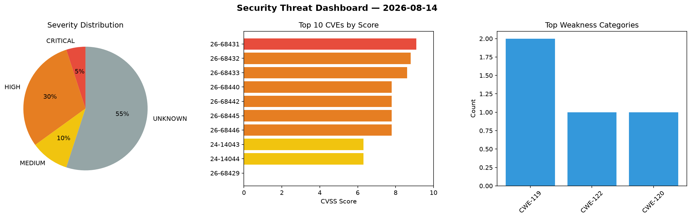
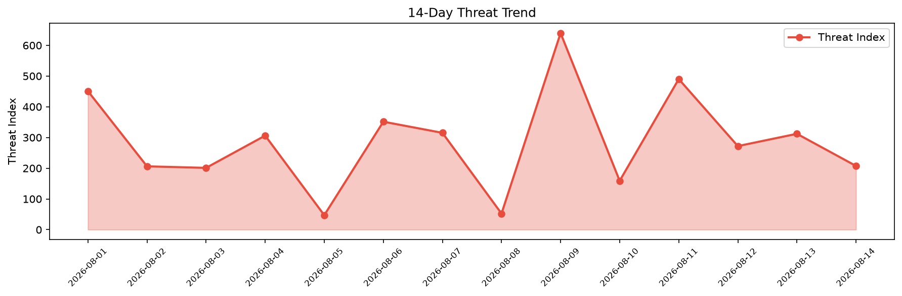

# Security Scan Report — 2026-08-14

**Scan ID:** `de1298d116` | **CVEs:** 20 | **Threat Index:** 207.4

## Threat Overview

| Metric | Value |
|--------|-------|
| Threat Index | 207.4 |
| Critical CVEs | 1 |
| CRITICAL | 1 |
| HIGH | 6 |
| MEDIUM | 2 |
| UNKNOWN | 11 |

## Delta vs Yesterday

| Metric | Today | Yesterday | Change |
|--------|-------|-----------|--------|
| total_cves | 20 | 20 | ➡️ 0.0% |
| threat_index | 207.4 | 312.0 | 📉 -33.5% |
| critical_count | 1 | 2 | 📉 -50.0% |

## Top Weakness Categories

| CWE | Count |
|-----|-------|
| CWE-119 | 2 |
| CWE-122 | 1 |
| CWE-120 | 1 |

## CVE Details

| CVE ID | Score | Severity | Description |
|--------|-------|----------|-------------|
| CVE-2026-68431 | 9.1 | CRITICAL | In the Linux kernel, the following vulnerability has been resolved:

ksmbd: vali... |
| CVE-2026-68432 | 8.8 | HIGH | In the Linux kernel, the following vulnerability has been resolved:

vxlan: requ... |
| CVE-2026-68433 | 8.6 | HIGH | In the Linux kernel, the following vulnerability has been resolved:

libceph: bo... |
| CVE-2026-68440 | 7.8 | HIGH | In the Linux kernel, the following vulnerability has been resolved:

net: txgbe:... |
| CVE-2026-68442 | 7.8 | HIGH | In the Linux kernel, the following vulnerability has been resolved:

btrfs: don'... |
| CVE-2026-68445 | 7.8 | HIGH | In the Linux kernel, the following vulnerability has been resolved:

drm/vc4: Pr... |
| CVE-2026-68446 | 7.8 | HIGH | In the Linux kernel, the following vulnerability has been resolved:

drm/vmwgfx:... |
| CVE-2024-14043 | 6.3 | MEDIUM | A vulnerability was determined in Open5GS up to 2.7.1. This vulnerability affect... |
| CVE-2024-14044 | 6.3 | MEDIUM | A vulnerability was identified in Open5GS up to 2.7.1. This issue affects the fu... |
| CVE-2026-68429 | 0.0 | UNKNOWN | In the Linux kernel, the following vulnerability has been resolved:

drm/dp_mst:... |
| CVE-2026-68430 | 0.0 | UNKNOWN | In the Linux kernel, the following vulnerability has been resolved:

drm/amdgpu/... |
| CVE-2026-68434 | 0.0 | UNKNOWN | In the Linux kernel, the following vulnerability has been resolved:

serial: 825... |
| CVE-2026-68435 | 0.0 | UNKNOWN | In the Linux kernel, the following vulnerability has been resolved:

LoongArch: ... |
| CVE-2026-68436 | 0.0 | UNKNOWN | In the Linux kernel, the following vulnerability has been resolved:

drm/amd/dis... |
| CVE-2026-68437 | 0.0 | UNKNOWN | In the Linux kernel, the following vulnerability has been resolved:

drm/imagina... |