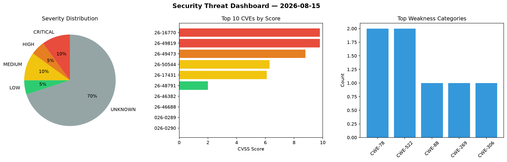
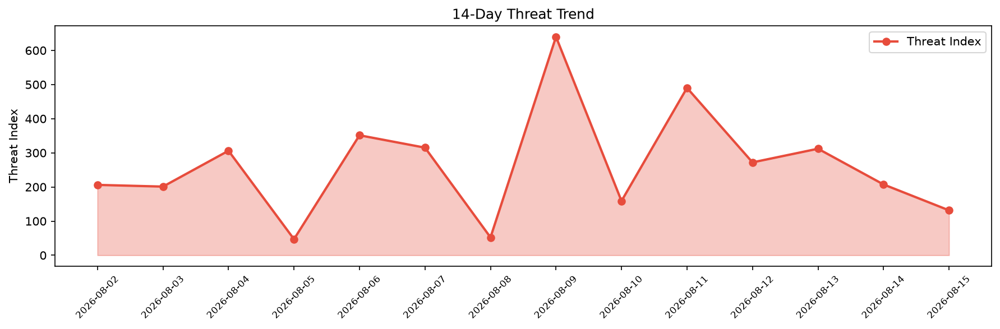

# Security Scan Report — 2026-08-15

**Scan ID:** `28a46f2a7c` | **CVEs:** 20 | **Threat Index:** 131.6

## Threat Overview

| Metric | Value |
|--------|-------|
| Threat Index | 131.6 |
| Critical CVEs | 2 |
| CRITICAL | 2 |
| HIGH | 1 |
| MEDIUM | 2 |
| LOW | 1 |
| UNKNOWN | 14 |

## Delta vs Yesterday

| Metric | Today | Yesterday | Change |
|--------|-------|-----------|--------|
| total_cves | 20 | 20 | ➡️ 0.0% |
| threat_index | 131.6 | 207.4 | 📉 -36.5% |
| critical_count | 2 | 1 | 📈 100.0% |

## Top Weakness Categories

| CWE | Count |
|-----|-------|
| CWE-78 | 2 |
| CWE-522 | 2 |
| CWE-88 | 1 |
| CWE-269 | 1 |
| CWE-306 | 1 |

## CVE Details

| CVE ID | Score | Severity | Description |
|--------|-------|----------|-------------|
| CVE-2026-16770 | 9.8 | CRITICAL | PDF::WebKit versions through 1.2 for Perl allow argument injection into wkhtmlto... |
| CVE-2026-49819 | 9.8 | CRITICAL | UpSnap is a wake on lan web app. Versions 4.4.1 through 5.3.5 are vulnerable to ... |
| CVE-2026-49473 | 8.8 | HIGH | @cedar-policy/authorization-for-expressjs is an open-source Express.js middlewar... |
| CVE-2026-50544 | 6.3 | MEDIUM | NortheBridge/luminalshine is a Sunshine-compatible game stream host for Moonligh... |
| CVE-2026-17431 | 6.1 | MEDIUM | PDF::WebKit versions through 1.2 for Perl allow OS command injection via a 2-arg... |
| CVE-2026-48791 | 2.0 | LOW | sigstore-java is a sigstore java client for interacting with sigstore infrastruc... |
| CVE-2026-46382 | 0.0 | UNKNOWN | The Meeting Room Booking System (MRBS) is a PHP-based application for booking me... |
| CVE-2026-46688 | 0.0 | UNKNOWN | The Meeting Room Booking System (MRBS) is a PHP-based application for booking me... |
| CVE-2026-0289 | 0.0 | UNKNOWN | A  security bypass vulnerability in the Account Protection feature of Palo Alto ... |
| CVE-2026-0290 | 0.0 | UNKNOWN | An information disclosure vulnerability in the Account Protection feature of  Pa... |
| CVE-2026-0291 | 0.0 | UNKNOWN | An improper link resolution before file access vulnerability exists in the Palo ... |
| CVE-2026-0292 | 0.0 | UNKNOWN | An authentication bypass vulnerability in the network driver of Palo Alto Networ... |
| CVE-2026-0293 | 0.0 | UNKNOWN | A vulnerability in Palo Alto Networks Prisma® Access Agent on Windows enables a ... |
| CVE-2026-0294 | 0.0 | UNKNOWN | A privilege escalation (PE) vulnerability in the Palo Alto Networks Prisma® Acce... |
| CVE-2026-0295 | 0.0 | UNKNOWN | A race condition in the Palo Alto Networks GlobalProtect™ client on macOS enable... |