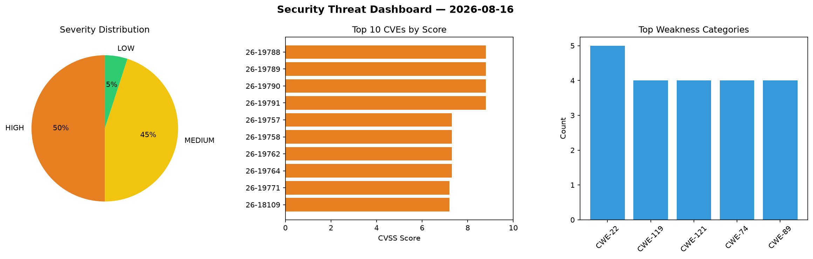
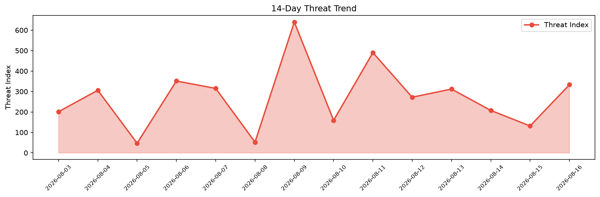

# Security Scan Report — 2026-08-16

**Scan ID:** `503e9ccdf9` | **CVEs:** 20 | **Threat Index:** 333.2

## Threat Overview

| Metric | Value |
|--------|-------|
| Threat Index | 333.2 |
| Critical CVEs | 0 |
| HIGH | 10 |
| MEDIUM | 9 |
| LOW | 1 |

## Delta vs Yesterday

| Metric | Today | Yesterday | Change |
|--------|-------|-----------|--------|
| total_cves | 20 | 20 | ➡️ 0.0% |
| threat_index | 333.2 | 131.6 | 📈 153.2% |
| critical_count | 0 | 2 | 📉 -100.0% |

## Top Weakness Categories

| CWE | Count |
|-----|-------|
| CWE-22 | 5 |
| CWE-119 | 4 |
| CWE-121 | 4 |
| CWE-74 | 4 |
| CWE-89 | 4 |

## CVE Details

| CVE ID | Score | Severity | Description |
|--------|-------|----------|-------------|
| CVE-2026-19788 | 8.8 | HIGH | A vulnerability was found in Tenda AC1206 15.03.06.23_multi_TD01. This affects t... |
| CVE-2026-19789 | 8.8 | HIGH | A vulnerability was determined in Tenda AC1206 15.03.06.23_multi_TD01. This vuln... |
| CVE-2026-19790 | 8.8 | HIGH | A vulnerability was identified in Tenda G0 up to 20260625. This issue affects th... |
| CVE-2026-19791 | 8.8 | HIGH | A weakness has been identified in Tenda G0 up to 20260625. The affected element ... |
| CVE-2026-19757 | 7.3 | HIGH | A vulnerability was found in Dromara lamp-cloud up to 5.10.0. This vulnerability... |
| CVE-2026-19758 | 7.3 | HIGH | A vulnerability was determined in dromara lamp-cloud up to 5.10.0. This issue af... |
| CVE-2026-19762 | 7.3 | HIGH | A vulnerability was found in DTStack Taier 1.4.0. Affected by this vulnerability... |
| CVE-2026-19764 | 7.3 | HIGH | A vulnerability was identified in Raisecom Communication Command and Dispatch Ma... |
| CVE-2026-19771 | 7.2 | HIGH | A vulnerability was identified in Baicells EG3661M BaiCE_BQ6_2.0.5.3_NA. This im... |
| CVE-2026-18109 | 7.2 | HIGH | The W3 Total Cache plugin for WordPress is vulnerable to Stored Cross-Site Scrip... |
| CVE-2026-19765 | 6.3 | MEDIUM | A security flaw has been discovered in eyaushev swagger-testcase-mcp 5babb27c951... |
| CVE-2026-19767 | 6.3 | MEDIUM | A weakness has been identified in itsourcecode Hospital Management System 1.0. T... |
| CVE-2026-19785 | 6.3 | MEDIUM | A vulnerability has been found in francoisjacquet RosarioSIS up to 12.7.4. This ... |
| CVE-2026-19770 | 5.3 | MEDIUM | A vulnerability was identified in feedmob fm-mcp-servers 0.0.3. Affected by this... |
| CVE-2026-19761 | 4.7 | MEDIUM | A vulnerability has been found in DTStack Taier 1.4.0. Affected is the function ... |