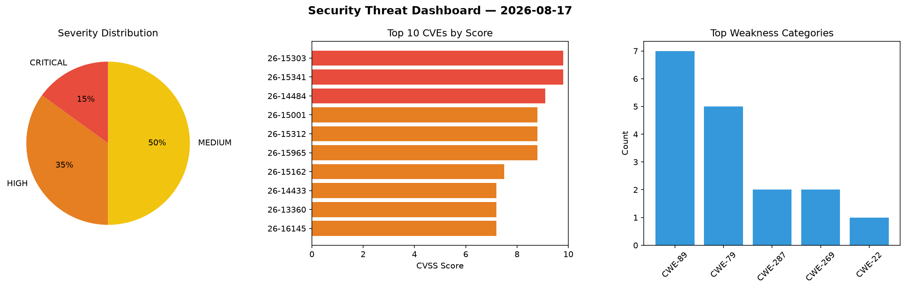
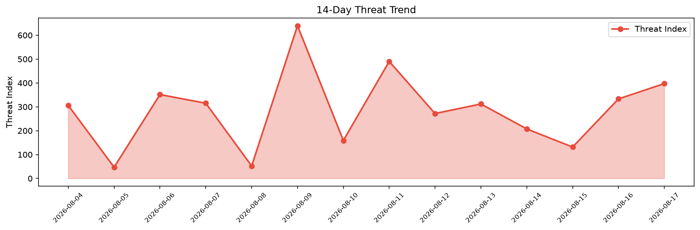

# Security Scan Report — 2026-08-17

**Scan ID:** `75c6c4f130` | **CVEs:** 20 | **Threat Index:** 397.3

## Threat Overview

| Metric | Value |
|--------|-------|
| Threat Index | 397.3 |
| Critical CVEs | 3 |
| CRITICAL | 3 |
| HIGH | 7 |
| MEDIUM | 10 |

## Delta vs Yesterday

| Metric | Today | Yesterday | Change |
|--------|-------|-----------|--------|
| total_cves | 20 | 20 | ➡️ 0.0% |
| threat_index | 397.3 | 333.2 | 📈 19.2% |
| critical_count | 3 | 0 | ➡️ 0% |

## Top Weakness Categories

| CWE | Count |
|-----|-------|
| CWE-89 | 7 |
| CWE-79 | 5 |
| CWE-287 | 2 |
| CWE-269 | 2 |
| CWE-22 | 1 |

## CVE Details

| CVE ID | Score | Severity | Description |
|--------|-------|----------|-------------|
| CVE-2026-15303 | 9.8 | CRITICAL | The 6Storage Rentals plugin for WordPress is vulnerable to authentication bypass... |
| CVE-2026-15341 | 9.8 | CRITICAL | The User Session Synchronizer plugin for WordPress is vulnerable to Authenticati... |
| CVE-2026-14484 | 9.1 | CRITICAL | The RapiSafe – Secure Multi File Upload for Contact Form 7 plugin for WordPress ... |
| CVE-2026-15001 | 8.8 | HIGH | The bLoyal: Loyalty & Promotions by bLoyal plugin for WordPress is vulnerable to... |
| CVE-2026-15312 | 8.8 | HIGH | The Propovoice: All-in-One Client Management System plugin for WordPress is vuln... |
| CVE-2026-15965 | 8.8 | HIGH | The MaxUpload – Big File Uploads – Increase Maximum File Upload Size plugin for ... |
| CVE-2026-15162 | 7.5 | HIGH | The Object Sync for Salesforce plugin is vulnerable to unauthenticated SQL Injec... |
| CVE-2026-14433 | 7.2 | HIGH | The Online Booking & Scheduling Calendar for WordPress by vcita plugin for WordP... |
| CVE-2026-13360 | 7.2 | HIGH | The Cookie Banner for GDPR / CCPA – WPLP Cookie Consent plugin for WordPress is ... |
| CVE-2026-16145 | 7.2 | HIGH | The Invisible Anti-Spam & CAPTCHA — reCAPTCHA Alternative for All Forms plugin f... |
| CVE-2026-16080 | 6.5 | MEDIUM | The Image Uploader for Welcart plugin for WordPress is vulnerable to generic SQL... |
| CVE-2026-15453 | 6.5 | MEDIUM | The KiviCare – Clinic & Patient Management System (EHR) plugin for WordPress is ... |
| CVE-2026-16586 | 6.5 | MEDIUM | The Contest Gallery – Upload & Vote Photos, Media, Sell with PayPal & Stripe plu... |
| CVE-2026-15948 | 6.4 | MEDIUM | The Hydra Booking — Appointment Scheduling & Booking Calendar plugin for WordPre... |
| CVE-2026-17090 | 6.4 | MEDIUM | The Beaver Builder Page Builder – Drag and Drop Website Builder plugin for WordP... |