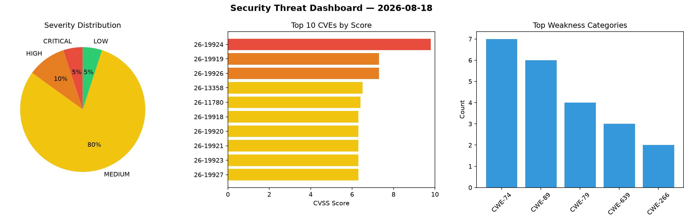
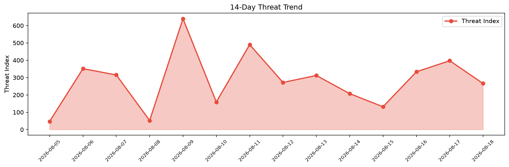

# Security Scan Report — 2026-08-18

**Scan ID:** `f1f1659a28` | **CVEs:** 20 | **Threat Index:** 265.9

## Threat Overview

| Metric | Value |
|--------|-------|
| Threat Index | 265.9 |
| Critical CVEs | 1 |
| CRITICAL | 1 |
| HIGH | 2 |
| MEDIUM | 16 |
| LOW | 1 |

## Delta vs Yesterday

| Metric | Today | Yesterday | Change |
|--------|-------|-----------|--------|
| total_cves | 20 | 20 | ➡️ 0.0% |
| threat_index | 265.9 | 397.3 | 📉 -33.1% |
| critical_count | 1 | 3 | 📉 -66.7% |

## Top Weakness Categories

| CWE | Count |
|-----|-------|
| CWE-74 | 7 |
| CWE-89 | 6 |
| CWE-79 | 4 |
| CWE-639 | 3 |
| CWE-266 | 2 |

## CVE Details

| CVE ID | Score | Severity | Description |
|--------|-------|----------|-------------|
| CVE-2026-19924 | 9.8 | CRITICAL | A security vulnerability has been detected in Tenda AC10 16.03.10.09_multi_TDE01... |
| CVE-2026-19919 | 7.3 | HIGH | A vulnerability was found in code-projects Online Shopping System 1.0. This impa... |
| CVE-2026-19926 | 7.3 | HIGH | A vulnerability has been found in Evergreen up to 3.14.11/3.15.11/3.16.5/3.17-be... |
| CVE-2026-13358 | 6.5 | MEDIUM | The Appointment Booking Calendar — Simply Schedule Appointments Booking Plugin p... |
| CVE-2026-11780 | 6.4 | MEDIUM | The Quiz and Survey Master (QSM) – Easy Quiz and Survey Maker plugin for WordPre... |
| CVE-2026-19918 | 6.3 | MEDIUM | A vulnerability has been found in SpaceX Starlink Router Gen 3 2025.11.14.mr6470... |
| CVE-2026-19920 | 6.3 | MEDIUM | A vulnerability was determined in code-projects Online Shopping System 1.0. Affe... |
| CVE-2026-19921 | 6.3 | MEDIUM | A vulnerability was identified in code-projects Online Shopping System 1.0. Affe... |
| CVE-2026-19923 | 6.3 | MEDIUM | A weakness has been identified in code-projects Online Shopping System 1.0. This... |
| CVE-2026-19927 | 6.3 | MEDIUM | A vulnerability was found in OpenBoxes up to 0.9.7. The impacted element is the ... |
| CVE-2026-19928 | 6.3 | MEDIUM | A vulnerability was determined in OpenBoxes up to 0.9.7. This affects the functi... |
| CVE-2026-19929 | 6.3 | MEDIUM | A vulnerability was identified in OpenBoxes up to 0.9.6. This impacts the functi... |
| CVE-2026-19930 | 6.3 | MEDIUM | A security flaw has been discovered in Dolibarr up to 23.0.3. Affected is an unk... |
| CVE-2026-19925 | 4.7 | MEDIUM | A vulnerability was detected in SourceCodester Stock Management System 1.0. This... |
| CVE-2026-2487 | 4.4 | MEDIUM | The Admin Custom Login plugin for WordPress is vulnerable to Stored Cross-Site S... |