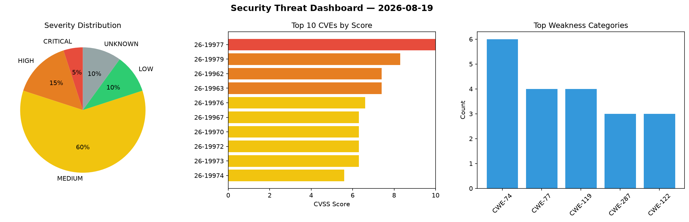
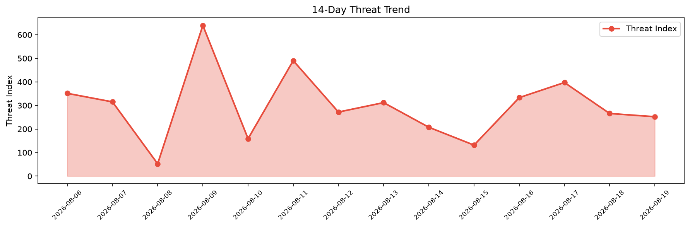

# Security Scan Report — 2026-08-19

**Scan ID:** `013d076afe` | **CVEs:** 20 | **Threat Index:** 252.1

## Threat Overview

| Metric | Value |
|--------|-------|
| Threat Index | 252.1 |
| Critical CVEs | 1 |
| CRITICAL | 1 |
| HIGH | 3 |
| MEDIUM | 12 |
| LOW | 2 |
| UNKNOWN | 2 |

## Delta vs Yesterday

| Metric | Today | Yesterday | Change |
|--------|-------|-----------|--------|
| total_cves | 20 | 20 | ➡️ 0.0% |
| threat_index | 252.1 | 265.9 | 📉 -5.2% |
| critical_count | 1 | 1 | ➡️ 0.0% |

## Top Weakness Categories

| CWE | Count |
|-----|-------|
| CWE-74 | 6 |
| CWE-77 | 4 |
| CWE-119 | 4 |
| CWE-287 | 3 |
| CWE-122 | 3 |

## CVE Details

| CVE ID | Score | Severity | Description |
|--------|-------|----------|-------------|
| CVE-2026-19977 | 10.0 | CRITICAL | A vulnerability was detected in EFM ipTIME A3004T 14.19.0. The affected element ... |
| CVE-2026-19979 | 8.3 | HIGH | A vulnerability was identified in GL.iNet A1300, AX1800, AXT1800, BE1400, BE3600... |
| CVE-2026-19962 | 7.4 | HIGH | A flaw has been found in Edimax EW-7478APC 1.04. Affected by this vulnerability ... |
| CVE-2026-19963 | 7.4 | HIGH | A vulnerability has been found in Edimax EW-7478APC 1.04. Affected by this issue... |
| CVE-2026-19976 | 6.6 | MEDIUM | A security vulnerability has been detected in COMFAST CF-N1-S 2.6.0.1. Impacted ... |
| CVE-2026-19967 | 6.3 | MEDIUM | A security flaw has been discovered in Open Asset Import Library Assimp 17c12da.... |
| CVE-2026-19970 | 6.3 | MEDIUM | A vulnerability was detected in Open Asset Import Library Assimp 17c12da. This a... |
| CVE-2026-19972 | 6.3 | MEDIUM | A vulnerability has been found in itsourcecode Hospital Management System 1.0. A... |
| CVE-2026-19973 | 6.3 | MEDIUM | A vulnerability was found in itsourcecode Hospital Management System 1.0. Affect... |
| CVE-2026-19974 | 5.6 | MEDIUM | A security flaw has been discovered in treefrogframework treefrog-framework up t... |
| CVE-2026-19964 | 5.5 | MEDIUM | A vulnerability was found in Jij-Inc Jij-MCP-Server 0.1.0. This affects the func... |
| CVE-2026-19966 | 5.4 | MEDIUM | A vulnerability was identified in CodeCanyon TimeCamp Integration for CRM up to ... |
| CVE-2026-19969 | 5.4 | MEDIUM | A security vulnerability has been detected in Open Asset Import Library Assimp 1... |
| CVE-2026-19978 | 5.3 | MEDIUM | A flaw has been found in jiantao88 android-mcp-server up to cfb872b2446794193b58... |
| CVE-2026-19971 | 4.7 | MEDIUM | A flaw has been found in LB-Link WR1210M 1.0.3. This impacts the function main o... |