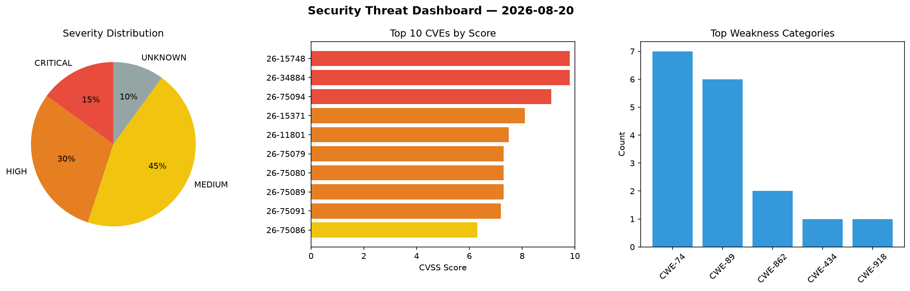
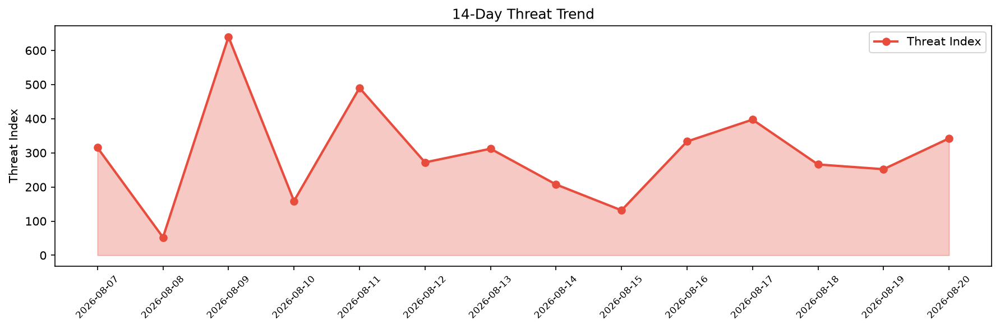

# Security Scan Report — 2026-08-20

**Scan ID:** `6554cb0c49` | **CVEs:** 20 | **Threat Index:** 342.3

## Threat Overview

| Metric | Value |
|--------|-------|
| Threat Index | 342.3 |
| Critical CVEs | 3 |
| CRITICAL | 3 |
| HIGH | 6 |
| MEDIUM | 9 |
| UNKNOWN | 2 |

## Delta vs Yesterday

| Metric | Today | Yesterday | Change |
|--------|-------|-----------|--------|
| total_cves | 20 | 20 | ➡️ 0.0% |
| threat_index | 342.3 | 252.1 | 📈 35.8% |
| critical_count | 3 | 1 | 📈 200.0% |

## Top Weakness Categories

| CWE | Count |
|-----|-------|
| CWE-74 | 7 |
| CWE-89 | 6 |
| CWE-862 | 2 |
| CWE-434 | 1 |
| CWE-918 | 1 |

## CVE Details

| CVE ID | Score | Severity | Description |
|--------|-------|----------|-------------|
| CVE-2026-15748 | 9.8 | CRITICAL | The Forminator Forms plugin for WordPress is vulnerable to Arbitrary File Upload... |
| CVE-2026-34884 | 9.8 | CRITICAL | SSRF via set_skywalking_url Tool and GraphQL expression injection vulnerability ... |
| CVE-2026-75094 | 9.1 | CRITICAL | A flaw has been found in COMFAST CF-N1-S 2.6.0.1. This impacts the function sub_... |
| CVE-2026-15371 | 8.1 | HIGH | Velociraptor's web GUI allows specifying a custom type for columns in tables. Th... |
| CVE-2026-11801 | 7.5 | HIGH | The WPAdverts – Classifieds Plugin plugin for WordPress is vulnerable to authori... |
| CVE-2026-75079 | 7.3 | HIGH | A weakness has been identified in SourceCodester Class and Exam Timetabling Syst... |
| CVE-2026-75080 | 7.3 | HIGH | A security vulnerability has been detected in SourceCodester Class and Exam Time... |
| CVE-2026-75089 | 7.3 | HIGH | A weakness has been identified in PHPGurukul Complaint Management System 1.0. Af... |
| CVE-2026-75091 | 7.2 | HIGH | The Quill Forms / Conversational Multi Step Forms, Surveys & quizzes plugin for ... |
| CVE-2026-75086 | 6.3 | MEDIUM | A vulnerability has been found in itsourcecode Hospital Management System 1.0. T... |
| CVE-2026-75087 | 6.3 | MEDIUM | A vulnerability was found in itsourcecode Hospital Management System 1.0. This a... |
| CVE-2026-75088 | 6.3 | MEDIUM | A vulnerability was determined in itsourcecode Hospital Management System 1.0. T... |
| CVE-2024-14045 | 6.3 | MEDIUM | A weakness has been identified in OpenBoxes up to 0.9.2. This vulnerability affe... |
| CVE-2026-75081 | 4.3 | MEDIUM | A vulnerability was detected in Webkul Bagisto up to 2.4.4. Impacted is an unkno... |
| CVE-2026-75082 | 4.3 | MEDIUM | A flaw has been found in Webkul Bagisto up to 2.4.4. The affected element is an ... |