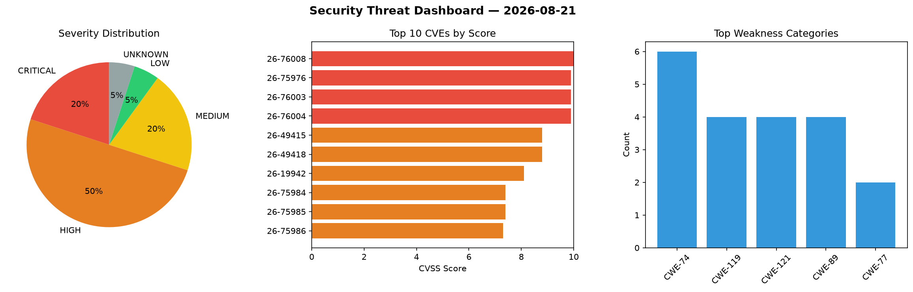
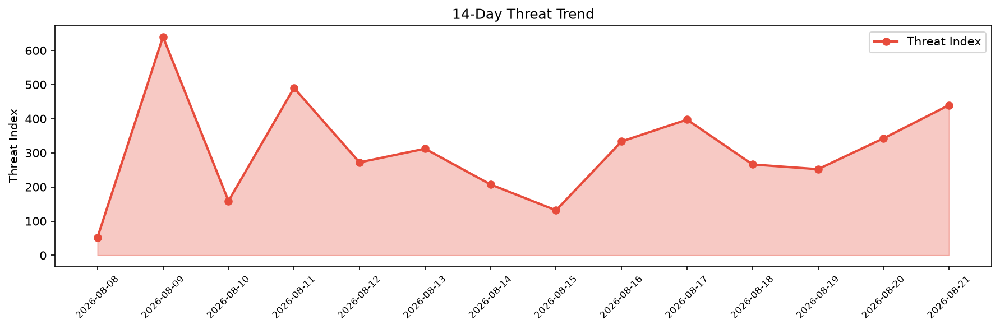

# Security Scan Report — 2026-08-21

**Scan ID:** `dfda4069bb` | **CVEs:** 20 | **Threat Index:** 439.7

## Threat Overview

| Metric | Value |
|--------|-------|
| Threat Index | 439.7 |
| Critical CVEs | 4 |
| CRITICAL | 4 |
| HIGH | 10 |
| MEDIUM | 4 |
| LOW | 1 |
| UNKNOWN | 1 |

## Delta vs Yesterday

| Metric | Today | Yesterday | Change |
|--------|-------|-----------|--------|
| total_cves | 20 | 20 | ➡️ 0.0% |
| threat_index | 439.7 | 342.3 | 📈 28.5% |
| critical_count | 4 | 3 | 📈 33.3% |

## Top Weakness Categories

| CWE | Count |
|-----|-------|
| CWE-74 | 6 |
| CWE-119 | 4 |
| CWE-121 | 4 |
| CWE-89 | 4 |
| CWE-77 | 2 |

## CVE Details

| CVE ID | Score | Severity | Description |
|--------|-------|----------|-------------|
| CVE-2026-76008 | 10.0 | CRITICAL | A flaw has been found in Comfast CF-N1-S 2.6.0.1. This affects the function get_... |
| CVE-2026-75976 | 9.9 | CRITICAL | A weakness has been identified in TRENDnet TEW-823DRU 1.1.02b01. Impacted is the... |
| CVE-2026-76003 | 9.9 | CRITICAL | A weakness has been identified in UTT HiPER 1200GW up to 2.5.3-170306. Affected ... |
| CVE-2026-76004 | 9.9 | CRITICAL | A security vulnerability has been detected in UTT HiPER 1250GW up to 3.2.7-21090... |
| CVE-2026-49415 | 8.8 | HIGH | During execve(2) of a SUID binary, the new virtual address space is installed be... |
| CVE-2026-49418 | 8.8 | HIGH | When msync(MS_INVALIDATE) is called on a mapping of an unmanaged device object, ... |
| CVE-2026-19942 | 8.1 | HIGH | The Atarim – AI Agency for WordPress: Edit Pages, Fix Code, Update Plugins, SEO ... |
| CVE-2026-75984 | 7.4 | HIGH | A vulnerability was detected in TRENDnet TEW-823DRU 1.1.02b01. Impacted is an un... |
| CVE-2026-75985 | 7.4 | HIGH | A flaw has been found in TRENDnet Router 1.1.02b01. The affected element is an u... |
| CVE-2026-75986 | 7.3 | HIGH | A vulnerability has been found in code-projects Online Job Portal System 1.0. Th... |
| CVE-2026-75987 | 7.3 | HIGH | A vulnerability was found in SPLWare esProc up to 20260507. This affects the fun... |
| CVE-2026-76048 | 7.3 | HIGH | A flaw has been found in SourceCodester Simple Online Food Ordering System 1.0. ... |
| CVE-2026-76049 | 7.3 | HIGH | A vulnerability has been found in SourceCodester Simple Online Food Ordering Sys... |
| CVE-2026-76050 | 7.3 | HIGH | A vulnerability was found in SourceCodester Simple Online Food Ordering System 1... |
| CVE-2026-15421 | 6.4 | MEDIUM | The Speed Optimizer – The All-In-One Performance-Boosting Plugin plugin for Word... |