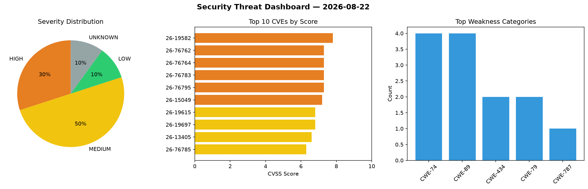
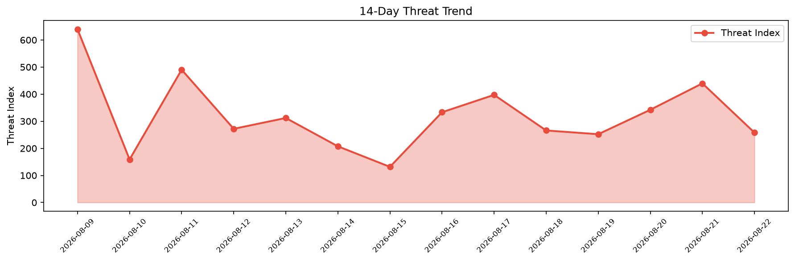

# Security Scan Report — 2026-08-22

**Scan ID:** `f64534f28e` | **CVEs:** 20 | **Threat Index:** 258.0

## Threat Overview

| Metric | Value |
|--------|-------|
| Threat Index | 258.0 |
| Critical CVEs | 0 |
| HIGH | 6 |
| MEDIUM | 10 |
| LOW | 2 |
| UNKNOWN | 2 |

## Delta vs Yesterday

| Metric | Today | Yesterday | Change |
|--------|-------|-----------|--------|
| total_cves | 20 | 20 | ➡️ 0.0% |
| threat_index | 258.0 | 439.7 | 📉 -41.3% |
| critical_count | 0 | 4 | 📉 -100.0% |

## Top Weakness Categories

| CWE | Count |
|-----|-------|
| CWE-74 | 4 |
| CWE-89 | 4 |
| CWE-434 | 2 |
| CWE-79 | 2 |
| CWE-787 | 1 |

## CVE Details

| CVE ID | Score | Severity | Description |
|--------|-------|----------|-------------|
| CVE-2026-19582 | 7.8 | HIGH | In binutils 2.46.1 and prior versions, a victim who opens a crafted PE file usin... |
| CVE-2026-76762 | 7.3 | HIGH | A vulnerability was detected in code-projects Assessment Management 1.0. The aff... |
| CVE-2026-76764 | 7.3 | HIGH | A flaw has been found in code-projects Employee Management System 1.0. The impac... |
| CVE-2026-76783 | 7.3 | HIGH | A security vulnerability has been detected in DeDeCMS 53_1_UTF8. This vulnerabil... |
| CVE-2026-76795 | 7.3 | HIGH | A vulnerability has been found in AeternaLabsHQ PullMD 3.2.0. This impacts an un... |
| CVE-2026-15049 | 7.2 | HIGH | The Depicter — Popup & Slider Builder WordPress plugin before 4.8.0 does not val... |
| CVE-2026-19615 | 6.8 | MEDIUM | The Admin and Site Enhancements (ASE) WordPress plugin before 9.0.1 does not san... |
| CVE-2026-19697 | 6.8 | MEDIUM | The GutenKit  WordPress plugin before 2.5.0 does not sanitise uploaded SVG files... |
| CVE-2026-13405 | 6.6 | MEDIUM | The Royal Addons for Elementor  WordPress plugin before 1.7.1066 does not correc... |
| CVE-2026-76785 | 6.3 | MEDIUM | A security flaw has been discovered in amirsanni Mini-Inventory-and-Sales-Manage... |
| CVE-2026-76800 | 6.3 | MEDIUM | A flaw has been found in DeDeCMS 3. Affected by this vulnerability is an unknown... |
| CVE-2026-76956 | 5.9 | MEDIUM | In libexpat 2.8.2 and 2.8.3 before 2.8.4, misinterpretation of getentropy's retu... |
| CVE-2022-4996 | 5.3 | MEDIUM | A flaw has been found in mruby 3.1.0. Affected is the function udiv of the file ... |
| CVE-2026-76799 | 5.3 | MEDIUM | A weakness has been identified in code-projects Login Registration System 1.0. T... |
| CVE-2026-17153 | 5.3 | MEDIUM | The AI Agent by SiteGround plugin for WordPress is vulnerable to authorization b... |