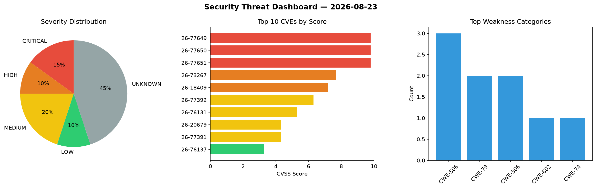
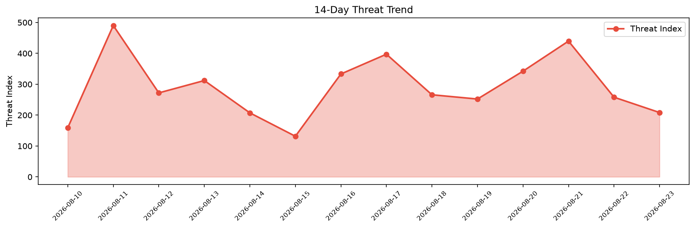

# Security Scan Report — 2026-08-23

**Scan ID:** `7e0c29f129` | **CVEs:** 20 | **Threat Index:** 208.4

## Threat Overview

| Metric | Value |
|--------|-------|
| Threat Index | 208.4 |
| Critical CVEs | 3 |
| CRITICAL | 3 |
| HIGH | 2 |
| MEDIUM | 4 |
| LOW | 2 |
| UNKNOWN | 9 |

## Delta vs Yesterday

| Metric | Today | Yesterday | Change |
|--------|-------|-----------|--------|
| total_cves | 20 | 20 | ➡️ 0.0% |
| threat_index | 208.4 | 258.0 | 📉 -19.2% |
| critical_count | 3 | 0 | ➡️ 0% |

## Top Weakness Categories

| CWE | Count |
|-----|-------|
| CWE-506 | 3 |
| CWE-79 | 2 |
| CWE-306 | 2 |
| CWE-602 | 1 |
| CWE-74 | 1 |

## CVE Details

| CVE ID | Score | Severity | Description |
|--------|-------|----------|-------------|
| CVE-2026-77649 | 9.8 | CRITICAL | The internment crate 0.8.7 for Rust can trigger execution of malicious code when... |
| CVE-2026-77650 | 9.8 | CRITICAL | The append-only-vec crate 0.1.9 for Rust can trigger execution of malicious code... |
| CVE-2026-77651 | 9.8 | CRITICAL | The arrayref crate 0.3.10 for Rust can trigger execution of malicious code when ... |
| CVE-2026-73267 | 7.7 | HIGH | A flaw was found in the clusterclaims-controller component of multicluster engin... |
| CVE-2026-18409 | 7.2 | HIGH | The WPForms Pro plugin for WordPress is vulnerable to Stored Cross-Site Scriptin... |
| CVE-2026-77392 | 6.3 | MEDIUM | A weakness has been identified in SourceCodester Dynamic Input Field Generator U... |
| CVE-2026-76131 | 5.3 | MEDIUM | Use of hard-coded credentials issue exists in VOCALOID6 , which may allow an att... |
| CVE-2026-20679 | 4.3 | MEDIUM | The issue was addressed with improved checks. This issue is fixed in macOS Sequo... |
| CVE-2026-77391 | 4.3 | MEDIUM | A security flaw has been discovered in SourceCodester Dynamic Input Field Genera... |
| CVE-2026-76137 | 3.3 | LOW | Missing authentication for critical function vulnerability exists in VOCALOID6. ... |
| CVE-2026-43679 | 2.4 | LOW | This issue was addressed with improved permissions checking. This issue is fixed... |
| CVE-2026-16520 | 0.0 | UNKNOWN | Improper input validation and Exposure of sensitive information through data que... |
| CVE-2026-76155 | 0.0 | UNKNOWN | Use of default credentials in Datiphy Data Management Center from v8.3.0 through... |
| CVE-2026-76156 | 0.0 | UNKNOWN | OS command injection in the api endpoint of Datiphy Data Management Center from ... |
| CVE-2026-76157 | 0.0 | UNKNOWN | Missing authentication for a critical function in the upload API endpoint of Dat... |