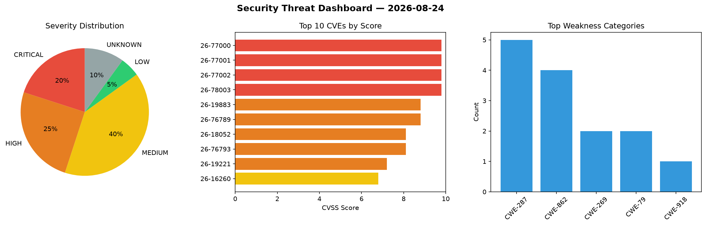
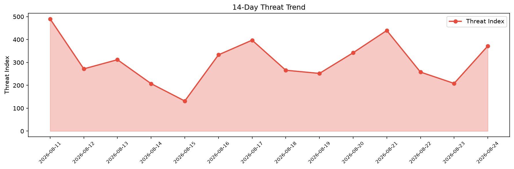

# Security Scan Report — 2026-08-24

**Scan ID:** `a55a86efa9` | **CVEs:** 20 | **Threat Index:** 371.9

## Threat Overview

| Metric | Value |
|--------|-------|
| Threat Index | 371.9 |
| Critical CVEs | 4 |
| CRITICAL | 4 |
| HIGH | 5 |
| MEDIUM | 8 |
| LOW | 1 |
| UNKNOWN | 2 |

## Delta vs Yesterday

| Metric | Today | Yesterday | Change |
|--------|-------|-----------|--------|
| total_cves | 20 | 20 | ➡️ 0.0% |
| threat_index | 371.9 | 208.4 | 📈 78.5% |
| critical_count | 4 | 3 | 📈 33.3% |

## Top Weakness Categories

| CWE | Count |
|-----|-------|
| CWE-287 | 5 |
| CWE-862 | 4 |
| CWE-269 | 2 |
| CWE-79 | 2 |
| CWE-918 | 1 |

## CVE Details

| CVE ID | Score | Severity | Description |
|--------|-------|----------|-------------|
| CVE-2026-77000 | 9.8 | CRITICAL | The WP Social Media Login WordPress plugin through 1.0.6 does not verify that a ... |
| CVE-2026-77001 | 9.8 | CRITICAL | The Social Login & Sharing buttons with Analytics By SoClever WordPress plugin t... |
| CVE-2026-77002 | 9.8 | CRITICAL | The SmilePass Selfie Login WordPress plugin through 1.0.2 does not perform any s... |
| CVE-2026-78003 | 9.8 | CRITICAL | The Mailgun for WordPress plugin for WordPress is vulnerable to Server-Side Requ... |
| CVE-2026-19883 | 8.8 | HIGH | The WPeMatico RSS Feed Fetcher plugin for WordPress is vulnerable to unauthorize... |
| CVE-2026-76789 | 8.8 | HIGH | The Slider Hero with Video Background, Animation WordPress plugin before 9.1.3 d... |
| CVE-2026-18052 | 8.1 | HIGH | The ManageWP Worker WordPress plugin before 4.9.37 does not bind the account bei... |
| CVE-2026-76793 | 8.1 | HIGH | The Firebase Authentication WordPress plugin before 1.7.1 does not require the e... |
| CVE-2026-19221 | 7.2 | HIGH | The Forminator Forms  WordPress plugin before 1.57.0.5 does not restrict a netwo... |
| CVE-2026-16260 | 6.8 | MEDIUM | The Post Grid, Slider & Carousel Ultimate  WordPress plugin before 1.8.1 does no... |
| CVE-2026-19093 | 6.8 | MEDIUM | The Tutor LMS  WordPress plugin before 4.0.6 does not validate a stored file pat... |
| CVE-2026-19222 | 6.6 | MEDIUM | The Forminator Forms  WordPress plugin before 1.57.0.7 does not consistently enf... |
| CVE-2026-75027 | 5.3 | MEDIUM | The Themify Builder plugin for WordPress is vulnerable to authorization bypass i... |
| CVE-2026-16612 | 5.3 | MEDIUM | The FiboSearch  WordPress plugin before 1.34.1 does not consistently exclude pas... |
| CVE-2026-16738 | 5.3 | MEDIUM | The Conekta Payment Gateway WordPress plugin before 6.2.2 does not verify the au... |