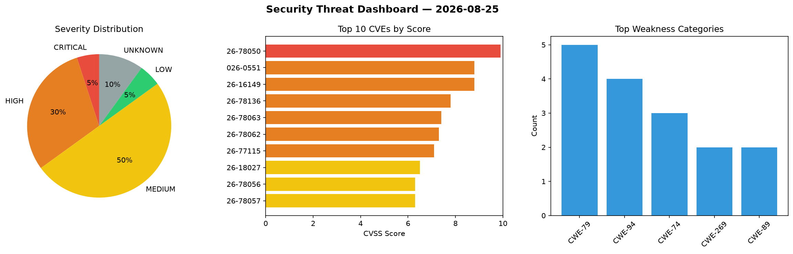
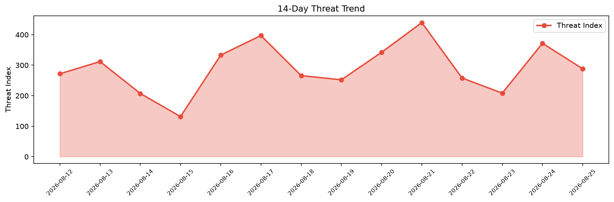

# Security Scan Report — 2026-08-25

**Scan ID:** `9b3fdf89e9` | **CVEs:** 20 | **Threat Index:** 288.3

## Threat Overview

| Metric | Value |
|--------|-------|
| Threat Index | 288.3 |
| Critical CVEs | 1 |
| CRITICAL | 1 |
| HIGH | 6 |
| MEDIUM | 10 |
| LOW | 1 |
| UNKNOWN | 2 |

## Delta vs Yesterday

| Metric | Today | Yesterday | Change |
|--------|-------|-----------|--------|
| total_cves | 20 | 20 | ➡️ 0.0% |
| threat_index | 288.3 | 371.9 | 📉 -22.5% |
| critical_count | 1 | 4 | 📉 -75.0% |

## Top Weakness Categories

| CWE | Count |
|-----|-------|
| CWE-79 | 5 |
| CWE-94 | 4 |
| CWE-74 | 3 |
| CWE-269 | 2 |
| CWE-89 | 2 |

## CVE Details

| CVE ID | Score | Severity | Description |
|--------|-------|----------|-------------|
| CVE-2026-78050 | 9.9 | CRITICAL | A vulnerability was found in Comfast CF-N1-S 2.6.0.1. The affected element is th... |
| CVE-2026-0551 | 8.8 | HIGH | The PPWP – Password Protect Pages plugin for WordPress is vulnerable to PHP Obje... |
| CVE-2026-16149 | 8.8 | HIGH | The Security Hardener plugin for WordPress is vulnerable to Missing Authorizatio... |
| CVE-2026-78136 | 7.8 | HIGH | chirpmyradio CHIRP before 39178db allows eval injection via crafted CSV data. Th... |
| CVE-2026-78063 | 7.4 | HIGH | A security flaw has been discovered in Tenda CH22 1.0.0.1. The impacted element ... |
| CVE-2026-78062 | 7.3 | HIGH | A vulnerability was identified in vas3k TaxHacker up to 0.8.2. The affected elem... |
| CVE-2026-77115 | 7.1 | HIGH | Brave Popup Builder (brave-popup-builder) up to version 0.8.5 reflects UTM query... |
| CVE-2026-18027 | 6.5 | MEDIUM | The WebToffee WooCommerce PDF Invoices, Packing Slips, Delivery Notes & Shipping... |
| CVE-2026-78056 | 6.3 | MEDIUM | A vulnerability was detected in sambitraj Student-Management-System up to 56ba28... |
| CVE-2026-78057 | 6.3 | MEDIUM | A flaw has been found in sambitraj Student-Management-System up to 56ba287f2e903... |
| CVE-2026-78061 | 6.3 | MEDIUM | A vulnerability was determined in vas3k TaxHacker up to 0.8.2. Impacted is the f... |
| CVE-2026-78051 | 5.3 | MEDIUM | A vulnerability was determined in alexta69 MeTube up to 2026.06.10. The impacted... |
| CVE-2026-78054 | 4.3 | MEDIUM | A weakness has been identified in SourceCodester Class and Exam Timetabling Syst... |
| CVE-2026-78055 | 4.3 | MEDIUM | A security vulnerability has been detected in SourceCodester Class and Exam Time... |
| CVE-2026-78059 | 4.3 | MEDIUM | A vulnerability has been found in SourceCodester Stock Management System 1.0. Th... |