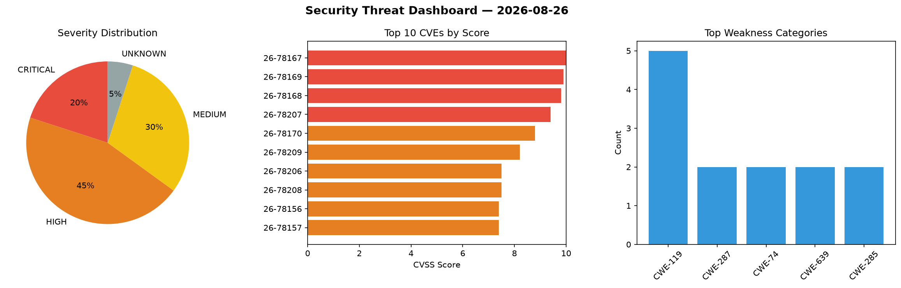
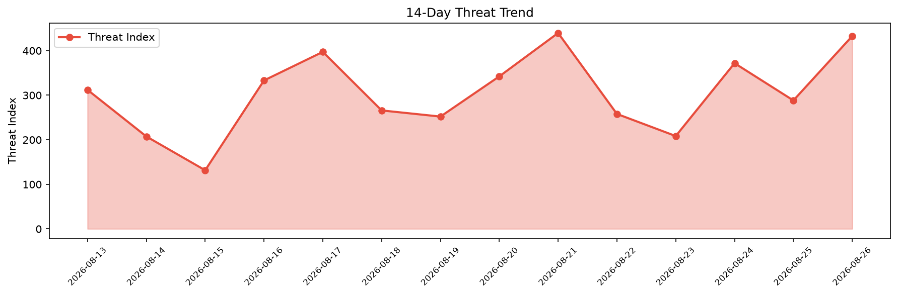

# Security Scan Report — 2026-08-26

**Scan ID:** `a89c1d81c4` | **CVEs:** 20 | **Threat Index:** 432.7

## Threat Overview

| Metric | Value |
|--------|-------|
| Threat Index | 432.7 |
| Critical CVEs | 4 |
| CRITICAL | 4 |
| HIGH | 9 |
| MEDIUM | 6 |
| UNKNOWN | 1 |

## Delta vs Yesterday

| Metric | Today | Yesterday | Change |
|--------|-------|-----------|--------|
| total_cves | 20 | 20 | ➡️ 0.0% |
| threat_index | 432.7 | 288.3 | 📈 50.1% |
| critical_count | 4 | 1 | 📈 300.0% |

## Top Weakness Categories

| CWE | Count |
|-----|-------|
| CWE-119 | 5 |
| CWE-287 | 2 |
| CWE-74 | 2 |
| CWE-639 | 2 |
| CWE-285 | 2 |

## CVE Details

| CVE ID | Score | Severity | Description |
|--------|-------|----------|-------------|
| CVE-2026-78167 | 10.0 | CRITICAL | A weakness has been identified in EFM ipTIME T16000M 14.20.2. The impacted eleme... |
| CVE-2026-78169 | 9.9 | CRITICAL | A vulnerability was detected in UTT HiPER 1250GW up to 3.2.7-210907-180535. This... |
| CVE-2026-78168 | 9.8 | CRITICAL | A security vulnerability has been detected in EFM ipTIME T24000M up to 14.20.0. ... |
| CVE-2026-78207 | 9.4 | CRITICAL | exceljs-hardened before 5.0.0 contains a prototype pollution vulnerability in th... |
| CVE-2026-78170 | 8.8 | HIGH | A flaw has been found in UTT HiPER 1200GW up to 2.5.3-170306. Affected is the fu... |
| CVE-2026-78209 | 8.2 | HIGH | exceljs-hardened versions before 5.0.0 fail to neutralize leading equals, plus, ... |
| CVE-2026-78206 | 7.5 | HIGH | exceljs-hardened before 5.0.0 decompresses all entries from supplied xlsx archiv... |
| CVE-2026-78208 | 7.5 | HIGH | exceljs-hardened before 5.0.0 contains a path traversal vulnerability in the Wor... |
| CVE-2026-78156 | 7.4 | HIGH | A security vulnerability has been detected in Open5GS 2.8.0. Affected by this is... |
| CVE-2026-78157 | 7.4 | HIGH | A vulnerability was detected in Open5GS 2.8.0. This affects the function pcrf_rx... |
| CVE-2026-78161 | 7.3 | HIGH | A vulnerability was found in warmcat libwebsockets 4.5.0. Impacted is the functi... |
| CVE-2026-78171 | 7.3 | HIGH | A vulnerability has been found in itsourcecode Sales and Inventory System 1.0. A... |
| CVE-2026-78203 | 7.1 | HIGH | Ghostwriter before 7.1.2 fails to validate template ownership in the report temp... |
| CVE-2026-78158 | 6.3 | MEDIUM | A flaw has been found in Open5GS 2.8.0. This vulnerability affects unknown code ... |
| CVE-2026-78160 | 6.3 | MEDIUM | A vulnerability has been found in Dolibarr ERP up to 18.0.10/22.0.5/23.0.3. This... |