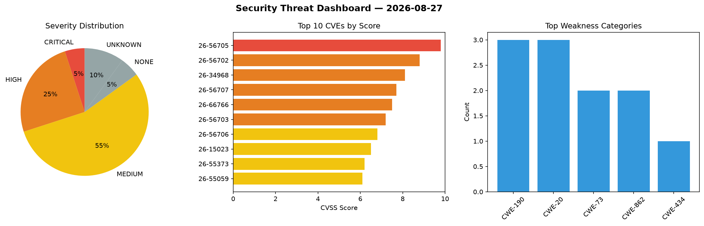
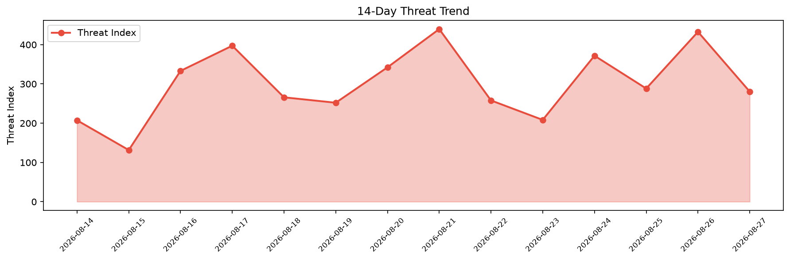

# Security Scan Report — 2026-08-27

**Scan ID:** `fe86004f47` | **CVEs:** 20 | **Threat Index:** 280.5

## Threat Overview

| Metric | Value |
|--------|-------|
| Threat Index | 280.5 |
| Critical CVEs | 1 |
| CRITICAL | 1 |
| HIGH | 5 |
| MEDIUM | 11 |
| NONE | 1 |
| UNKNOWN | 2 |

## Delta vs Yesterday

| Metric | Today | Yesterday | Change |
|--------|-------|-----------|--------|
| total_cves | 20 | 20 | ➡️ 0.0% |
| threat_index | 280.5 | 432.7 | 📉 -35.2% |
| critical_count | 1 | 4 | 📉 -75.0% |

## Top Weakness Categories

| CWE | Count |
|-----|-------|
| CWE-190 | 3 |
| CWE-20 | 3 |
| CWE-73 | 2 |
| CWE-862 | 2 |
| CWE-434 | 1 |

## CVE Details

| CVE ID | Score | Severity | Description |
|--------|-------|----------|-------------|
| CVE-2026-56705 | 9.8 | CRITICAL | Adminer before 5.4.3 fails to sanitize the server field before constructing a PD... |
| CVE-2026-56702 | 8.8 | HIGH | Adminer versions before 5.4.3 contain an unrestricted file upload vulnerability ... |
| CVE-2026-34968 | 8.1 | HIGH | Adminer before 5.4.3 contains an arbitrary file deletion vulnerability in SQLite... |
| CVE-2026-56707 | 7.7 | HIGH | Grav Flex Objects plugin versions 1.4.0 through 1.4.7 contain an authorization b... |
| CVE-2026-66766 | 7.5 | HIGH | SAP S/4HANA (Private Cloud) uses a third-party component that contains a Regular... |
| CVE-2026-56703 | 7.2 | HIGH | Adminer before 5.4.3 contains a remote code execution vulnerability in SQLite qu... |
| CVE-2026-56706 | 6.8 | MEDIUM | Adminer before 5.4.3 uses a CSRF token scheme that transmits both the XOR mask a... |
| CVE-2026-15023 | 6.5 | MEDIUM | The Events Manager – Calendar, Bookings, Tickets, and more! plugin for WordPress... |
| CVE-2026-55373 | 6.2 | MEDIUM | OpenEXR is the reference implementation and specification for the EXR image form... |
| CVE-2026-55059 | 6.1 | MEDIUM | OpenEXR is the reference implementation and specification for the EXR image form... |
| CVE-2026-56704 | 6.1 | MEDIUM | Adminer before 5.4.3 inserts unsanitized database server version strings into sc... |
| CVE-2026-34964 | 5.8 | MEDIUM | Adminer before 5.5.0 contains a server-side request forgery vulnerability in the... |
| CVE-2026-59183 | 5.5 | MEDIUM | OpenEXR is the reference implementation and specification for the EXR image form... |
| CVE-2026-34967 | 5.4 | MEDIUM | Adminer versions 5.3.0 through 5.4.2 with the sql-log plugin enabled contain an ... |
| CVE-2026-34959 | 4.7 | MEDIUM | Adminer 4.6.0 before 5.5.0 prepends the client-supplied X-Forwarded-Prefix heade... |