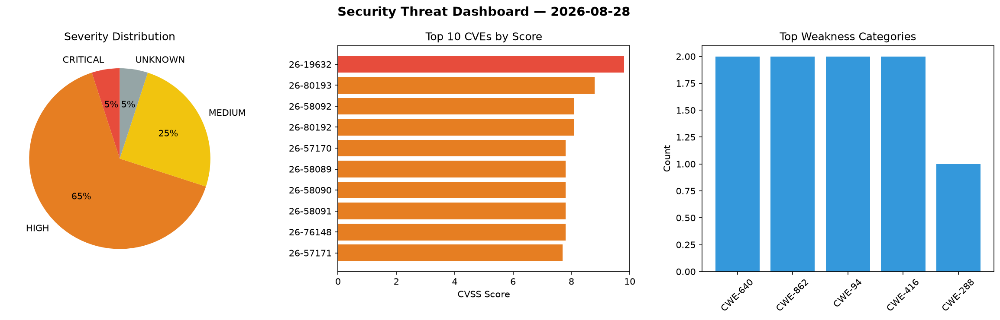
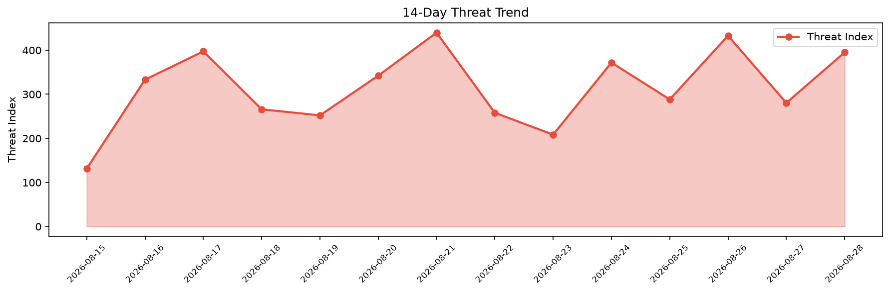

# Security Scan Report — 2026-08-28

**Scan ID:** `09f474d6e7` | **CVEs:** 20 | **Threat Index:** 394.9

## Threat Overview

| Metric | Value |
|--------|-------|
| Threat Index | 394.9 |
| Critical CVEs | 1 |
| CRITICAL | 1 |
| HIGH | 13 |
| MEDIUM | 5 |
| UNKNOWN | 1 |

## Delta vs Yesterday

| Metric | Today | Yesterday | Change |
|--------|-------|-----------|--------|
| total_cves | 20 | 20 | ➡️ 0.0% |
| threat_index | 394.9 | 280.5 | 📈 40.8% |
| critical_count | 1 | 1 | ➡️ 0.0% |

## Top Weakness Categories

| CWE | Count |
|-----|-------|
| CWE-640 | 2 |
| CWE-862 | 2 |
| CWE-94 | 2 |
| CWE-416 | 2 |
| CWE-288 | 1 |

## CVE Details

| CVE ID | Score | Severity | Description |
|--------|-------|----------|-------------|
| CVE-2026-19632 | 9.8 | CRITICAL | The TranslatePress – Translate Multilingual sites with AI Translation plugin for... |
| CVE-2026-80193 | 8.8 | HIGH | Kimai before 2.62.0 fails to validate create_other_timesheet permission in the Q... |
| CVE-2026-58092 | 8.1 | HIGH | In FreeBSD 15.0, the kernel structure used to represent user credentials changed... |
| CVE-2026-80192 | 8.1 | HIGH | @better-auth/sso before 1.6.27 (and before 1.4.8 in the 1.4.x line and before 1.... |
| CVE-2026-57170 | 7.8 | HIGH | Compliance-trestle (Trestle) is a Python SDK and command-line tool for managing ... |
| CVE-2026-58089 | 7.8 | HIGH | When a process calls execve(2) to execute a setuid or setgid image, hwpmc(4) is ... |
| CVE-2026-58090 | 7.8 | HIGH | The SOCK_STREAM receive path in the unix socket implementation failed to fully d... |
| CVE-2026-58091 | 7.8 | HIGH | The implementation of this ioctl attempts to acquire locks on all channels in a ... |
| CVE-2026-76148 | 7.8 | HIGH | CorvusSKK contains a code injection vulnerability, which may lead to arbitrary c... |
| CVE-2026-57171 | 7.7 | HIGH | Compliance-trestle (Trestle) is a Python SDK and command-line tool for managing ... |
| CVE-2026-29988 | 7.6 | HIGH | A cleartext transmission of sensitive information vulnerability in the NFC inter... |
| CVE-2026-80191 | 7.5 | HIGH | GROWI applies its page-viewer permission check to attachment requests only when ... |
| CVE-2026-80196 | 7.5 | HIGH | Kimai before 2.58.0 contains an authentication bypass vulnerability where passwo... |
| CVE-2026-54467 | 7.0 | HIGH | On the Trusted Firmware-M (TF-M) 2 through 2.3.0 platform before 00d1b3e, mailbo... |
| CVE-2026-80189 | 6.5 | MEDIUM | LeafWiki extracts an uploaded ZIP archive without limiting how much data it will... |