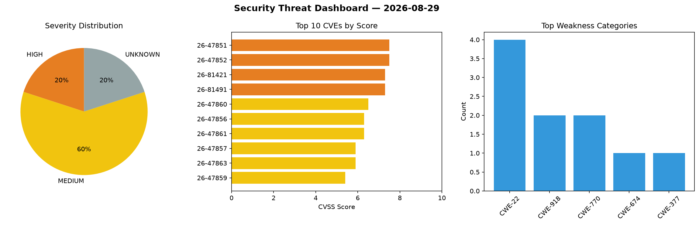
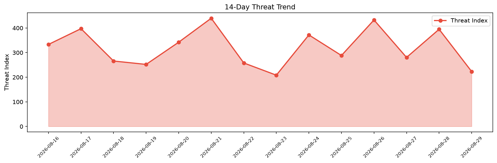

# Security Scan Report — 2026-08-29

**Scan ID:** `1f7ec26948` | **CVEs:** 20 | **Threat Index:** 223.2

## Threat Overview

| Metric | Value |
|--------|-------|
| Threat Index | 223.2 |
| Critical CVEs | 0 |
| HIGH | 4 |
| MEDIUM | 12 |
| UNKNOWN | 4 |

## Delta vs Yesterday

| Metric | Today | Yesterday | Change |
|--------|-------|-----------|--------|
| total_cves | 20 | 20 | ➡️ 0.0% |
| threat_index | 223.2 | 394.9 | 📉 -43.5% |
| critical_count | 0 | 1 | 📉 -100.0% |

## Top Weakness Categories

| CWE | Count |
|-----|-------|
| CWE-22 | 4 |
| CWE-918 | 2 |
| CWE-770 | 2 |
| CWE-674 | 1 |
| CWE-377 | 1 |

## CVE Details

| CVE ID | Score | Severity | Description |
|--------|-------|----------|-------------|
| CVE-2026-47851 | 7.5 | HIGH | Analyzing a PDF with a deeply nested or cyclic table of contents can cause a Sta... |
| CVE-2026-47852 | 7.5 | HIGH | A local attacker on a multi-user host can pre-create the deterministic cache pat... |
| CVE-2026-81421 | 7.3 | HIGH | A security flaw has been discovered in ddfourtwo sentry-selfhosted-mcp 0.4.0. Th... |
| CVE-2026-81491 | 7.3 | HIGH | A flaw has been found in boxpositron with-context-mcp up to 3.0.7. This affects ... |
| CVE-2026-47860 | 6.5 | MEDIUM | An attacker who can publish to a queue consumed by an application that has enabl... |
| CVE-2026-47856 | 6.3 | MEDIUM | Spring Integration's JSON to object conversion uses the json__TypeId__ header to... |
| CVE-2026-47861 | 6.3 | MEDIUM | An unauthenticated remote attacker who can send a single UDP packet to a Spring ... |
| CVE-2026-47857 | 5.9 | MEDIUM | In Reactor Core, applications that use the Flux.windowTimeout operator with fair... |
| CVE-2026-47863 | 5.9 | MEDIUM | In Reactor Core, applications that use the Flux.bufferTimeout operator with fair... |
| CVE-2026-47859 | 5.4 | MEDIUM | RFC6587SyslogDeserializer, used by the Spring Integration syslog TCP inbound ada... |
| CVE-2026-47862 | 5.4 | MEDIUM | An attacker who can set the file_name header on a message reaching a ZipTransfor... |
| CVE-2026-47845 | 5.3 | MEDIUM | In specific scenarios, Reactor Netty HTTP Server may incorrectly evaluate the re... |
| CVE-2026-47874 | 5.3 | MEDIUM | The vulnerability occurs when a client sends HTTP/1.1 pipelined requests over a ... |
| CVE-2026-81485 | 5.3 | MEDIUM | A security vulnerability has been detected in danielpopamd linkedin-ads-mcp 1.0.... |
| CVE-2026-81486 | 5.3 | MEDIUM | A vulnerability was detected in bsmi021 mcp-file-context-server 1.0.0. Affected ... |