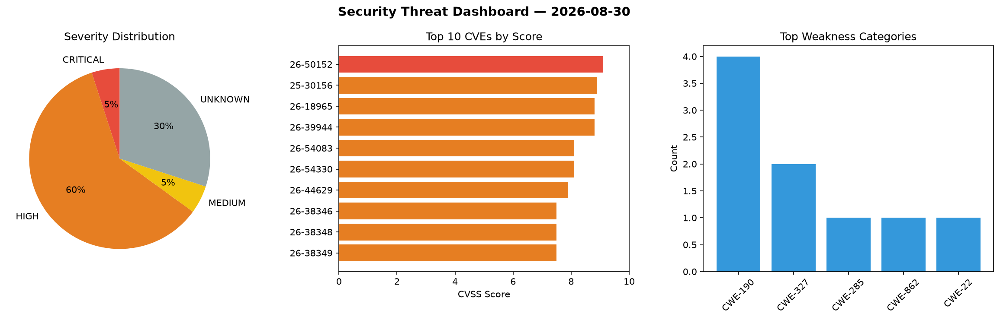
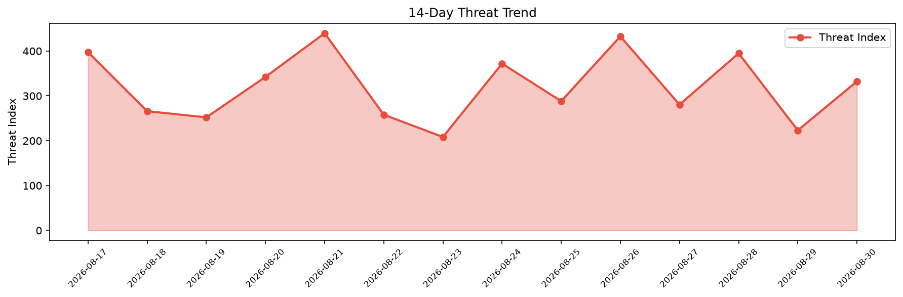

# Security Scan Report — 2026-08-30

**Scan ID:** `e34e13533b` | **CVEs:** 20 | **Threat Index:** 332.3

## Threat Overview

| Metric | Value |
|--------|-------|
| Threat Index | 332.3 |
| Critical CVEs | 1 |
| CRITICAL | 1 |
| HIGH | 12 |
| MEDIUM | 1 |
| UNKNOWN | 6 |

## Delta vs Yesterday

| Metric | Today | Yesterday | Change |
|--------|-------|-----------|--------|
| total_cves | 20 | 20 | ➡️ 0.0% |
| threat_index | 332.3 | 223.2 | 📈 48.9% |
| critical_count | 1 | 0 | ➡️ 0% |

## Top Weakness Categories

| CWE | Count |
|-----|-------|
| CWE-190 | 4 |
| CWE-327 | 2 |
| CWE-285 | 1 |
| CWE-862 | 1 |
| CWE-22 | 1 |

## CVE Details

| CVE ID | Score | Severity | Description |
|--------|-------|----------|-------------|
| CVE-2026-50152 | 9.1 | CRITICAL | Ceph is an open-source distributed storage platform providing object, block, and... |
| CVE-2025-30156 | 8.9 | HIGH | Ceph is an open-source distributed storage platform providing object, block, and... |
| CVE-2026-18965 | 8.8 | HIGH | PayRange API is missing proper authorization on management endpoints, which allo... |
| CVE-2026-39944 | 8.8 | HIGH | Ceph is an open-source distributed storage platform providing object, block, and... |
| CVE-2026-54083 | 8.1 | HIGH | Wazuh is an open-source security platform providing unified XDR and SIEM protect... |
| CVE-2026-54330 | 8.1 | HIGH | Ceph is an open-source distributed storage platform providing object, block, and... |
| CVE-2026-44629 | 7.9 | HIGH | Improper access control to the Synergis Softwire installation folder. This vulne... |
| CVE-2026-38346 | 7.5 | HIGH | An integer overflow in the yuv2planeX_8_c() function (libswscale/output.c) of FF... |
| CVE-2026-38348 | 7.5 | HIGH | An integer overflow in the libswscale/utils.c component of FFmpeg N-122528-gdd29... |
| CVE-2026-38349 | 7.5 | HIGH | An integer overflow in the hScale16To19_c() function (libswscale/output.c) of FF... |
| CVE-2026-38350 | 7.5 | HIGH | An integer overflow in the target_sws_fuzzer() function (libswscale/output.c) of... |
| CVE-2026-18717 | 7.4 | HIGH | ASE2000 2.35 through 2.37 is vulnerable to an improper certificate validation vu... |
| CVE-2026-54085 | 7.1 | HIGH | Wazuh is an open-source security platform providing unified XDR and SIEM protect... |
| CVE-2026-54084 | 5.3 | MEDIUM | Wazuh is an open-source security platform providing unified XDR and SIEM protect... |
| CVE-2026-17610 | 0.0 | UNKNOWN | In SiSDK v2026.6.0 and earlier, high network traffic loads can cause a dropped A... |