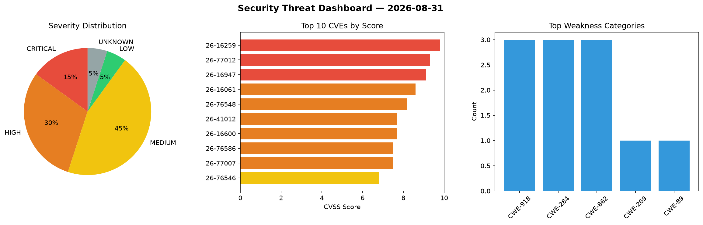
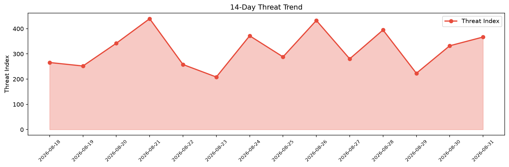

# Security Scan Report — 2026-08-31

**Scan ID:** `1d41a7aedb` | **CVEs:** 20 | **Threat Index:** 366.9

## Threat Overview

| Metric | Value |
|--------|-------|
| Threat Index | 366.9 |
| Critical CVEs | 3 |
| CRITICAL | 3 |
| HIGH | 6 |
| MEDIUM | 9 |
| LOW | 1 |
| UNKNOWN | 1 |

## Delta vs Yesterday

| Metric | Today | Yesterday | Change |
|--------|-------|-----------|--------|
| total_cves | 20 | 20 | ➡️ 0.0% |
| threat_index | 366.9 | 332.3 | 📈 10.4% |
| critical_count | 3 | 1 | 📈 200.0% |

## Top Weakness Categories

| CWE | Count |
|-----|-------|
| CWE-918 | 3 |
| CWE-284 | 3 |
| CWE-862 | 3 |
| CWE-269 | 1 |
| CWE-89 | 1 |

## CVE Details

| CVE ID | Score | Severity | Description |
|--------|-------|----------|-------------|
| CVE-2026-16259 | 9.8 | CRITICAL | The Uix UserCenter WordPress plugin through 1.0.3 does not verify that the accou... |
| CVE-2026-77012 | 9.3 | CRITICAL | The 爱采集数据采集和发布插件 WordPress plugin through 1.0.0 does not require a per-install s... |
| CVE-2026-16947 | 9.1 | CRITICAL | The Total processing card payments for WooCommerce WordPress plugin through 7.3 ... |
| CVE-2026-16061 | 8.6 | HIGH | The Rest Routes  WordPress plugin through 5.5.5 does not sanitize and validate a... |
| CVE-2026-76548 | 8.2 | HIGH | The User Profile Builder  WordPress plugin before 4.0.1 does not properly restri... |
| CVE-2026-41012 | 7.7 | HIGH | Traffic interception vulnerability in BOSH Director vCenter CPI allows attackers... |
| CVE-2026-16600 | 7.7 | HIGH | The SmartAIPress WordPress plugin through 1.2.0 does not perform a capability ch... |
| CVE-2026-76586 | 7.5 | HIGH | The Appointment Booking Calendar Plugin and Scheduling Plugin  WordPress plugin ... |
| CVE-2026-77007 | 7.5 | HIGH | The HEL Online Classroom: AI-powered Online Classrooms WordPress plugin through ... |
| CVE-2026-76546 | 6.8 | MEDIUM | The User Profile Builder  WordPress plugin before 4.0.1 does not escape the outp... |
| CVE-2026-76547 | 6.6 | MEDIUM | The User Profile Builder  WordPress plugin before 4.0.1 does not validate the ty... |
| CVE-2026-18233 | 6.5 | MEDIUM | The MStore API  WordPress plugin before 4.21.1 does not verify that the order ta... |
| CVE-2026-18234 | 6.5 | MEDIUM | The MStore API  WordPress plugin before 4.21.1 does not verify that the order ta... |
| CVE-2026-77008 | 6.5 | MEDIUM | The HEL Online Classroom: AI-powered Online Classrooms WordPress plugin through ... |
| CVE-2026-77010 | 6.5 | MEDIUM | The HEL Online Classroom: AI-powered Online Classrooms WordPress plugin through ... |