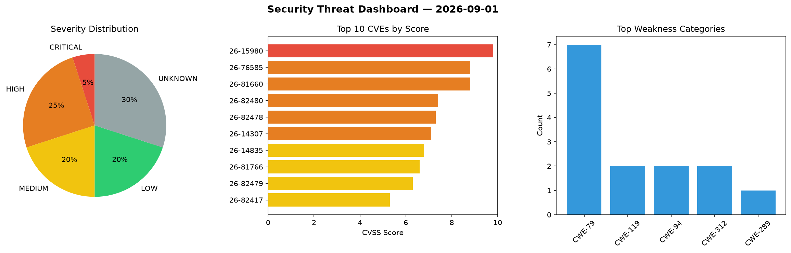
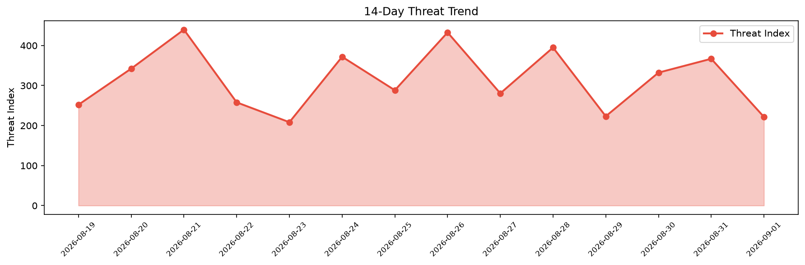

# Security Scan Report — 2026-09-01

**Scan ID:** `a67d8d80bf` | **CVEs:** 20 | **Threat Index:** 221.6

## Threat Overview

| Metric | Value |
|--------|-------|
| Threat Index | 221.6 |
| Critical CVEs | 1 |
| CRITICAL | 1 |
| HIGH | 5 |
| MEDIUM | 4 |
| LOW | 4 |
| UNKNOWN | 6 |

## Delta vs Yesterday

| Metric | Today | Yesterday | Change |
|--------|-------|-----------|--------|
| total_cves | 20 | 20 | ➡️ 0.0% |
| threat_index | 221.6 | 366.9 | 📉 -39.6% |
| critical_count | 1 | 3 | 📉 -66.7% |

## Top Weakness Categories

| CWE | Count |
|-----|-------|
| CWE-79 | 7 |
| CWE-119 | 2 |
| CWE-94 | 2 |
| CWE-312 | 2 |
| CWE-289 | 1 |

## CVE Details

| CVE ID | Score | Severity | Description |
|--------|-------|----------|-------------|
| CVE-2026-15980 | 9.8 | CRITICAL | The MyHome Core plugin for WordPress is vulnerable to Authentication Bypass in a... |
| CVE-2026-76585 | 8.8 | HIGH | The Customer Reviews for WooCommerce WordPress plugin before 5.118.0 does not sa... |
| CVE-2026-81660 | 8.8 | HIGH | The Groundhogg — CRM, Newsletters, and Marketing Automation WordPress plugin bef... |
| CVE-2026-82480 | 7.4 | HIGH | A security flaw has been discovered in NASA cFS up to 7.0.1. The affected elemen... |
| CVE-2026-82478 | 7.3 | HIGH | A vulnerability was determined in NASA Trick 19.6.0. This issue affects the func... |
| CVE-2026-14307 | 7.1 | HIGH | The geotargetingwp WordPress plugin before 3.5.6.2 does not sanitise or escape s... |
| CVE-2026-14835 | 6.8 | MEDIUM | The SOGO Add Script to Individual Pages Header Footer WordPress plugin through 3... |
| CVE-2026-81766 | 6.6 | MEDIUM | The Really Simple Security  WordPress plugin before 9.8.0 does not check that th... |
| CVE-2026-82479 | 6.3 | MEDIUM | A vulnerability was identified in NASA cFS up to 7.0.1. Impacted is the function... |
| CVE-2026-82417 | 5.3 | MEDIUM | ### Summary

`qs.stringify` throws a `TypeError` when it serializes an object ... |
| CVE-2026-82562 | 3.7 | LOW | ### Summary

When `qs.parse` is called with `comma: true` and `throwOnLimitExc... |
| CVE-2026-78364 | 3.5 | LOW | The MW WP Form WordPress plugin before 5.1.6 does not sanitise and escape some o... |
| CVE-2026-82482 | 3.5 | LOW | A security vulnerability has been detected in coppermine-gallery Coppermine Phot... |
| CVE-2026-82483 | 3.5 | LOW | A vulnerability was detected in coppermine-gallery Coppermine Photo Gallery up t... |
| CVE-2026-75847 | 0.0 | UNKNOWN | Cleartext Storage of Sensitive Information vulnerability in ash-project ash_pape... |