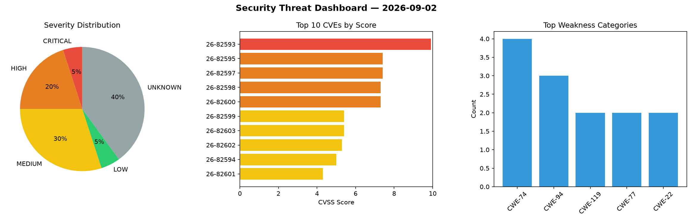
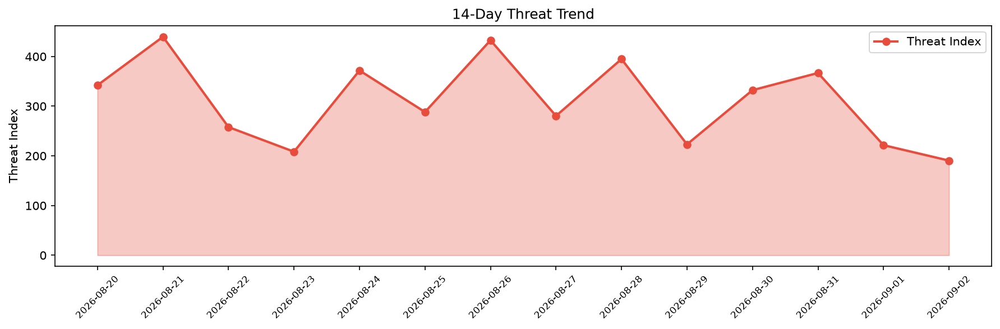

# Security Scan Report — 2026-09-02

**Scan ID:** `238a8d412f` | **CVEs:** 20 | **Threat Index:** 190.5

## Threat Overview

| Metric | Value |
|--------|-------|
| Threat Index | 190.5 |
| Critical CVEs | 1 |
| CRITICAL | 1 |
| HIGH | 4 |
| MEDIUM | 6 |
| LOW | 1 |
| UNKNOWN | 8 |

## Delta vs Yesterday

| Metric | Today | Yesterday | Change |
|--------|-------|-----------|--------|
| total_cves | 20 | 20 | ➡️ 0.0% |
| threat_index | 190.5 | 221.6 | 📉 -14.0% |
| critical_count | 1 | 1 | ➡️ 0.0% |

## Top Weakness Categories

| CWE | Count |
|-----|-------|
| CWE-74 | 4 |
| CWE-94 | 3 |
| CWE-119 | 2 |
| CWE-77 | 2 |
| CWE-22 | 2 |

## CVE Details

| CVE ID | Score | Severity | Description |
|--------|-------|----------|-------------|
| CVE-2026-82593 | 9.9 | CRITICAL | A flaw has been found in D-Link DIR-825M 1.1.8. This impacts the function sub_41... |
| CVE-2026-82595 | 7.4 | HIGH | A vulnerability was found in D-Link DIR-825M 1.1.8. Affected by this vulnerabili... |
| CVE-2026-82597 | 7.4 | HIGH | A vulnerability was identified in TOTOLINK NR1800X 9.1.0u.6681_B20230703. This a... |
| CVE-2026-82598 | 7.3 | HIGH | A vulnerability was determined in SeaCMS up to 13.6. Affected is the function pa... |
| CVE-2026-82600 | 7.3 | HIGH | A security flaw has been discovered in SeaCMS up to 13.6. Affected by this issue... |
| CVE-2026-82599 | 5.4 | MEDIUM | A vulnerability was identified in SeaCMS up to 13.6. Affected by this vulnerabil... |
| CVE-2026-82603 | 5.4 | MEDIUM | A vulnerability was detected in SeaCMS up to 13.6. This issue affects some unkno... |
| CVE-2026-82602 | 5.3 | MEDIUM | A security vulnerability has been detected in SeaCMS up to 13.6. This vulnerabil... |
| CVE-2026-82594 | 5.0 | MEDIUM | A vulnerability has been found in LogNet grpc-spring-boot-starter up to 5.2.0. A... |
| CVE-2026-82601 | 4.3 | MEDIUM | A weakness has been identified in SeaCMS up to 13.6. This affects an unknown par... |
| CVE-2026-82604 | 4.3 | MEDIUM | A flaw has been found in BareBones BBEdit up to 15.5.5. Impacted is an unknown f... |
| CVE-2026-82596 | 3.3 | LOW | A vulnerability was determined in LatencyUtils up to 2.0.3. Affected by this iss... |
| CVE-2026-77956 | 0.0 | UNKNOWN | Improper Control of Generation of Code (Code Injection) vulnerability in ash-pro... |
| CVE-2026-81315 | 0.0 | UNKNOWN | Origin Validation Error vulnerability in ash-project ash_ai allows a malicious w... |
| CVE-2026-75760 | 0.0 | UNKNOWN | Generation of Error Message Containing Sensitive Information vulnerability in as... |