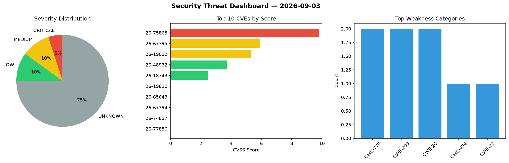
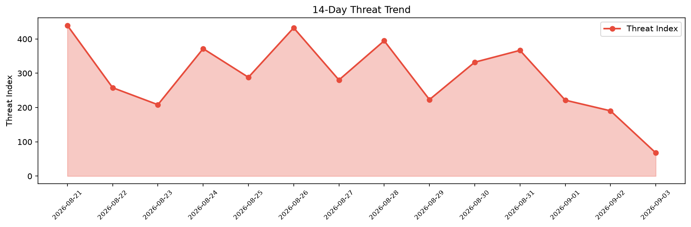

# Security Scan Report — 2026-09-03

**Scan ID:** `5304857382` | **CVEs:** 20 | **Threat Index:** 67.8

## Threat Overview

| Metric | Value |
|--------|-------|
| Threat Index | 67.8 |
| Critical CVEs | 1 |
| CRITICAL | 1 |
| MEDIUM | 2 |
| LOW | 2 |
| UNKNOWN | 15 |

## Delta vs Yesterday

| Metric | Today | Yesterday | Change |
|--------|-------|-----------|--------|
| total_cves | 20 | 20 | ➡️ 0.0% |
| threat_index | 67.8 | 190.5 | 📉 -64.4% |
| critical_count | 1 | 1 | ➡️ 0.0% |

## Top Weakness Categories

| CWE | Count |
|-----|-------|
| CWE-770 | 2 |
| CWE-209 | 2 |
| CWE-20 | 2 |
| CWE-434 | 1 |
| CWE-22 | 1 |

## CVE Details

| CVE ID | Score | Severity | Description |
|--------|-------|----------|-------------|
| CVE-2026-75865 | 9.8 | CRITICAL | The WPLP Cookie Consent – Cookie Banner & Consent Management for GDPR, CCPA & Go... |
| CVE-2026-67395 | 5.9 | MEDIUM | A path traversal vulnerability exists in Sage Employee Self Service’s custom log... |
| CVE-2026-19032 | 5.3 | MEDIUM | jackson-databind's deserializer for java.nio.file.Path resolves an attacker-supp... |
| CVE-2026-48932 | 3.7 | LOW | A flaw in Node.js HTTP client can cause a request desynchronization for Node.js-... |
| CVE-2026-18743 | 2.5 | LOW | A flaw was found in popt. This vulnerability allows an attacker to provide speci... |
| CVE-2026-19820 | 0.0 | UNKNOWN | A vulnerability in the Backblaze Client allows a local user to make the system n... |
| CVE-2026-65643 | 0.0 | UNKNOWN | Eval injection in cPanel 11.138.0.0 and earlier allows remote authenticated user... |
| CVE-2026-67394 | 0.0 | UNKNOWN | A critical local privilege escalation via OS command injection vulnerability has... |
| CVE-2026-74837 | 0.0 | UNKNOWN | Allocation of Resources Without Limits or Throttling vulnerability in ash-projec... |
| CVE-2026-77856 | 0.0 | UNKNOWN | Allocation of Resources Without Limits or Throttling vulnerability in ash-projec... |
| CVE-2026-77950 | 0.0 | UNKNOWN | Generation of Error Message Containing Sensitive Information vulnerability in as... |
| CVE-2026-82730 | 0.0 | UNKNOWN | Incorrect Authorization vulnerability in ash-project ash_typescript allows an un... |
| CVE-2026-82731 | 0.0 | UNKNOWN | URL Redirection to Untrusted Site ('Open Redirect') vulnerability in ash-project... |
| CVE-2026-82732 | 0.0 | UNKNOWN | Improper Input Validation vulnerability in ash-project ash_typescript allows a r... |
| CVE-2026-82733 | 0.0 | UNKNOWN | Generation of Error Message Containing Sensitive Information vulnerability in as... |