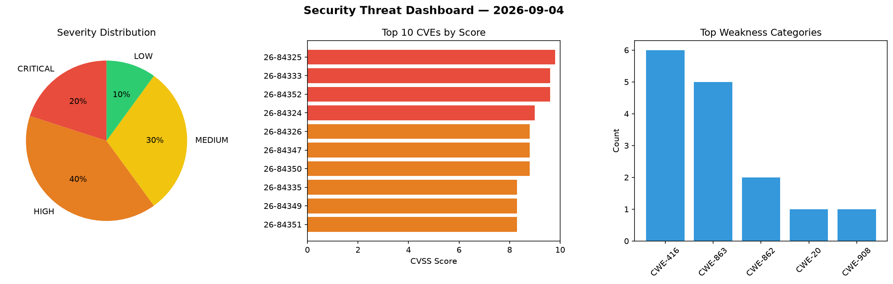
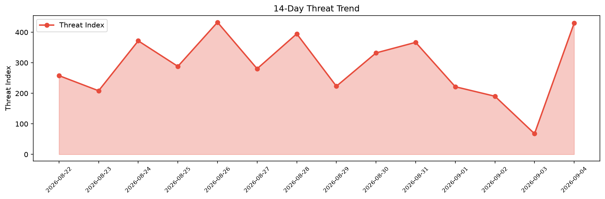

# Security Scan Report — 2026-09-04

**Scan ID:** `01a5e2f296` | **CVEs:** 20 | **Threat Index:** 429.9

## Threat Overview

| Metric | Value |
|--------|-------|
| Threat Index | 429.9 |
| Critical CVEs | 4 |
| CRITICAL | 4 |
| HIGH | 8 |
| MEDIUM | 6 |
| LOW | 2 |

## Delta vs Yesterday

| Metric | Today | Yesterday | Change |
|--------|-------|-----------|--------|
| total_cves | 20 | 20 | ➡️ 0.0% |
| threat_index | 429.9 | 67.8 | 📈 534.1% |
| critical_count | 4 | 1 | 📈 300.0% |

## Top Weakness Categories

| CWE | Count |
|-----|-------|
| CWE-416 | 6 |
| CWE-863 | 5 |
| CWE-862 | 2 |
| CWE-20 | 1 |
| CWE-908 | 1 |

## CVE Details

| CVE ID | Score | Severity | Description |
|--------|-------|----------|-------------|
| CVE-2026-84325 | 9.8 | CRITICAL | Improper input validation in DataTransfer in Google Chrome prior to 152.0.7977.7... |
| CVE-2026-84333 | 9.6 | CRITICAL | Use after free in Dawn in Google Chrome on on Android prior to 152.0.7977.75 all... |
| CVE-2026-84352 | 9.6 | CRITICAL | Use after free in WebGL in Google Chrome on on Android prior to 152.0.7977.75 al... |
| CVE-2026-84324 | 9.0 | CRITICAL | Use after free in Proxy in Google Chrome prior to 152.0.7977.75 allowed a remote... |
| CVE-2026-84326 | 8.8 | HIGH | Uninitialized resource in V8 in Google Chrome prior to 152.0.7977.75 allowed a r... |
| CVE-2026-84347 | 8.8 | HIGH | Use after free in WebRTC in Google Chrome prior to 152.0.7977.75 allowed a remot... |
| CVE-2026-84350 | 8.8 | HIGH | Use after free in TabStrip in Google Chrome prior to 152.0.7977.75 allowed a rem... |
| CVE-2026-84335 | 8.3 | HIGH | Incorrect authorization in TabStrip in Google Chrome prior to 152.0.7977.75 allo... |
| CVE-2026-84349 | 8.3 | HIGH | Use after free in Browser in Google Chrome prior to 152.0.7977.75 allowed a remo... |
| CVE-2026-84351 | 8.3 | HIGH | Buffer overflow in GPU in Google Chrome on on Windows prior to 152.0.7977.75 all... |
| CVE-2026-84334 | 8.1 | HIGH | Incorrect authorization in Chromoting in Google Chrome on on Windows prior to 15... |
| CVE-2026-81928 | 7.5 | HIGH | Net::DNS versions before 1.57 for Perl allow memory exhaustion via unbounded rec... |
| CVE-2026-84327 | 6.5 | MEDIUM | Incorrect authorization in Autofill in Google Chrome on on Android prior to 152.... |
| CVE-2026-84332 | 6.5 | MEDIUM | Incorrect authorization in SiteSettings in Google Chrome prior to 152.0.7977.75 ... |
| CVE-2026-84348 | 6.5 | MEDIUM | Information leak in MediaCapture in Google Chrome prior to 152.0.7977.75 allowed... |