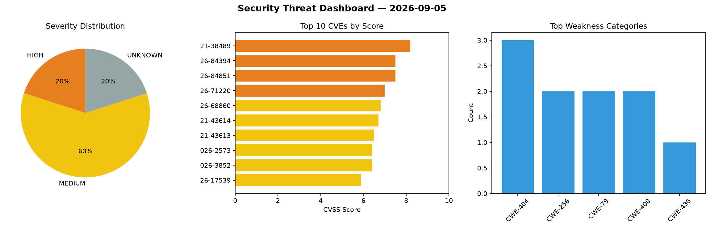
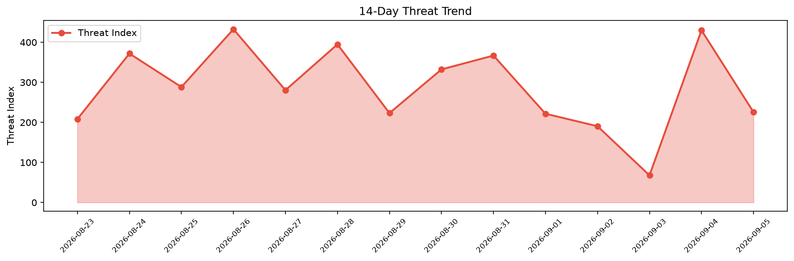

# Security Scan Report — 2026-09-05

**Scan ID:** `ad6b3c290c` | **CVEs:** 20 | **Threat Index:** 225.6

## Threat Overview

| Metric | Value |
|--------|-------|
| Threat Index | 225.6 |
| Critical CVEs | 0 |
| HIGH | 4 |
| MEDIUM | 12 |
| UNKNOWN | 4 |

## Delta vs Yesterday

| Metric | Today | Yesterday | Change |
|--------|-------|-----------|--------|
| total_cves | 20 | 20 | ➡️ 0.0% |
| threat_index | 225.6 | 429.9 | 📉 -47.5% |
| critical_count | 0 | 4 | 📉 -100.0% |

## Top Weakness Categories

| CWE | Count |
|-----|-------|
| CWE-404 | 3 |
| CWE-256 | 2 |
| CWE-79 | 2 |
| CWE-400 | 2 |
| CWE-436 | 1 |

## CVE Details

| CVE ID | Score | Severity | Description |
|--------|-------|----------|-------------|
| CVE-2021-38489 | 8.2 | HIGH | HDD password plaintext is stored in a UEFI variable.... |
| CVE-2026-84394 | 7.5 | HIGH | fast-uri accepts a host that contains an unbalanced or misplaced authority brack... |
| CVE-2026-84851 | 7.5 | HIGH | An uncontrolled recursion issue exists in Amazon Ion-C versions before 1.1.6 tha... |
| CVE-2026-71220 | 7.0 | HIGH | A stack out-of-bounds write vulnerability was found in gfs2-utils. In gfs2_edit,... |
| CVE-2026-68860 | 6.8 | MEDIUM | Dell PowerProtect Data Manager, versions 20.2.0.0 and below, contain a Reliance ... |
| CVE-2021-43614 | 6.7 | MEDIUM | Error in handling the PlatformLangCodes UEFI variable could cause a buffer overf... |
| CVE-2021-43613 | 6.5 | MEDIUM | An issue was discovered in SysPasswordDxe in Insyde InsydeH2O. User and administ... |
| CVE-2026-2573 | 6.4 | MEDIUM | The GutenKit – Page Builder Blocks, Patterns, and Templates for Gutenberg Block ... |
| CVE-2026-3852 | 6.4 | MEDIUM | The Divi theme for WordPress is vulnerable to Stored Cross-Site Scripting via th... |
| CVE-2026-17539 | 5.9 | MEDIUM | RTU500 has a vulnerability, where high-load scenarios, such as sending GI reques... |
| CVE-2026-3416 | 5.9 | MEDIUM | The API Publisher component previously used a non-cryptographic pseudorandom num... |
| CVE-2026-84886 | 5.3 | MEDIUM | A vulnerability was determined in simular-ai Agent-S up to 0.3.2. Affected by th... |
| CVE-2026-71219 | 4.7 | MEDIUM | A stack overflow vulnerability was found in gfs2-utils. The hash table traversal... |
| CVE-2026-84885 | 4.3 | MEDIUM | A vulnerability has been found in simular-ai Agent-S 0.3.1/0.3.2. This impacts a... |
| CVE-2026-84887 | 4.3 | MEDIUM | A vulnerability was identified in simular-ai Agent-S up to 0.3.2. Affected by th... |