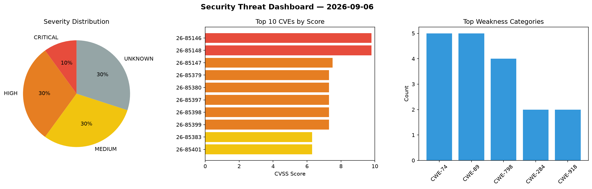
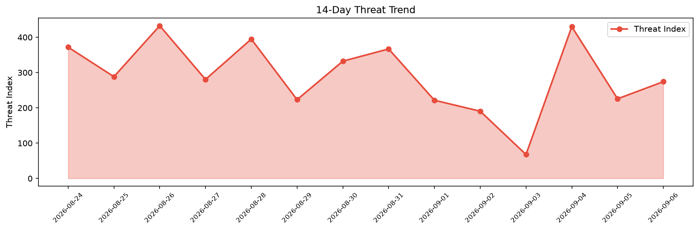

# Security Scan Report — 2026-09-06

**Scan ID:** `829b929081` | **CVEs:** 20 | **Threat Index:** 274.2

## Threat Overview

| Metric | Value |
|--------|-------|
| Threat Index | 274.2 |
| Critical CVEs | 2 |
| CRITICAL | 2 |
| HIGH | 6 |
| MEDIUM | 6 |
| UNKNOWN | 6 |

## Delta vs Yesterday

| Metric | Today | Yesterday | Change |
|--------|-------|-----------|--------|
| total_cves | 20 | 20 | ➡️ 0.0% |
| threat_index | 274.2 | 225.6 | 📈 21.5% |
| critical_count | 2 | 0 | ➡️ 0% |

## Top Weakness Categories

| CWE | Count |
|-----|-------|
| CWE-74 | 5 |
| CWE-89 | 5 |
| CWE-798 | 4 |
| CWE-284 | 2 |
| CWE-918 | 2 |

## CVE Details

| CVE ID | Score | Severity | Description |
|--------|-------|----------|-------------|
| CVE-2026-85146 | 9.8 | CRITICAL | SmartIT Desktop Manager developed by Lightstar has a Use of Hard-coded Credentia... |
| CVE-2026-85148 | 9.8 | CRITICAL | SmartIT Desktop Manager developed by Lightstar has a Use of Hard-coded Credentia... |
| CVE-2026-85147 | 7.5 | HIGH | SmartIT Desktop Manager developed by Lightstar has a Use of Hard-coded Credentia... |
| CVE-2026-85379 | 7.3 | HIGH | A security flaw has been discovered in light0011 cms c774dce31c6df0055568a8d5c53... |
| CVE-2026-85380 | 7.3 | HIGH | A weakness has been identified in light0011 cms c774dce31c6df0055568a8d5c53d964d... |
| CVE-2026-85397 | 7.3 | HIGH | A vulnerability was determined in code-projects Hospital Information System 1.0.... |
| CVE-2026-85398 | 7.3 | HIGH | A vulnerability was identified in code-projects Hospital Information System 1.0.... |
| CVE-2026-85399 | 7.3 | HIGH | A security flaw has been discovered in code-projects Hospital Information System... |
| CVE-2026-85383 | 6.3 | MEDIUM | A flaw has been found in itsourcecode Sales and Inventory System 1.0. The affect... |
| CVE-2026-85401 | 6.3 | MEDIUM | A weakness has been identified in Dolibarr up to 21.0.4/22.0.5/23.0.3. Affected ... |
| CVE-2026-85381 | 5.3 | MEDIUM | A security vulnerability has been detected in light0011 cms c774dce31c6df0055568... |
| CVE-2026-85149 | 5.3 | MEDIUM | SmartIT Desktop Manager developed by Lightstar has a Use of Hard-coded Credentia... |
| CVE-2026-49509 | 4.4 | MEDIUM | Out-of-bounds read vulnerability in Samsung Opensource Escargot allows Overread ... |
| CVE-2026-85382 | 4.3 | MEDIUM | A vulnerability was detected in light0011 cms c774dce31c6df0055568a8d5c53d964d99... |
| CVE-2026-67397 | 0.0 | UNKNOWN | Path traversal in Plesk 18.0.79.9 and earlier and 18.0.80 through 18.0.80.5 allo... |