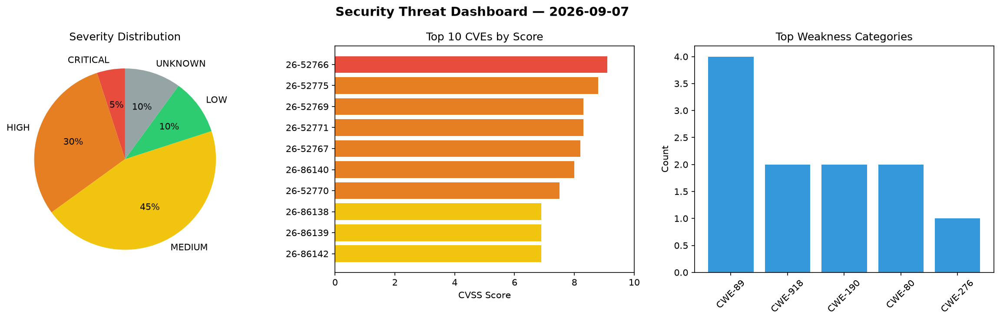
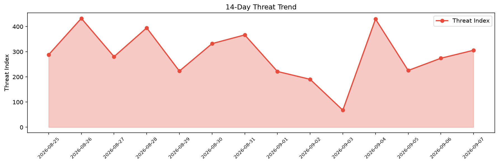

# Security Scan Report — 2026-09-07

**Scan ID:** `920e9791d1` | **CVEs:** 20 | **Threat Index:** 305.9

## Threat Overview

| Metric | Value |
|--------|-------|
| Threat Index | 305.9 |
| Critical CVEs | 1 |
| CRITICAL | 1 |
| HIGH | 6 |
| MEDIUM | 9 |
| LOW | 2 |
| UNKNOWN | 2 |

## Delta vs Yesterday

| Metric | Today | Yesterday | Change |
|--------|-------|-----------|--------|
| total_cves | 20 | 20 | ➡️ 0.0% |
| threat_index | 305.9 | 274.2 | 📈 11.6% |
| critical_count | 1 | 2 | 📉 -50.0% |

## Top Weakness Categories

| CWE | Count |
|-----|-------|
| CWE-89 | 4 |
| CWE-918 | 2 |
| CWE-190 | 2 |
| CWE-80 | 2 |
| CWE-276 | 1 |

## CVE Details

| CVE ID | Score | Severity | Description |
|--------|-------|----------|-------------|
| CVE-2026-52766 | 9.1 | CRITICAL | YesWiki is a wiki system written in PHP. Prior to version 4.6.6, the {{erasespam... |
| CVE-2026-52775 | 8.8 | HIGH | YesWiki is a wiki system written in PHP. Prior to version 4.6.6, YesWiki through... |
| CVE-2026-52769 | 8.3 | HIGH | YesWiki is a wiki system written in PHP. From version 4.6.2 to before version 4.... |
| CVE-2026-52771 | 8.3 | HIGH | YesWiki is a wiki system written in PHP. From version 4.2.0 to before version 4.... |
| CVE-2026-52767 | 8.2 | HIGH | YesWiki is a wiki system written in PHP. From version 4.6.2 to before version 4.... |
| CVE-2026-86140 | 8.0 | HIGH | In libxml2 before 2.15.4, xmlSnprintfElements in valid.c has a strcat stack-base... |
| CVE-2026-52770 | 7.5 | HIGH | YesWiki is a wiki system written in PHP. Prior to version 4.6.6, YesWiki’s publi... |
| CVE-2026-86138 | 6.9 | MEDIUM | In libxml2 before 2.15.4, xmlDictAddQString in dict.c has an integer overflow an... |
| CVE-2026-86139 | 6.9 | MEDIUM | In libxml2 before 2.15.4, xmlURIEscapeStr in uri.c has an integer overflow.... |
| CVE-2026-86142 | 6.9 | MEDIUM | In libxml2 before 2.15.4, there is a heap-based buffer overflow in xmlXPtrEvalXP... |
| CVE-2026-86143 | 6.9 | MEDIUM | In xmlIO in libxml2 before 2.15.4, an inconsistency in xmlOutputWriteCallback an... |
| CVE-2026-52763 | 6.5 | MEDIUM | YesWiki is a wiki system written in PHP. Prior to version 4.6.6, the recentchang... |
| CVE-2026-86100 | 6.4 | MEDIUM | Camaleon CMS versions 2.7.5 through 2.9.1 fail to validate redirect targets when... |
| CVE-2026-52773 | 6.1 | MEDIUM | YesWiki is a wiki system written in PHP. From version 4.1.0 to before version 4.... |
| CVE-2026-52774 | 6.1 | MEDIUM | YesWiki is a wiki system written in PHP. Prior to version 4.6.6, YesWiki's Bazar... |