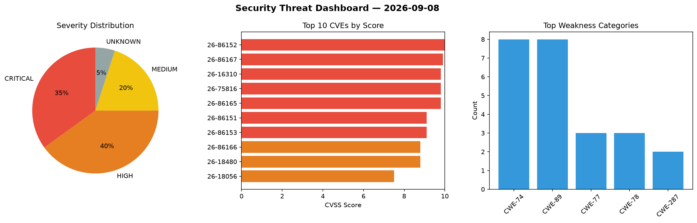
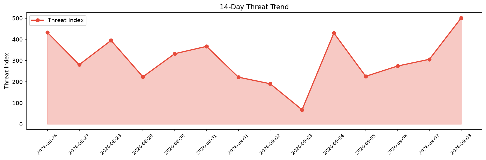

# Security Scan Report — 2026-09-08

**Scan ID:** `c156d80d59` | **CVEs:** 20 | **Threat Index:** 501.2

## Threat Overview

| Metric | Value |
|--------|-------|
| Threat Index | 501.2 |
| Critical CVEs | 7 |
| CRITICAL | 7 |
| HIGH | 8 |
| MEDIUM | 4 |
| UNKNOWN | 1 |

## Delta vs Yesterday

| Metric | Today | Yesterday | Change |
|--------|-------|-----------|--------|
| total_cves | 20 | 20 | ➡️ 0.0% |
| threat_index | 501.2 | 305.9 | 📈 63.8% |
| critical_count | 7 | 1 | 📈 600.0% |

## Top Weakness Categories

| CWE | Count |
|-----|-------|
| CWE-74 | 8 |
| CWE-89 | 8 |
| CWE-77 | 3 |
| CWE-78 | 3 |
| CWE-287 | 2 |

## CVE Details

| CVE ID | Score | Severity | Description |
|--------|-------|----------|-------------|
| CVE-2026-86152 | 10.0 | CRITICAL | A flaw has been found in Tenda CP3 27.5.57.101. The impacted element is the func... |
| CVE-2026-86167 | 9.9 | CRITICAL | A vulnerability was identified in Tenda HG10 300001138. Impacted is the function... |
| CVE-2026-16310 | 9.8 | CRITICAL | The MemberDash plugin for WordPress is vulnerable to Insecure Direct Object Refe... |
| CVE-2026-75816 | 9.8 | CRITICAL | The Frontend Admin by DynamiApps plugin for WordPress is vulnerable to Authentic... |
| CVE-2026-86165 | 9.8 | CRITICAL | A vulnerability was found in Tenda HG10 300001138. This vulnerability affects th... |
| CVE-2026-86151 | 9.1 | CRITICAL | A vulnerability was detected in Tenda CP3 27.5.57.101. The affected element is t... |
| CVE-2026-86153 | 9.1 | CRITICAL | A vulnerability has been found in Tenda CP3 27.5.57.101. This affects the functi... |
| CVE-2026-86166 | 8.8 | HIGH | A vulnerability was determined in Tenda HG10 300001138. This issue affects the f... |
| CVE-2026-18480 | 8.8 | HIGH | The SureCart  WordPress plugin before 4.6.3 does not ensure that the account aff... |
| CVE-2026-18056 | 7.5 | HIGH | The HivePress Authentication plugin for WordPress is vulnerable to Authenticatio... |
| CVE-2026-86159 | 7.3 | HIGH | A flaw has been found in SourceCodester Online Voting System 1.0. Impacted is an... |
| CVE-2026-86160 | 7.3 | HIGH | A vulnerability has been found in SourceCodester Online Voting System 1.0. The a... |
| CVE-2026-86161 | 7.3 | HIGH | A vulnerability was found in SourceCodester Online Voting System 1.0. The impact... |
| CVE-2026-86162 | 7.3 | HIGH | A vulnerability was determined in SourceCodester Online Voting System 1.0. This ... |
| CVE-2026-86168 | 7.3 | HIGH | A security flaw has been discovered in code-projects Content Management System 1... |