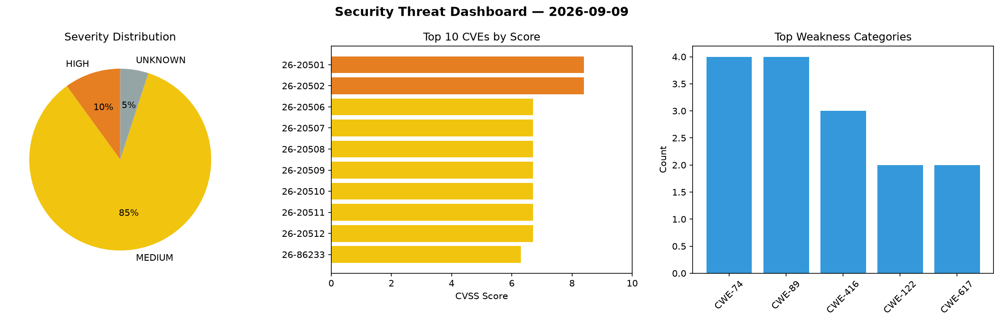
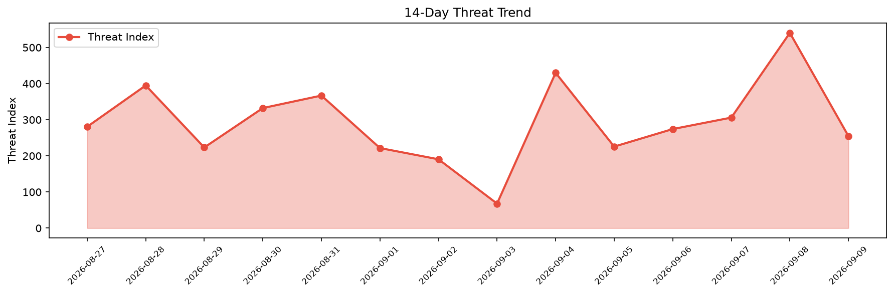

# Security Scan Report — 2026-09-09

**Scan ID:** `fb2a87f5a0` | **CVEs:** 20 | **Threat Index:** 254.8

## Threat Overview

| Metric | Value |
|--------|-------|
| Threat Index | 254.8 |
| Critical CVEs | 0 |
| HIGH | 2 |
| MEDIUM | 17 |
| UNKNOWN | 1 |

## Delta vs Yesterday

| Metric | Today | Yesterday | Change |
|--------|-------|-----------|--------|
| total_cves | 20 | 20 | ➡️ 0.0% |
| threat_index | 254.8 | 540.4 | 📉 -52.8% |
| critical_count | 0 | 8 | 📉 -100.0% |

## Top Weakness Categories

| CWE | Count |
|-----|-------|
| CWE-74 | 4 |
| CWE-89 | 4 |
| CWE-416 | 3 |
| CWE-122 | 2 |
| CWE-617 | 2 |

## CVE Details

| CVE ID | Score | Severity | Description |
|--------|-------|----------|-------------|
| CVE-2026-20501 | 8.4 | HIGH | In vdec, there is a possible out of bounds write due to a heap buffer overflow. ... |
| CVE-2026-20502 | 8.4 | HIGH | In vdec, there is a possible out of bounds write due to a missing bounds check. ... |
| CVE-2026-20506 | 6.7 | MEDIUM | In Audio HAL, there is a possible escalation of privilege due to use after free.... |
| CVE-2026-20507 | 6.7 | MEDIUM | In Audio HAL, there is a possible escalation of privilege due to use after free.... |
| CVE-2026-20508 | 6.7 | MEDIUM | In Power HAL, there is a possible escalation of privilege due to type confusion.... |
| CVE-2026-20509 | 6.7 | MEDIUM | In Power HAL, there is a possible out of bounds write due to a missing bounds ch... |
| CVE-2026-20510 | 6.7 | MEDIUM | In camera middleware, there is a possible escalation of privilege due to double ... |
| CVE-2026-20511 | 6.7 | MEDIUM | In SurfaceFlinger, there is a possible memory corruption due to use after free. ... |
| CVE-2026-20512 | 6.7 | MEDIUM | In Audio HAL, there is a possible escalation of privilege due to improper input ... |
| CVE-2026-86233 | 6.3 | MEDIUM | A security vulnerability has been detected in itsourcecode Sales and Inventory S... |
| CVE-2026-86234 | 6.3 | MEDIUM | A vulnerability was detected in itsourcecode Sales and Inventory System 1.0. Thi... |
| CVE-2026-86235 | 6.3 | MEDIUM | A flaw has been found in itsourcecode Sales and Inventory System 1.0. This vulne... |
| CVE-2026-86236 | 6.3 | MEDIUM | A vulnerability has been found in itsourcecode Sales and Inventory System 1.0. T... |
| CVE-2026-20500 | 5.5 | MEDIUM | In Modem, there is a possible system crash due to improper input validation. Thi... |
| CVE-2026-86237 | 5.3 | MEDIUM | A vulnerability was found in openagents-org openagents up to 0.8.19/0.9.3.post20... |