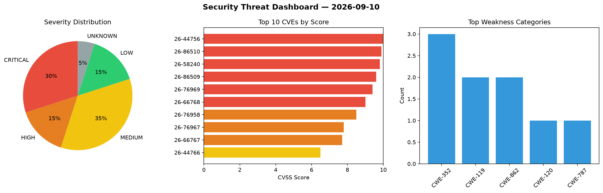
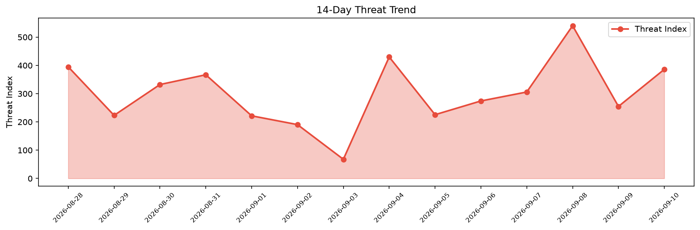

# Security Scan Report — 2026-09-10

**Scan ID:** `5b23428513` | **CVEs:** 20 | **Threat Index:** 386.0

## Threat Overview

| Metric | Value |
|--------|-------|
| Threat Index | 386.0 |
| Critical CVEs | 6 |
| CRITICAL | 6 |
| HIGH | 3 |
| MEDIUM | 7 |
| LOW | 3 |
| UNKNOWN | 1 |

## Delta vs Yesterday

| Metric | Today | Yesterday | Change |
|--------|-------|-----------|--------|
| total_cves | 20 | 20 | ➡️ 0.0% |
| threat_index | 386.0 | 254.8 | 📈 51.5% |
| critical_count | 6 | 0 | ➡️ 0% |

## Top Weakness Categories

| CWE | Count |
|-----|-------|
| CWE-352 | 3 |
| CWE-119 | 2 |
| CWE-862 | 2 |
| CWE-120 | 1 |
| CWE-787 | 1 |

## CVE Details

| CVE ID | Score | Severity | Description |
|--------|-------|----------|-------------|
| CVE-2026-44756 | 10.0 | CRITICAL | A memory safety vulnerability exists in the Extended Passport Protocol (EPP) pro... |
| CVE-2026-86510 | 9.9 | CRITICAL | A vulnerability has been found in D-Link DIR-822A A_101. Affected is the functio... |
| CVE-2026-58240 | 9.8 | CRITICAL | SAP NetWeaver Message Server does not sufficiently validate the authenticity of ... |
| CVE-2026-86509 | 9.6 | CRITICAL | A flaw has been found in D-Link DIR-895L A1_102b07. This impacts the function se... |
| CVE-2026-76969 | 9.4 | CRITICAL | @sap/cds-mtxs NPM library does not perform sufficient checks on certain function... |
| CVE-2026-66768 | 9.0 | CRITICAL | SAP GUI for Java does not correctly enforce the trust level policy for certain f... |
| CVE-2026-76958 | 8.5 | HIGH | SAP Integration Suite does not sufficiently validate XML documents accepted from... |
| CVE-2026-76967 | 7.8 | HIGH | SAP NetWeaver Business Client does not perform sufficient validation when proces... |
| CVE-2026-66767 | 7.7 | HIGH | SAP NetWeaver Application Server for ABAP and ABAP Platform allows an unauthenti... |
| CVE-2026-44766 | 6.5 | MEDIUM | SAP S/4HANA (Intercompany Matching and Reconciliation) allows a low-privileged a... |
| CVE-2026-76968 | 6.5 | MEDIUM | SAP Web Dispatcher, Internet Communication Manager and SAP Content Server allows... |
| CVE-2026-76971 | 6.5 | MEDIUM | Due to a Server-Side Request Forgery (SSRF) vulnerability in SAP Manufacturing I... |
| CVE-2026-76959 | 4.6 | MEDIUM | SAP S/4HANA Finance (Advanced Payment Management) does not perform sufficient Cr... |
| CVE-2026-76962 | 4.3 | MEDIUM | SAP S/4HANA (Manage Bank Chains app) does not perform sufficient authorization c... |
| CVE-2026-76963 | 4.3 | MEDIUM | Due to a missing authorization check in Application Server ABAP of SAP NetWeaver... |