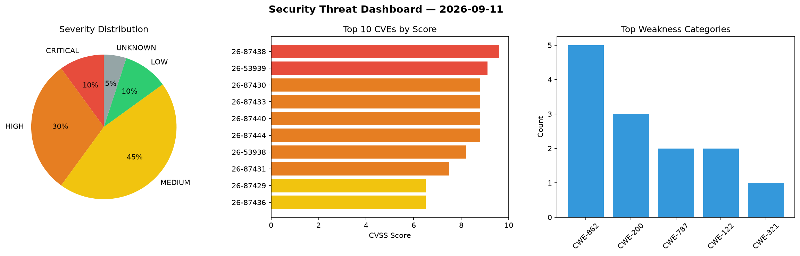
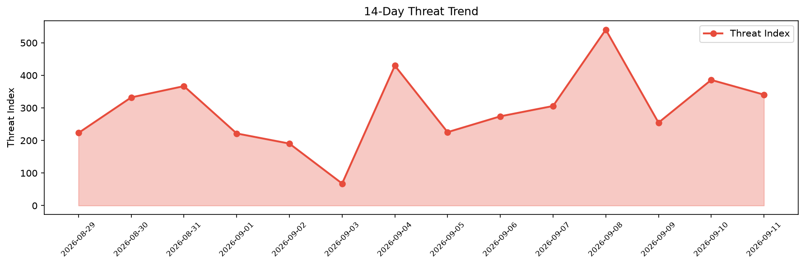

# Security Scan Report — 2026-09-11

**Scan ID:** `6bd809f5b0` | **CVEs:** 20 | **Threat Index:** 340.7

## Threat Overview

| Metric | Value |
|--------|-------|
| Threat Index | 340.7 |
| Critical CVEs | 2 |
| CRITICAL | 2 |
| HIGH | 6 |
| MEDIUM | 9 |
| LOW | 2 |
| UNKNOWN | 1 |

## Delta vs Yesterday

| Metric | Today | Yesterday | Change |
|--------|-------|-----------|--------|
| total_cves | 20 | 20 | ➡️ 0.0% |
| threat_index | 340.7 | 386.0 | 📉 -11.7% |
| critical_count | 2 | 6 | 📉 -66.7% |

## Top Weakness Categories

| CWE | Count |
|-----|-------|
| CWE-862 | 5 |
| CWE-200 | 3 |
| CWE-787 | 2 |
| CWE-122 | 2 |
| CWE-321 | 1 |

## CVE Details

| CVE ID | Score | Severity | Description |
|--------|-------|----------|-------------|
| CVE-2026-87438 | 9.6 | CRITICAL | Out of bounds write in WebGL in Google Chrome on on Android prior to 153.0.8010.... |
| CVE-2026-53939 | 9.1 | CRITICAL | OpenIDC/cjose is a C library implementing the Javascript Object Signing and Encr... |
| CVE-2026-87430 | 8.8 | HIGH | Buffer overflow in WebRTC in Google Chrome prior to 153.0.8010.36 allowed a remo... |
| CVE-2026-87433 | 8.8 | HIGH | Race condition in FileAPI in Google Chrome prior to 153.0.8010.36 allowed a remo... |
| CVE-2026-87440 | 8.8 | HIGH | Out of bounds read in Media in Google Chrome prior to 153.0.8010.36 allowed a re... |
| CVE-2026-87444 | 8.8 | HIGH | Memory corruption in Codecs in Google Chrome prior to 153.0.8010.36 allowed a re... |
| CVE-2026-53938 | 8.2 | HIGH | OpenIDC/cjose is a C library implementing the Javascript Object Signing and Encr... |
| CVE-2026-87431 | 7.5 | HIGH | Missing authorization in Extensions in Google Chrome prior to 153.0.8010.36 allo... |
| CVE-2026-87429 | 6.5 | MEDIUM | Missing authorization in ServiceWorker in Google Chrome prior to 153.0.8010.36 a... |
| CVE-2026-87436 | 6.5 | MEDIUM | Incomplete cleanup in Browser in Google Chrome prior to 153.0.8010.36 allowed a ... |
| CVE-2026-87437 | 6.5 | MEDIUM | Information leak in Frames in Google Chrome prior to 153.0.8010.36 allowed a rem... |
| CVE-2026-87441 | 6.5 | MEDIUM | Missing authorization in Downloads in Google Chrome prior to 153.0.8010.36 allow... |
| CVE-2026-87443 | 6.5 | MEDIUM | Missing authorization in Actor in Google Chrome prior to 153.0.8010.36 allowed a... |
| CVE-2026-53937 | 6.2 | MEDIUM | MCP Kotlin SDK is the Kotlin Multiplatform software development kit for the Mode... |
| CVE-2026-87435 | 5.3 | MEDIUM | Information leak in ControlledFrame in Google Chrome prior to 153.0.8010.36 allo... |