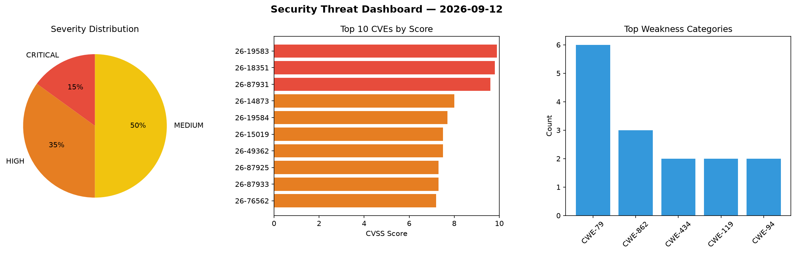
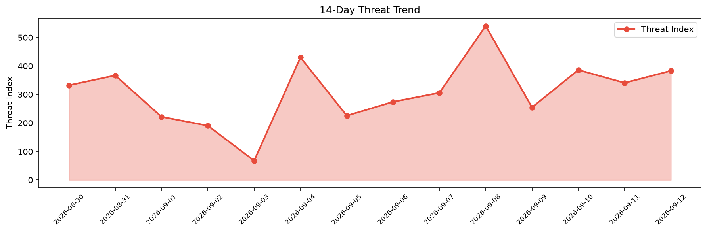

# Security Scan Report — 2026-09-12

**Scan ID:** `9161bedf50` | **CVEs:** 20 | **Threat Index:** 383.1

## Threat Overview

| Metric | Value |
|--------|-------|
| Threat Index | 383.1 |
| Critical CVEs | 3 |
| CRITICAL | 3 |
| HIGH | 7 |
| MEDIUM | 10 |

## Delta vs Yesterday

| Metric | Today | Yesterday | Change |
|--------|-------|-----------|--------|
| total_cves | 20 | 20 | ➡️ 0.0% |
| threat_index | 383.1 | 340.7 | 📈 12.4% |
| critical_count | 3 | 2 | 📈 50.0% |

## Top Weakness Categories

| CWE | Count |
|-----|-------|
| CWE-79 | 6 |
| CWE-862 | 3 |
| CWE-434 | 2 |
| CWE-119 | 2 |
| CWE-94 | 2 |

## CVE Details

| CVE ID | Score | Severity | Description |
|--------|-------|----------|-------------|
| CVE-2026-19583 | 9.9 | CRITICAL | Velociraptor allows some sensitive artifacts to be gated by additional permissio... |
| CVE-2026-18351 | 9.8 | CRITICAL | The Drag and Drop File Upload for Elementor Forms plugin for WordPress is vulner... |
| CVE-2026-87931 | 9.6 | CRITICAL | A vulnerability has been found in Behavioral Technology Group Pavlok Behavioral ... |
| CVE-2026-14873 | 8.0 | HIGH | The Bulk Password Reset plugin for WordPress is vulnerable to privilege escalati... |
| CVE-2026-19584 | 7.7 | HIGH | Velociraptor allows for the creation of notebook backups in its default enabled ... |
| CVE-2026-15019 | 7.5 | HIGH | The Direct Download for WooCommerce plugin for WordPress is vulnerable to Direct... |
| CVE-2026-49362 | 7.5 | HIGH | An unauthenticated remote attacker can create arbitrary durable queues via the C... |
| CVE-2026-87925 | 7.3 | HIGH | A vulnerability was detected in Rizwan17 inventory-management-system up to bfe78... |
| CVE-2026-87933 | 7.3 | HIGH | A vulnerability was found in DaveGamble cJSON up to 1.7.19. The affected element... |
| CVE-2026-76562 | 7.2 | HIGH | The Sidebar Manager Light plugin for WordPress is vulnerable to Stored Cross-Sit... |
| CVE-2026-84063 | 6.5 | MEDIUM | BurgerEditor 3.2.0 through 3.4.0 contains an issue with unrestricted upload of f... |
| CVE-2026-87870 | 6.4 | MEDIUM | The Ninja Forms - Scheduled Exports plugin for WordPress is vulnerable to Stored... |
| CVE-2026-15796 | 6.4 | MEDIUM | The Builderall for WordPress plugin for WordPress is vulnerable to Stored Cross-... |
| CVE-2026-15820 | 6.4 | MEDIUM | The Builderall for WordPress plugin for WordPress is vulnerable to Stored Cross-... |
| CVE-2026-4657 | 6.4 | MEDIUM | The Easy Google Fonts plugin for WordPress is vulnerable to Stored Cross-Site Sc... |