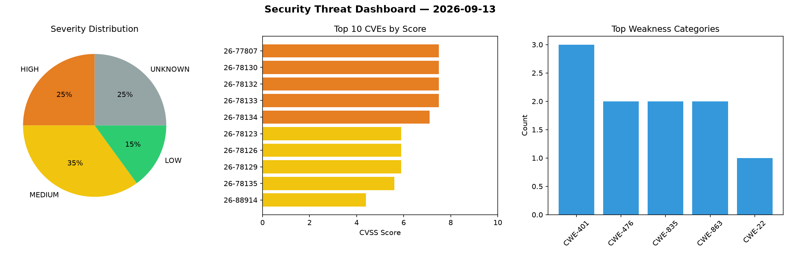
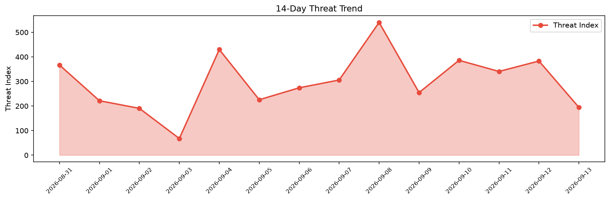

# Security Scan Report — 2026-09-13

**Scan ID:** `6563be5a21` | **CVEs:** 20 | **Threat Index:** 194.6

## Threat Overview

| Metric | Value |
|--------|-------|
| Threat Index | 194.6 |
| Critical CVEs | 0 |
| HIGH | 5 |
| MEDIUM | 7 |
| LOW | 3 |
| UNKNOWN | 5 |

## Delta vs Yesterday

| Metric | Today | Yesterday | Change |
|--------|-------|-----------|--------|
| total_cves | 20 | 20 | ➡️ 0.0% |
| threat_index | 194.6 | 383.1 | 📉 -49.2% |
| critical_count | 0 | 3 | 📉 -100.0% |

## Top Weakness Categories

| CWE | Count |
|-----|-------|
| CWE-401 | 3 |
| CWE-476 | 2 |
| CWE-835 | 2 |
| CWE-863 | 2 |
| CWE-22 | 1 |

## CVE Details

| CVE ID | Score | Severity | Description |
|--------|-------|----------|-------------|
| CVE-2026-77807 | 7.5 | HIGH | The AcyMailing – An Ultimate Newsletter Plugin and Marketing Automation Solution... |
| CVE-2026-78130 | 7.5 | HIGH | strongSwan 4.2.0 through 6.0.7 has a NULL pointer dereference in the x509 plugin... |
| CVE-2026-78132 | 7.5 | HIGH | strongSwan 5.1.3 through 6.0.7 has an infinite loop in the x509 plugin's attribu... |
| CVE-2026-78133 | 7.5 | HIGH | libcharon in strongSwan 6.0.0 through 6.0.7 has a use-after-free in IKEv2 rekeyi... |
| CVE-2026-78134 | 7.1 | HIGH | strongSwan 4.5.0 through 6.0.7 has Incorrect Access Control in the eap-ttls and ... |
| CVE-2026-78123 | 5.9 | MEDIUM | strongSwan 5.0.2 through 6.0.7 has an Expired Pointer Dereference in PKCS#7 pars... |
| CVE-2026-78126 | 5.9 | MEDIUM | strongSwan 4.1.10 through 6.0.7 allows a NULL pointer dereference in the eap-aka... |
| CVE-2026-78129 | 5.9 | MEDIUM | strongSwan 4.6.2 through 6.0.7 has an infinite loop in PKCS#5 decryption.... |
| CVE-2026-78135 | 5.6 | MEDIUM | libcharon in strongSwan 5.9.7 through 6.0.7 mishandles behavioral workflow in th... |
| CVE-2026-88914 | 4.4 | MEDIUM | A flaw was found in GStreamer's gst-plugins-good isomp4 plugin. When processing ... |
| CVE-2026-89092 | 4.2 | MEDIUM | The nscd service in the GNU C Library 2.3.4 onwards may crash due to a 
stack ov... |
| CVE-2026-89145 | 4.2 | MEDIUM | Flextype CMS versions 0.9.9 through 1.0.0-alpha.3 fail to HTML-escape plugin dir... |
| CVE-2026-78124 | 3.7 | LOW | strongSwan 5.0.2 through 6.0.7 allows PKCS#7 certificate enumeration in the open... |
| CVE-2026-78127 | 3.7 | LOW | libcharon in strongSwan 4.1.2 through 6.0.7 has a missing release of memory afte... |
| CVE-2026-78131 | 3.7 | LOW | strongSwan 4.2.0 through 6.0.7 has a missing release of memory after its effecti... |