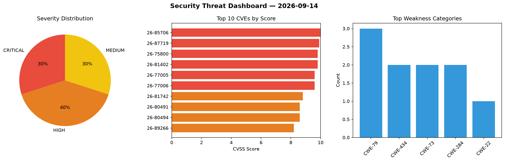
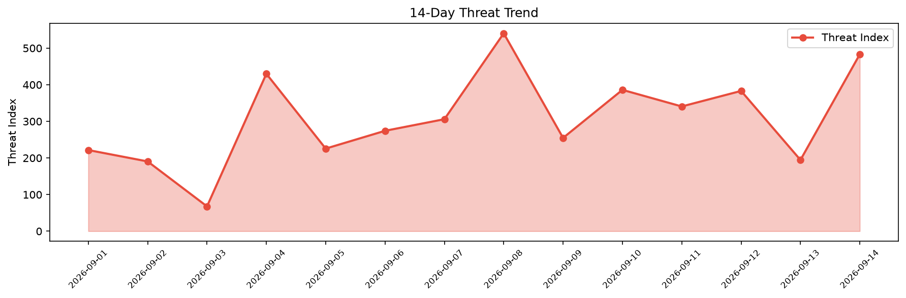

# Security Scan Report — 2026-09-14

**Scan ID:** `18bca3fe22` | **CVEs:** 20 | **Threat Index:** 483.1

## Threat Overview

| Metric | Value |
|--------|-------|
| Threat Index | 483.1 |
| Critical CVEs | 6 |
| CRITICAL | 6 |
| HIGH | 8 |
| MEDIUM | 6 |

## Delta vs Yesterday

| Metric | Today | Yesterday | Change |
|--------|-------|-----------|--------|
| total_cves | 20 | 20 | ➡️ 0.0% |
| threat_index | 483.1 | 194.6 | 📈 148.3% |
| critical_count | 6 | 0 | ➡️ 0% |

## Top Weakness Categories

| CWE | Count |
|-----|-------|
| CWE-79 | 3 |
| CWE-434 | 2 |
| CWE-73 | 2 |
| CWE-284 | 2 |
| CWE-22 | 1 |

## CVE Details

| CVE ID | Score | Severity | Description |
|--------|-------|----------|-------------|
| CVE-2026-85706 | 10.0 | CRITICAL | GitLab has remediated an issue in GitLab CE/EE affecting all versions from 18.7 ... |
| CVE-2026-87719 | 9.9 | CRITICAL | GitLab has remediated an issue in GitLab EE affecting all versions from 18.3 bef... |
| CVE-2026-75800 | 9.8 | CRITICAL | The Frontegg SAML SSO WordPress plugin through 1.0.1 does not verify the signatu... |
| CVE-2026-81402 | 9.8 | CRITICAL | The DS Ad Rotator WordPress plugin through 0.8 does not perform any capability c... |
| CVE-2026-77005 | 9.6 | CRITICAL | The CODE MONKEYS PROPOSALS  WordPress plugin through 1.0.1 does not validate a u... |
| CVE-2026-77006 | 9.6 | CRITICAL | The WebTotem Backups WordPress plugin through 1.0.1 does not validate a user-sup... |
| CVE-2026-81742 | 8.8 | HIGH | The BE REST Endpoints WordPress plugin through 1.0.0 does not perform any author... |
| CVE-2026-80491 | 8.6 | HIGH | The SAMO Forms WordPress plugin through 1.0.0 does not properly sanitise and esc... |
| CVE-2026-80494 | 8.6 | HIGH | The Yogeta WP Cloud WordPress plugin through 1.0 does not validate a user-suppli... |
| CVE-2026-89266 | 8.2 | HIGH | stb_vorbis through 1.22 contains a heap buffer overflow in start_decoder() where... |
| CVE-2026-77705 | 7.2 | HIGH | The Booking for Appointments and Events Calendar  WordPress plugin before 2.4.10... |
| CVE-2026-77752 | 7.2 | HIGH | The Temporary Login Without Password WordPress plugin before 1.9.9 does not veri... |
| CVE-2026-81090 | 7.2 | HIGH | The Gpx2Graphics WordPress plugin through 0.3 does not perform a CSRF check when... |
| CVE-2026-81429 | 7.1 | HIGH | The Export & Import WPBakery Page Builder WordPress plugin through 1.0.2 does no... |
| CVE-2026-77753 | 5.5 | MEDIUM | The Temporary Login Without Password WordPress plugin before 1.9.9 does not prev... |