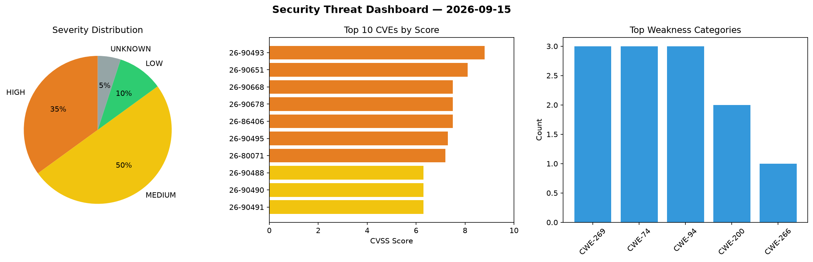
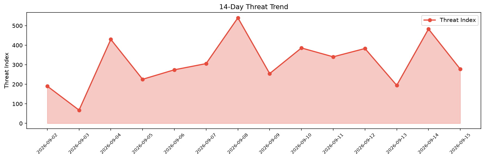

# Security Scan Report — 2026-09-15

**Scan ID:** `3aaf209554` | **CVEs:** 20 | **Threat Index:** 277.7

## Threat Overview

| Metric | Value |
|--------|-------|
| Threat Index | 277.7 |
| Critical CVEs | 0 |
| HIGH | 7 |
| MEDIUM | 10 |
| LOW | 2 |
| UNKNOWN | 1 |

## Delta vs Yesterday

| Metric | Today | Yesterday | Change |
|--------|-------|-----------|--------|
| total_cves | 20 | 20 | ➡️ 0.0% |
| threat_index | 277.7 | 483.1 | 📉 -42.5% |
| critical_count | 0 | 6 | 📉 -100.0% |

## Top Weakness Categories

| CWE | Count |
|-----|-------|
| CWE-269 | 3 |
| CWE-74 | 3 |
| CWE-94 | 3 |
| CWE-200 | 2 |
| CWE-266 | 1 |

## CVE Details

| CVE ID | Score | Severity | Description |
|--------|-------|----------|-------------|
| CVE-2026-90493 | 8.8 | HIGH | A vulnerability was detected in Tonec Internet Download Manager up to 6.42 Build... |
| CVE-2026-90651 | 8.1 | HIGH | Socket Firewall (socketdev/socket-registry-firewall) in registry mode before 2.0... |
| CVE-2026-90668 | 7.5 | HIGH | The webserver in UnrealIRCd 6.0.5 through 6.2.6 before 6.2.7 does not limit the ... |
| CVE-2026-90678 | 7.5 | HIGH | An issue was discovered in HAProxy 3.3.0 through 3.4.4 and in 3.5-dev1 through 3... |
| CVE-2026-86406 | 7.5 | HIGH | The User Registration & Membership  WordPress plugin before 5.2.8 does not check... |
| CVE-2026-90495 | 7.3 | HIGH | A vulnerability has been found in Fengoffice Feng Office up to 3.11.13.11. This ... |
| CVE-2026-80071 | 7.2 | HIGH | The User Registration & Membership  WordPress plugin before 5.2.8 does not prope... |
| CVE-2026-90488 | 6.3 | MEDIUM | A vulnerability was determined in Xuxueli xxl-job up to 3.4.2. This affects the ... |
| CVE-2026-90490 | 6.3 | MEDIUM | A security flaw has been discovered in lenve vhr 1.0-SNAPSHOT. This issue affect... |
| CVE-2026-90491 | 6.3 | MEDIUM | A weakness has been identified in sanjevirau gsubs up to 1.0.3. Impacted is the ... |
| CVE-2026-90492 | 6.3 | MEDIUM | A security vulnerability has been detected in webgjc web_robot 2.4.0/2.5.0/2.8.0... |
| CVE-2026-88764 | 5.4 | MEDIUM | The Simple Membership WordPress plugin before 4.7.8 does not validate that the m... |
| CVE-2026-90494 | 5.3 | MEDIUM | A flaw has been found in restify node-restify up to 12.0.0. This affects the fun... |
| CVE-2026-77773 | 5.3 | MEDIUM | The Contact Form to Chat Apps / Click to Chat to Order  WordPress plugin before ... |
| CVE-2026-80072 | 4.7 | MEDIUM | The User Registration & Membership  WordPress plugin before 5.2.8 does not valid... |