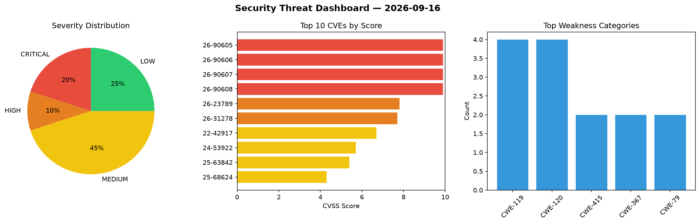
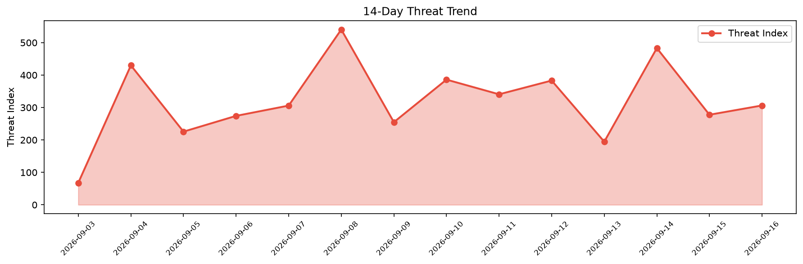

# Security Scan Report — 2026-09-16

**Scan ID:** `38c22c193a` | **CVEs:** 20 | **Threat Index:** 306.3

## Threat Overview

| Metric | Value |
|--------|-------|
| Threat Index | 306.3 |
| Critical CVEs | 4 |
| CRITICAL | 4 |
| HIGH | 2 |
| MEDIUM | 9 |
| LOW | 5 |

## Delta vs Yesterday

| Metric | Today | Yesterday | Change |
|--------|-------|-----------|--------|
| total_cves | 20 | 20 | ➡️ 0.0% |
| threat_index | 306.3 | 277.7 | 📈 10.3% |
| critical_count | 4 | 0 | ➡️ 0% |

## Top Weakness Categories

| CWE | Count |
|-----|-------|
| CWE-119 | 4 |
| CWE-120 | 4 |
| CWE-415 | 2 |
| CWE-367 | 2 |
| CWE-79 | 2 |

## CVE Details

| CVE ID | Score | Severity | Description |
|--------|-------|----------|-------------|
| CVE-2026-90605 | 9.9 | CRITICAL | A weakness has been identified in Totolink A3002MU Hh-B20211125.1046. This vulne... |
| CVE-2026-90606 | 9.9 | CRITICAL | A security vulnerability has been detected in Totolink A3002MU Hh-B20211125.1046... |
| CVE-2026-90607 | 9.9 | CRITICAL | A vulnerability was detected in Totolink A3002MU Hh-B20211125.1046. Impacted is ... |
| CVE-2026-90608 | 9.9 | CRITICAL | A flaw has been found in Totolink A3002MU Hh-B20211125.1046. The affected elemen... |
| CVE-2026-23789 | 7.8 | HIGH | An issue was discovered in MFC in Samsung Mobile Processor and Wearable Processo... |
| CVE-2026-31278 | 7.7 | HIGH | An issue in the /api/v2/setting/adserversetting endpoint of Suprema BioStar 2 be... |
| CVE-2022-42917 | 6.7 | MEDIUM | In FRRouting FRR before 8.5, the service user (usually frr) can escalate its pri... |
| CVE-2024-53922 | 5.7 | MEDIUM | An issue was discovered in the buffer queue driver in Samsung Automotive Process... |
| CVE-2025-63842 | 5.4 | MEDIUM | A Cross-Site Scripting (XSS) vulnerability in the web backend for the Repetico a... |
| CVE-2025-68624 | 4.3 | MEDIUM | N-able Mail Assure through April 2026 contains a design-level authorization flaw... |
| CVE-2026-23787 | 4.2 | MEDIUM | An issue was discovered in DPU in Samsung Mobile Processor Exynos 1280, 2200, 13... |
| CVE-2026-23788 | 4.2 | MEDIUM | An issue was discovered in DPU in Samsung Mobile Processor Exynos 1280, 2200, an... |
| CVE-2026-23790 | 4.2 | MEDIUM | An issue was discovered in DPU in Samsung Mobile Processor Exynos 1280, 2200, 13... |
| CVE-2026-23791 | 4.2 | MEDIUM | An issue was discovered in DPU in Samsung Mobile Processor Exynos 1280, 2200, 13... |
| CVE-2026-23792 | 4.0 | MEDIUM | An issue was discovered in NR RRC in Samsung Mobile Processor and Modem Exynos 1... |