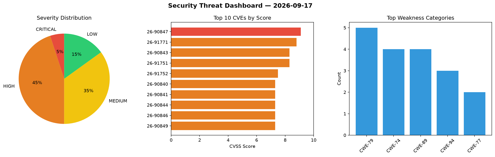
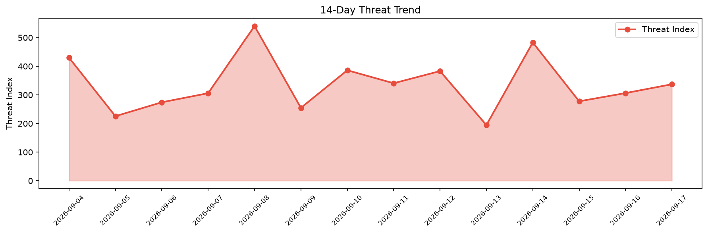

# Security Scan Report — 2026-09-17

**Scan ID:** `f8b555ec91` | **CVEs:** 20 | **Threat Index:** 337.2

## Threat Overview

| Metric | Value |
|--------|-------|
| Threat Index | 337.2 |
| Critical CVEs | 1 |
| CRITICAL | 1 |
| HIGH | 9 |
| MEDIUM | 7 |
| LOW | 3 |

## Delta vs Yesterday

| Metric | Today | Yesterday | Change |
|--------|-------|-----------|--------|
| total_cves | 20 | 20 | ➡️ 0.0% |
| threat_index | 337.2 | 306.3 | 📈 10.1% |
| critical_count | 1 | 4 | 📉 -75.0% |

## Top Weakness Categories

| CWE | Count |
|-----|-------|
| CWE-79 | 5 |
| CWE-74 | 4 |
| CWE-89 | 4 |
| CWE-94 | 3 |
| CWE-77 | 2 |

## CVE Details

| CVE ID | Score | Severity | Description |
|--------|-------|----------|-------------|
| CVE-2026-90847 | 9.1 | CRITICAL | A vulnerability was determined in EFM ipTIME C200E 1.094. The impacted element i... |
| CVE-2026-91771 | 8.8 | HIGH | Weights & Biases wandb before 0.29.0 fails to validate the file name from server... |
| CVE-2026-90843 | 8.3 | HIGH | A security vulnerability has been detected in SabyasachiRana WebMap up to 8b95fe... |
| CVE-2026-91751 | 8.3 | HIGH | Flextype CMS through 1.0.0-alpha.3 fails to properly validate id and new_id para... |
| CVE-2026-91752 | 7.5 | HIGH | GNU libextractor before 1.15 contains a stack-based buffer overflow vulnerabilit... |
| CVE-2026-90840 | 7.3 | HIGH | A vulnerability was identified in PHPGurukul Blood Donor Management System 1.0. ... |
| CVE-2026-90841 | 7.3 | HIGH | A security flaw has been discovered in PHPGurukul Blood Donor Management System ... |
| CVE-2026-90844 | 7.3 | HIGH | A vulnerability was detected in PHPGurukul Daily Expense Tracker System 1.1. Thi... |
| CVE-2026-90846 | 7.3 | HIGH | A vulnerability has been found in PHPGurukul Daily Expense Tracker System 1.1. I... |
| CVE-2026-90849 | 7.3 | HIGH | A security vulnerability has been detected in SourceCodester College Notes Galle... |
| CVE-2026-91750 | 6.5 | MEDIUM | WeKnora before 0.7.0 fails to re-validate HTTP redirect targets in the POST /api... |
| CVE-2026-91770 | 6.5 | MEDIUM | IceHRM before 36.0.0 fails to validate employee ownership on seven REST sub-reso... |
| CVE-2026-85575 | 6.4 | MEDIUM | The ShopEngine Elementor WooCommerce Builder Addon – All in One WooCommerce Solu... |
| CVE-2026-90851 | 6.3 | MEDIUM | A flaw has been found in PHPGurukul Hostel Management System 3.0. This affects a... |
| CVE-2026-91772 | 6.1 | MEDIUM | Halo through 2.26.1 contains an open redirect vulnerability in the anonymous thu... |