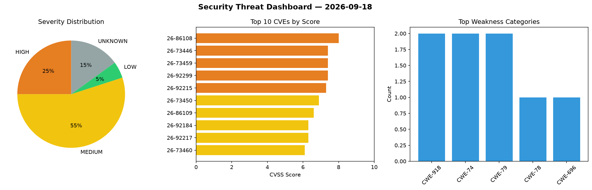
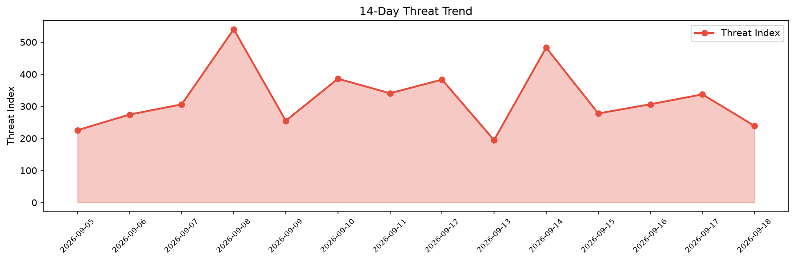

# Security Scan Report — 2026-09-18

**Scan ID:** `07713492ee` | **CVEs:** 20 | **Threat Index:** 239.0

## Threat Overview

| Metric | Value |
|--------|-------|
| Threat Index | 239.0 |
| Critical CVEs | 0 |
| HIGH | 5 |
| MEDIUM | 11 |
| LOW | 1 |
| UNKNOWN | 3 |

## Delta vs Yesterday

| Metric | Today | Yesterday | Change |
|--------|-------|-----------|--------|
| total_cves | 20 | 20 | ➡️ 0.0% |
| threat_index | 239.0 | 337.2 | 📉 -29.1% |
| critical_count | 0 | 1 | 📉 -100.0% |

## Top Weakness Categories

| CWE | Count |
|-----|-------|
| CWE-918 | 2 |
| CWE-74 | 2 |
| CWE-79 | 2 |
| CWE-78 | 1 |
| CWE-696 | 1 |

## CVE Details

| CVE ID | Score | Severity | Description |
|--------|-------|----------|-------------|
| CVE-2026-86108 | 8.0 | HIGH | Insufficient validation of inputs supplied through affected VeloCloud Edge manag... |
| CVE-2026-73446 | 7.4 | HIGH | On affected platforms running Arista EOS with IS-IS configured on a broadcast in... |
| CVE-2026-73459 | 7.4 | HIGH | On affected platforms running Arista EOS with IS-IS configured, an unauthenticat... |
| CVE-2026-92299 | 7.4 | HIGH | @jitsi/electron-sdk before 10.0.5 exposes getDesktopSources() via contextBridge ... |
| CVE-2026-92215 | 7.3 | HIGH | A vulnerability has been found in a2ui-project a2ui up to 0.10.7. Affected by th... |
| CVE-2026-73450 | 6.9 | MEDIUM | On affected platforms running Arista EOS with MLAG Dual Primary Detection config... |
| CVE-2026-86109 | 6.6 | MEDIUM | The VeloCloud Edge software update workflow may accept update bundles without pr... |
| CVE-2026-92184 | 6.3 | MEDIUM | A security flaw has been discovered in ag-ui-protocol ag-ui 0.3.0. Affected is t... |
| CVE-2026-92217 | 6.3 | MEDIUM | A vulnerability was determined in a2ui-project a2ui up to 0.10.6. This affects t... |
| CVE-2026-73460 | 6.1 | MEDIUM | On affected platforms running Arista EOS with IS-IS graceful restart enabled, an... |
| CVE-2026-92213 | 5.5 | MEDIUM | A vulnerability was detected in a2ui-project a2ui up to 0.10.6. This impacts the... |
| CVE-2026-92220 | 5.3 | MEDIUM | A vulnerability was found in vllm-project vLLM 0.26.0/0.27.0. Affected is the fu... |
| CVE-2026-92298 | 4.8 | MEDIUM | EspoCRM through 10.0.8 uses PHP's rand() function to generate tokens for lead-ca... |
| CVE-2026-92221 | 4.7 | MEDIUM | A vulnerability was determined in gedelumbung HospitalManagement up to c2d455437... |
| CVE-2026-92247 | 4.7 | MEDIUM | A security vulnerability has been detected in synaptikcms synaptik-cms up to 1.3... |