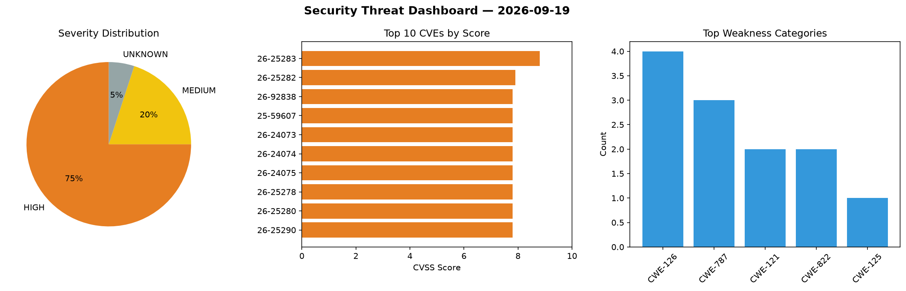
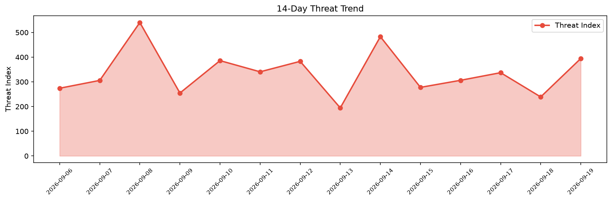

# Security Scan Report — 2026-09-19

**Scan ID:** `bfc998dd61` | **CVEs:** 20 | **Threat Index:** 394.6

## Threat Overview

| Metric | Value |
|--------|-------|
| Threat Index | 394.6 |
| Critical CVEs | 0 |
| HIGH | 15 |
| MEDIUM | 4 |
| UNKNOWN | 1 |

## Delta vs Yesterday

| Metric | Today | Yesterday | Change |
|--------|-------|-----------|--------|
| total_cves | 20 | 20 | ➡️ 0.0% |
| threat_index | 394.6 | 239.0 | 📈 65.1% |
| critical_count | 0 | 0 | ➡️ 0% |

## Top Weakness Categories

| CWE | Count |
|-----|-------|
| CWE-126 | 4 |
| CWE-787 | 3 |
| CWE-121 | 2 |
| CWE-822 | 2 |
| CWE-125 | 1 |

## CVE Details

| CVE ID | Score | Severity | Description |
|--------|-------|----------|-------------|
| CVE-2026-25283 | 8.8 | HIGH | Memory Corruption when copying unverified data from an external source exceeds t... |
| CVE-2026-25282 | 7.9 | HIGH | Transient DOS when processing unverified data from a neighboring system causes o... |
| CVE-2026-92838 | 7.8 | HIGH | A DLL hijacking
vulnerability exists in the GeoVision GV-Remote E-Map desktop
ap... |
| CVE-2025-59607 | 7.8 | HIGH | Memory Corruption when copying large input data exceeds normal allocation limits... |
| CVE-2026-24073 | 7.8 | HIGH | Memory corruption when processing decode statistics due to insufficient validati... |
| CVE-2026-24074 | 7.8 | HIGH | Memory Corruption when processing data with large offset and length values excee... |
| CVE-2026-24075 | 7.8 | HIGH | Memory Corruption when multiple threads issue concurrent IOCTL requests to the d... |
| CVE-2026-25278 | 7.8 | HIGH | Memory Corruption when processing I2C transfer requests due to a race condition ... |
| CVE-2026-25280 | 7.8 | HIGH | Memory corruption when processing escape handling flow with insufficient user bu... |
| CVE-2026-25290 | 7.8 | HIGH | Memory Corruption when validating large data buffers from external sources using... |
| CVE-2026-81546 | 7.7 | HIGH | The Affinity by Canva application before 3.3.0 (September 2026 release) did not ... |
| CVE-2026-25275 | 7.5 | HIGH | Transient DOS when processing authentication frames with invalid FILS informatio... |
| CVE-2026-24081 | 7.4 | HIGH | Transient DOS when processing a channel map with insufficient used channels and ... |
| CVE-2026-25281 | 7.4 | HIGH | Transient DOS when processing large or numerous request buffers without sufficie... |
| CVE-2026-25284 | 7.3 | HIGH | Information Disclosure when a pointer is reused after being deallocated.... |