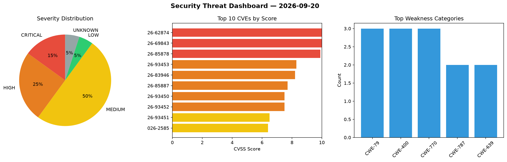
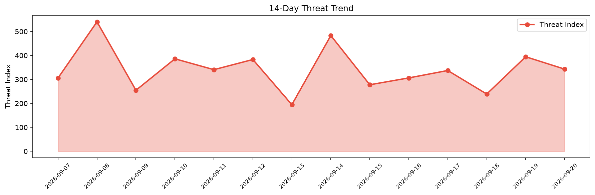

# Security Scan Report — 2026-09-20

**Scan ID:** `220d88958b` | **CVEs:** 20 | **Threat Index:** 342.9

## Threat Overview

| Metric | Value |
|--------|-------|
| Threat Index | 342.9 |
| Critical CVEs | 3 |
| CRITICAL | 3 |
| HIGH | 5 |
| MEDIUM | 10 |
| LOW | 1 |
| UNKNOWN | 1 |

## Delta vs Yesterday

| Metric | Today | Yesterday | Change |
|--------|-------|-----------|--------|
| total_cves | 20 | 20 | ➡️ 0.0% |
| threat_index | 342.9 | 394.6 | 📉 -13.1% |
| critical_count | 3 | 0 | ➡️ 0% |

## Top Weakness Categories

| CWE | Count |
|-----|-------|
| CWE-79 | 3 |
| CWE-400 | 3 |
| CWE-770 | 3 |
| CWE-787 | 2 |
| CWE-639 | 2 |

## CVE Details

| CVE ID | Score | Severity | Description |
|--------|-------|----------|-------------|
| CVE-2026-62874 | 10.0 | CRITICAL | Insufficient verification of data authenticity in Azure Billing allows an unauth... |
| CVE-2026-69843 | 10.0 | CRITICAL | Authentication bypass by spoofing in Microsoft Fabric allows an unauthorized att... |
| CVE-2026-85878 | 9.9 | CRITICAL | Improper authorization in Azure Database for PostgreSQL allows an authorized att... |
| CVE-2026-93453 | 8.3 | HIGH | SOGo before 5.12.11 constructs password-reset links using the client-supplied Or... |
| CVE-2026-83946 | 8.2 | HIGH | Improper neutralization of input during web page generation ('cross-site scripti... |
| CVE-2026-85887 | 7.7 | HIGH | Incorrect permission assignment for critical resource in M365 Copilot allows an ... |
| CVE-2026-93450 | 7.5 | HIGH | go-openapi/swag jsonutils before 0.27.1 contains a stack overflow vulnerability ... |
| CVE-2026-93452 | 7.5 | HIGH | snappy-java through 1.1.10.8 contains a buffer overflow vulnerability in Snappy.... |
| CVE-2026-93451 | 6.5 | MEDIUM | snappy-java through 1.1.10.8 contains a buffer overflow vulnerability in typed S... |
| CVE-2026-2585 | 6.4 | MEDIUM | The Brizy – Page Builder plugin for WordPress is vulnerable to Stored Cross-Site... |
| CVE-2026-77164 | 6.2 | MEDIUM | Circles' remote-instance signature verification fetches the attacker-supplied ke... |
| CVE-2026-93454 | 5.4 | MEDIUM | Aureus ERP through 1.6.0 stores the Payment Term note field unsanitized and rend... |
| CVE-2026-93310 | 5.3 | MEDIUM | A vulnerability was identified in O-RAN-SC SMO OAM 2025-06-10. This affects an u... |
| CVE-2026-18441 | 4.3 | MEDIUM | The Appointment Booking Plugin – LatePoint / Calendar & Scheduling for WordPress... |
| CVE-2026-93308 | 4.3 | MEDIUM | A vulnerability was found in O-RAN-SC SMO OAM 2025-06-10. Affected by this vulne... |