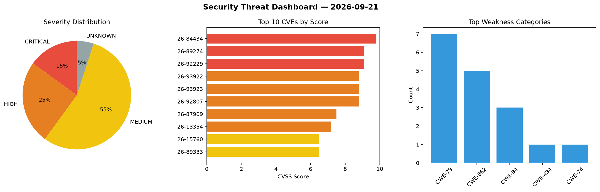
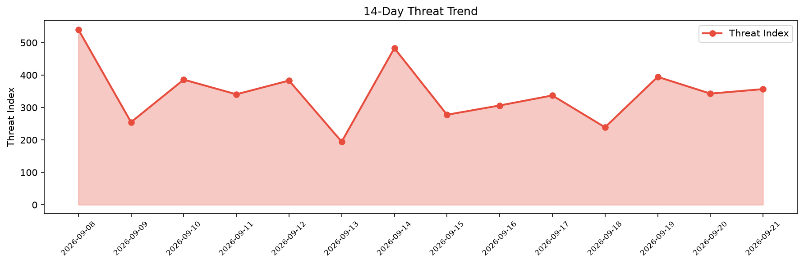

# Security Scan Report — 2026-09-21

**Scan ID:** `37a0872e57` | **CVEs:** 20 | **Threat Index:** 356.7

## Threat Overview

| Metric | Value |
|--------|-------|
| Threat Index | 356.7 |
| Critical CVEs | 3 |
| CRITICAL | 3 |
| HIGH | 5 |
| MEDIUM | 11 |
| UNKNOWN | 1 |

## Delta vs Yesterday

| Metric | Today | Yesterday | Change |
|--------|-------|-----------|--------|
| total_cves | 20 | 20 | ➡️ 0.0% |
| threat_index | 356.7 | 342.9 | 📈 4.0% |
| critical_count | 3 | 3 | ➡️ 0.0% |

## Top Weakness Categories

| CWE | Count |
|-----|-------|
| CWE-79 | 7 |
| CWE-862 | 5 |
| CWE-94 | 3 |
| CWE-434 | 1 |
| CWE-74 | 1 |

## CVE Details

| CVE ID | Score | Severity | Description |
|--------|-------|----------|-------------|
| CVE-2026-84434 | 9.8 | CRITICAL | The Gravity Forms plugin for WordPress is vulnerable to Arbitrary File Upload in... |
| CVE-2026-89274 | 9.1 | CRITICAL | The WP Recipe Maker plugin for WordPress is vulnerable to Arbitrary Shortcode Ex... |
| CVE-2026-92229 | 9.1 | CRITICAL | The The Forminator Forms – Contact Form, Payment Form & Custom Form Builder plug... |
| CVE-2026-93922 | 8.8 | HIGH | SiYuan through 3.8.4 renders notebook names as raw HTML in the Daily Note picker... |
| CVE-2026-93923 | 8.8 | HIGH | SiYuan through 3.8.4 fails to escape heading style attributes when rendering out... |
| CVE-2026-92807 | 8.8 | HIGH | The Save as PDF Plugin by PDFCrowd plugin for WordPress is vulnerable to Arbitra... |
| CVE-2026-87909 | 7.5 | HIGH | The WP Photo Album Plus plugin for WordPress is vulnerable to Remote Code Execut... |
| CVE-2026-13354 | 7.2 | HIGH | The Asset CleanUp: Page Speed Booster plugin for WordPress is vulnerable to Stor... |
| CVE-2026-15760 | 6.5 | MEDIUM | The Divi Essential plugin for WordPress is vulnerable to sensitive information e... |
| CVE-2026-89333 | 6.5 | MEDIUM | The Tutor LMS – eLearning and online course solution plugin for WordPress is vul... |
| CVE-2026-89334 | 6.5 | MEDIUM | The Better Messages – Chat Rooms, Group Chat, Private Messages & AI Chat Bots pl... |
| CVE-2026-77820 | 6.4 | MEDIUM | The WPComplete plugin for WordPress is vulnerable to Stored Cross-Site Scripting... |
| CVE-2026-89081 | 6.1 | MEDIUM | The Tutor LMS – eLearning and online course solution plugin for WordPress is vul... |
| CVE-2026-92967 | 6.1 | MEDIUM | The Pochipp plugin for WordPress is vulnerable to Reflected Cross-Site Scripting... |
| CVE-2026-89093 | 5.3 | MEDIUM | The Better Messages – Chat Rooms, Group Chat, Private Messages & AI Chat Bots pl... |