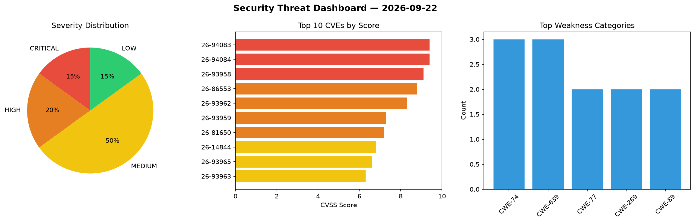
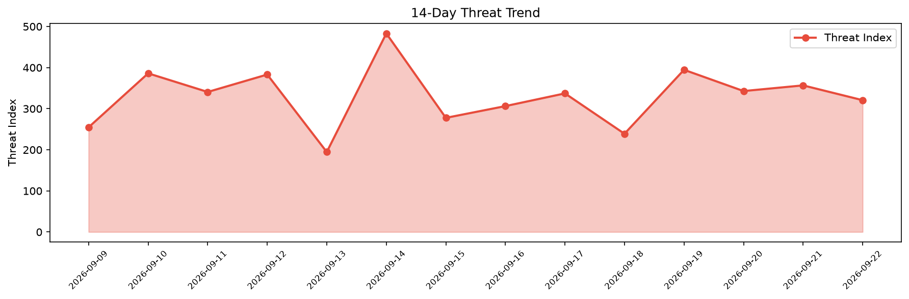

# Security Scan Report — 2026-09-22

**Scan ID:** `9e7690ca91` | **CVEs:** 20 | **Threat Index:** 320.7

## Threat Overview

| Metric | Value |
|--------|-------|
| Threat Index | 320.7 |
| Critical CVEs | 3 |
| CRITICAL | 3 |
| HIGH | 4 |
| MEDIUM | 10 |
| LOW | 3 |

## Delta vs Yesterday

| Metric | Today | Yesterday | Change |
|--------|-------|-----------|--------|
| total_cves | 20 | 20 | ➡️ 0.0% |
| threat_index | 320.7 | 356.7 | 📉 -10.1% |
| critical_count | 3 | 3 | ➡️ 0.0% |

## Top Weakness Categories

| CWE | Count |
|-----|-------|
| CWE-74 | 3 |
| CWE-639 | 3 |
| CWE-77 | 2 |
| CWE-269 | 2 |
| CWE-89 | 2 |

## CVE Details

| CVE ID | Score | Severity | Description |
|--------|-------|----------|-------------|
| CVE-2026-94083 | 9.4 | CRITICAL | Suricata before 8.0.7 has a DoH2 type confusion that can cause an invalid free, ... |
| CVE-2026-94084 | 9.4 | CRITICAL | Suricata before 8.0.7 has an Http2ThreadMultiBuf use-after-free when a transacti... |
| CVE-2026-93958 | 9.1 | CRITICAL | A vulnerability was found in D-Link R95 BE9500_1.00.16. This vulnerability affec... |
| CVE-2026-86553 | 8.8 | HIGH | SmartLife app dynamically generates fresh SmartLife application authentication p... |
| CVE-2026-93962 | 8.3 | HIGH | A weakness has been identified in Kamailio up to 5.8.8/6.0.7/6.1.4/6.2.0-dev1. T... |
| CVE-2026-93959 | 7.3 | HIGH | A vulnerability was determined in SourceCodester Online Reviewer Management Syst... |
| CVE-2026-81650 | 7.2 | HIGH | The Photo Gallery, Sliders, Proofing and   WordPress plugin before 4.5.0 does no... |
| CVE-2026-14844 | 6.8 | MEDIUM | The Master Slider  WordPress plugin through 3.11.2 does not sanitise and escape ... |
| CVE-2026-93965 | 6.6 | MEDIUM | A flaw has been found in aiyiyi121 SxDevOps 1.0/1.1. Affected is the function su... |
| CVE-2026-93963 | 6.3 | MEDIUM | A security vulnerability has been detected in itsourcecode Leave Management Syst... |
| CVE-2026-86552 | 5.4 | MEDIUM | SmartLife app dynamically generates brand‑new SmartLife application authenticati... |
| CVE-2026-93961 | 5.3 | MEDIUM | A security flaw has been discovered in Dromara UJCMS up to 12.3.1. The affected ... |
| CVE-2026-93964 | 5.3 | MEDIUM | A vulnerability was detected in NginxProxyManager nginx-proxy-manager up to 2.15... |
| CVE-2026-93957 | 4.3 | MEDIUM | A vulnerability has been found in olivier-ls PHP-FTS up to 1.1.3. This affects t... |
| CVE-2026-93960 | 4.3 | MEDIUM | A vulnerability was identified in Pixelfed up to 0.12.11. Impacted is the functi... |