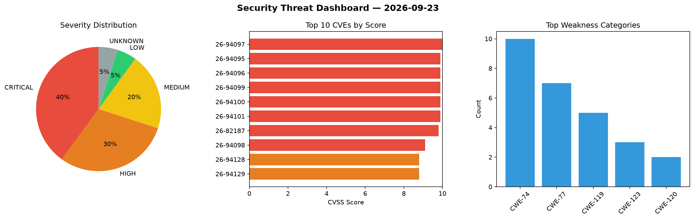
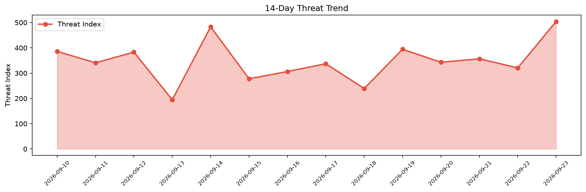

# Security Scan Report — 2026-09-23

**Scan ID:** `a7246bce35` | **CVEs:** 20 | **Threat Index:** 504.3

## Threat Overview

| Metric | Value |
|--------|-------|
| Threat Index | 504.3 |
| Critical CVEs | 8 |
| CRITICAL | 8 |
| HIGH | 6 |
| MEDIUM | 4 |
| LOW | 1 |
| UNKNOWN | 1 |

## Delta vs Yesterday

| Metric | Today | Yesterday | Change |
|--------|-------|-----------|--------|
| total_cves | 20 | 20 | ➡️ 0.0% |
| threat_index | 504.3 | 320.7 | 📈 57.2% |
| critical_count | 8 | 3 | 📈 166.7% |

## Top Weakness Categories

| CWE | Count |
|-----|-------|
| CWE-74 | 10 |
| CWE-77 | 7 |
| CWE-119 | 5 |
| CWE-123 | 3 |
| CWE-120 | 2 |

## CVE Details

| CVE ID | Score | Severity | Description |
|--------|-------|----------|-------------|
| CVE-2026-94097 | 10.0 | CRITICAL | A vulnerability was determined in Netcore NBR200V2 1.3.241127.071246. This affec... |
| CVE-2026-94095 | 9.9 | CRITICAL | A vulnerability has been found in Netcore NBR200V2 1.3.241127.071246. Affected b... |
| CVE-2026-94096 | 9.9 | CRITICAL | A vulnerability was found in Netcore NBR200V2 1.3.241127.071246. Affected by thi... |
| CVE-2026-94099 | 9.9 | CRITICAL | A security flaw has been discovered in Netcore NBR200V2 1.3.241127.071246. This ... |
| CVE-2026-94100 | 9.9 | CRITICAL | A weakness has been identified in Netcore NBR200V2 1.3.241127.071246. Impacted i... |
| CVE-2026-94101 | 9.9 | CRITICAL | A security vulnerability has been detected in Netcore NBR200V2 1.3.241127.071246... |
| CVE-2026-82187 | 9.8 | CRITICAL | The Web to Print Online Designer WordPress plugin before 2.15.0 does not validat... |
| CVE-2026-94098 | 9.1 | CRITICAL | A vulnerability was identified in Netcore NBR200V2 1.3.241127.071246. This vulne... |
| CVE-2026-94128 | 8.8 | HIGH | A security vulnerability has been detected in BioStar VIVID LED DJ 4.0.2411.1500... |
| CVE-2026-94129 | 8.8 | HIGH | A vulnerability was detected in BioStar VALKYRIE AURORA 2.10.2411.0800. This vul... |
| CVE-2026-94142 | 8.8 | HIGH | A security vulnerability has been detected in BioStar Temperature Monitor Utilit... |
| CVE-2026-94139 | 7.4 | HIGH | A weakness has been identified in Chengdu Feiyuxing Technology Feiyu Star Router... |
| CVE-2026-94110 | 7.3 | HIGH | A security vulnerability has been detected in QCMS up to 6.0.6. This issue affec... |
| CVE-2026-94143 | 7.3 | HIGH | A vulnerability was detected in drogonframework drogon up to 1.9.13. Affected by... |
| CVE-2026-94138 | 6.6 | MEDIUM | A security flaw has been discovered in Chengdu Feiyuxing Technology Feiyu Star R... |