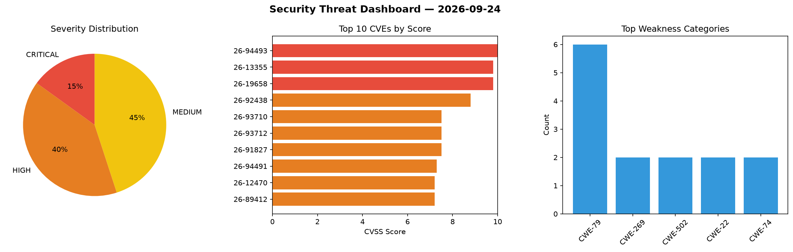
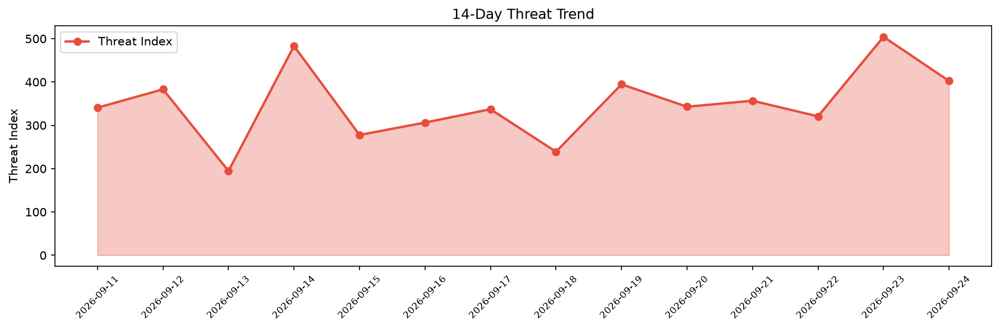

# Security Scan Report — 2026-09-24

**Scan ID:** `47555152ba` | **CVEs:** 20 | **Threat Index:** 402.4

## Threat Overview

| Metric | Value |
|--------|-------|
| Threat Index | 402.4 |
| Critical CVEs | 3 |
| CRITICAL | 3 |
| HIGH | 8 |
| MEDIUM | 9 |

## Delta vs Yesterday

| Metric | Today | Yesterday | Change |
|--------|-------|-----------|--------|
| total_cves | 20 | 20 | ➡️ 0.0% |
| threat_index | 402.4 | 504.3 | 📉 -20.2% |
| critical_count | 3 | 8 | 📉 -62.5% |

## Top Weakness Categories

| CWE | Count |
|-----|-------|
| CWE-79 | 6 |
| CWE-269 | 2 |
| CWE-502 | 2 |
| CWE-22 | 2 |
| CWE-74 | 2 |

## CVE Details

| CVE ID | Score | Severity | Description |
|--------|-------|----------|-------------|
| CVE-2026-94493 | 10.0 | CRITICAL | A vulnerability was detected in Gigatech PDV5701 1.0.31_240305_112640. This issu... |
| CVE-2026-13355 | 9.8 | CRITICAL | The Meta Box AIO plugin for WordPress is vulnerable to Privilege Escalation to A... |
| CVE-2026-19658 | 9.8 | CRITICAL | The Give Tributes plugin for WordPress is vulnerable to PHP Object Injection in ... |
| CVE-2026-92438 | 8.8 | HIGH | The Ninja Forms WordPress plugin 3.15.3 does not escape submitted form field val... |
| CVE-2026-93710 | 7.5 | HIGH | Dancer2 versions from 2.0.0 before 2.2.0 for Perl dispatch a route that a dying ... |
| CVE-2026-93712 | 7.5 | HIGH | Dancer2 versions from 2.1.0 before 2.2.0 for Perl serve files from outside publi... |
| CVE-2026-91827 | 7.5 | HIGH | The Ninja Forms WordPress plugin 3.15.3 does not prevent user-submitted form fie... |
| CVE-2026-94491 | 7.3 | HIGH | A weakness has been identified in Yonyou KSOA 9.0. This affects an unknown part ... |
| CVE-2026-12470 | 7.2 | HIGH | The CMP – Coming Soon & Maintenance Plugin by NiteoThemes plugin for WordPress i... |
| CVE-2026-89412 | 7.2 | HIGH | The TranslatePress – Translate Multilingual sites with AI Translation plugin for... |
| CVE-2026-94504 | 7.2 | HIGH | Ninja Forms 3.15.3 stores an anonymous non-RTE textarea value and renders it wit... |
| CVE-2026-88788 | 6.8 | MEDIUM | The Text Styler WordPress plugin through 1.1.1 does not sanitise and escape user... |
| CVE-2026-93711 | 6.5 | MEDIUM | Dancer2 versions before 2.2.0 for Perl do not strip CR and LF from response head... |
| CVE-2026-85653 | 6.4 | MEDIUM | The Contextual Related Posts plugin for WordPress is vulnerable to Stored Cross-... |
| CVE-2026-94492 | 6.3 | MEDIUM | A security vulnerability has been detected in Yonyou U8cloud 5.x. This vulnerabi... |