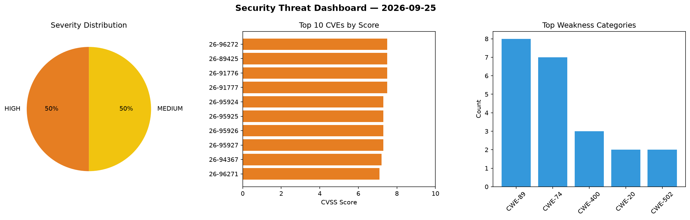
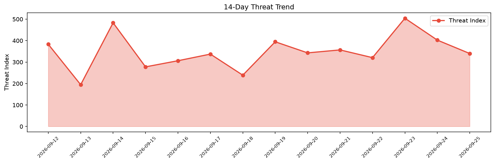

# Security Scan Report — 2026-09-25

**Scan ID:** `f2231dc31d` | **CVEs:** 20 | **Threat Index:** 339.9

## Threat Overview

| Metric | Value |
|--------|-------|
| Threat Index | 339.9 |
| Critical CVEs | 0 |
| HIGH | 10 |
| MEDIUM | 10 |

## Delta vs Yesterday

| Metric | Today | Yesterday | Change |
|--------|-------|-----------|--------|
| total_cves | 20 | 20 | ➡️ 0.0% |
| threat_index | 339.9 | 402.4 | 📉 -15.5% |
| critical_count | 0 | 3 | 📉 -100.0% |

## Top Weakness Categories

| CWE | Count |
|-----|-------|
| CWE-89 | 8 |
| CWE-74 | 7 |
| CWE-400 | 3 |
| CWE-20 | 2 |
| CWE-502 | 2 |

## CVE Details

| CVE ID | Score | Severity | Description |
|--------|-------|----------|-------------|
| CVE-2026-96272 | 7.5 | HIGH | ClipBucket v5 before 5.5.3-#182 contains a blind SQL injection vulnerability in ... |
| CVE-2026-89425 | 7.5 | HIGH | UTF8DataInputJsonParser._reportInvalidToken() in FasterXML jackson-core builds t... |
| CVE-2026-91776 | 7.5 | HIGH | TypeDeserializerBase._findDeserializer() in FasterXML jackson-databind caches th... |
| CVE-2026-91777 | 7.5 | HIGH | Forward-reference completion for @JsonIdentityInfo object IDs in FasterXML jacks... |
| CVE-2026-95924 | 7.3 | HIGH | A vulnerability has been found in SourceCodester Online Reviewer Management Syst... |
| CVE-2026-95925 | 7.3 | HIGH | A vulnerability was found in SourceCodester Online Reviewer Management System 1.... |
| CVE-2026-95926 | 7.3 | HIGH | A vulnerability was determined in SourceCodester Online Reviewer Management Syst... |
| CVE-2026-95927 | 7.3 | HIGH | A vulnerability was identified in SourceCodester Online Reviewer Management Syst... |
| CVE-2026-94367 | 7.2 | HIGH | OpenEye Apex Network Video Recorder (NVR) firmware 3.2.9.376 contains an OS comm... |
| CVE-2026-96271 | 7.1 | HIGH | Photoview through 2.4.0 contains an authorization bypass vulnerability in the sh... |
| CVE-2026-92928 | 6.5 | MEDIUM | OpenEye Apex Network Video Recorder (NVR) firmware 3.2.9.376 contains a hardcode... |
| CVE-2026-95829 | 6.3 | MEDIUM | A vulnerability was identified in TDuckCloud tduck-platform up to 5.3. This vuln... |
| CVE-2026-95830 | 6.3 | MEDIUM | A security flaw has been discovered in theRealSain Pixtream up to 866afd4f0cea81... |
| CVE-2026-95833 | 6.3 | MEDIUM | A weakness has been identified in itsourcecode Leave Management System 1.0. Impa... |
| CVE-2026-95868 | 6.3 | MEDIUM | A weakness has been identified in AdithyaYelloju Restaurant-Management-System up... |