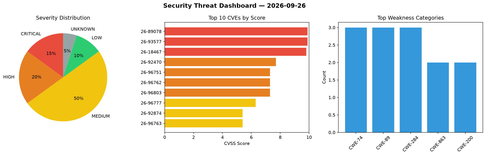
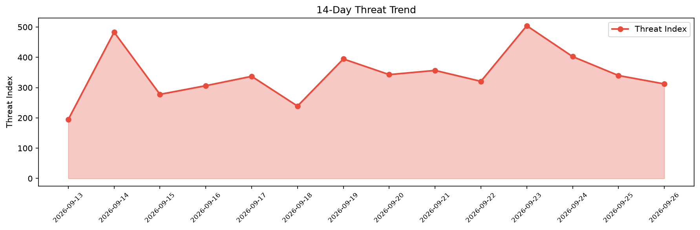

# Security Scan Report — 2026-09-26

**Scan ID:** `16aa2e5e2d` | **CVEs:** 20 | **Threat Index:** 312.2

## Threat Overview

| Metric | Value |
|--------|-------|
| Threat Index | 312.2 |
| Critical CVEs | 3 |
| CRITICAL | 3 |
| HIGH | 4 |
| MEDIUM | 10 |
| LOW | 2 |
| UNKNOWN | 1 |

## Delta vs Yesterday

| Metric | Today | Yesterday | Change |
|--------|-------|-----------|--------|
| total_cves | 20 | 20 | ➡️ 0.0% |
| threat_index | 312.2 | 339.9 | 📉 -8.1% |
| critical_count | 3 | 0 | ➡️ 0% |

## Top Weakness Categories

| CWE | Count |
|-----|-------|
| CWE-74 | 3 |
| CWE-89 | 3 |
| CWE-284 | 3 |
| CWE-863 | 2 |
| CWE-200 | 2 |

## CVE Details

| CVE ID | Score | Severity | Description |
|--------|-------|----------|-------------|
| CVE-2026-89078 | 9.9 | CRITICAL | GitLab has remediated an issue in GitLab CE/EE affecting all versions from 19.2 ... |
| CVE-2026-93577 | 9.9 | CRITICAL | GitLab has remediated an issue in GitLab CE/EE affecting all versions from 19.2 ... |
| CVE-2026-18467 | 9.8 | CRITICAL | The Paytium: Mollie payment forms & donations plugin for WordPress is vulnerable... |
| CVE-2026-92470 | 7.7 | HIGH | GitLab has remediated an issue in GitLab EE affecting all versions from 18.7 bef... |
| CVE-2026-96751 | 7.3 | HIGH | A vulnerability has been found in pmTicket Project-Management-Software up to 078... |
| CVE-2026-96762 | 7.3 | HIGH | A vulnerability was determined in kvcache-ai mooncake up to 0.3.12/0.3.13.post1.... |
| CVE-2026-96803 | 7.3 | HIGH | A vulnerability was identified in java110 MicroCommunity up to 2.0. Affected is ... |
| CVE-2026-96777 | 6.3 | MEDIUM | A vulnerability was determined in Forma LMS up to 4.1.43. This impacts the funct... |
| CVE-2026-92874 | 5.4 | MEDIUM | GitLab has remediated an issue in GitLab CE/EE affecting all versions from 18.3 ... |
| CVE-2026-96763 | 5.4 | MEDIUM | A security flaw has been discovered in kvcache-ai mooncake up to 0.3.12/0.3.13.p... |
| CVE-2026-96772 | 5.3 | MEDIUM | A security flaw has been discovered in Intelliants Subrion CMS up to 4.2.1. This... |
| CVE-2026-96774 | 5.3 | MEDIUM | A vulnerability was found in SPON Communications IP Network Audio Device XC-9603... |
| CVE-2026-92529 | 4.3 | MEDIUM | GitLab has remediated an issue in GitLab EE affecting all versions from 19.1 bef... |
| CVE-2026-92530 | 4.3 | MEDIUM | GitLab has remediated an issue in GitLab CE/EE affecting all versions from 19.1 ... |
| CVE-2026-96739 | 4.3 | MEDIUM | A flaw has been found in SEMCMS up to 4.2. Affected by this issue is some unknow... |