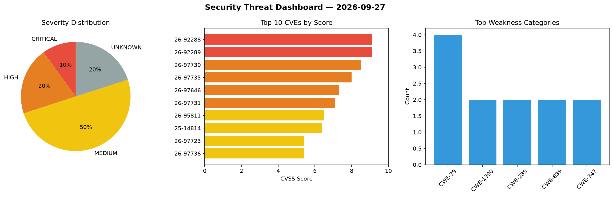
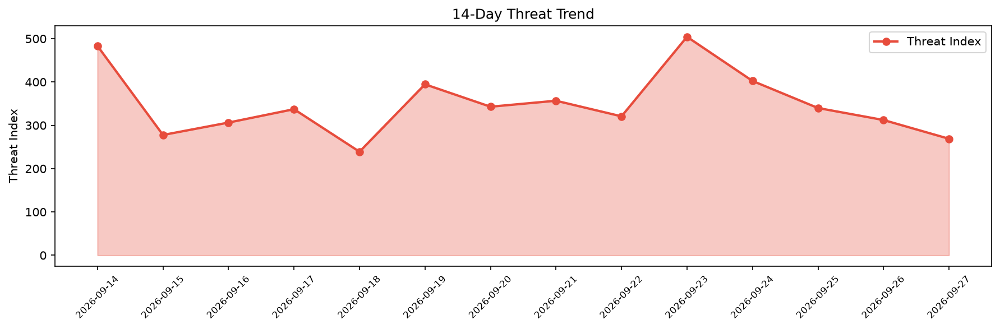

# Security Scan Report — 2026-09-27

**Scan ID:** `9b08d0bdfa` | **CVEs:** 20 | **Threat Index:** 268.9

## Threat Overview

| Metric | Value |
|--------|-------|
| Threat Index | 268.9 |
| Critical CVEs | 2 |
| CRITICAL | 2 |
| HIGH | 4 |
| MEDIUM | 10 |
| UNKNOWN | 4 |

## Delta vs Yesterday

| Metric | Today | Yesterday | Change |
|--------|-------|-----------|--------|
| total_cves | 20 | 20 | ➡️ 0.0% |
| threat_index | 268.9 | 312.2 | 📉 -13.9% |
| critical_count | 2 | 3 | 📉 -33.3% |

## Top Weakness Categories

| CWE | Count |
|-----|-------|
| CWE-79 | 4 |
| CWE-1390 | 2 |
| CWE-285 | 2 |
| CWE-639 | 2 |
| CWE-347 | 2 |

## CVE Details

| CVE ID | Score | Severity | Description |
|--------|-------|----------|-------------|
| CVE-2026-92288 | 9.1 | CRITICAL | Lemonldap::NG::Portal versions from 2.20.0 before 2.21.6, from 2.22.0 before 2.2... |
| CVE-2026-92289 | 9.1 | CRITICAL | Lemonldap::NG::Portal versions from 2.23.0 before 2.23.4 for Perl allow a PKCE b... |
| CVE-2026-97730 | 8.5 | HIGH | In Netgate pfSense Plus before 26.07 and pfSense CE before 2.9.0, a Local File I... |
| CVE-2026-97735 | 8.0 | HIGH | ITFlow before 26.08 allows SVG attachments in the ticket email parser (cron/tick... |
| CVE-2026-97646 | 7.3 | HIGH | A weakness has been identified in ningzichun student-management-system up to 987... |
| CVE-2026-97731 | 7.1 | HIGH | MinIO through 7aac2a2 does not verify that every x-amz-* header present on a req... |
| CVE-2026-95811 | 6.5 | MEDIUM | Lemonldap::NG::Handler versions from 2.0.0 before 2.16.10, from 2.17.0 before 2.... |
| CVE-2025-14814 | 6.4 | MEDIUM | The CSS & JavaScript Toolbox plugin for WordPress is vulnerable to Stored Cross-... |
| CVE-2026-97723 | 5.4 | MEDIUM | madpsy ka9q_ubersdr before 0.1.58 has a stored cross-site scripting (XSS) vulner... |
| CVE-2026-97736 | 5.4 | MEDIUM | tinyauth before 5.1.3 allows rule bypass by appending an allowed route string. T... |
| CVE-2026-97647 | 5.3 | MEDIUM | A security vulnerability has been detected in ningzichun student-management-syst... |
| CVE-2026-97732 | 5.1 | MEDIUM | IRONMACE Ironshield 1.0.0.167 has a tvk.sys kernel-mode driver that authenticate... |
| CVE-2026-97649 | 4.7 | MEDIUM | A flaw has been found in ningzichun student-management-system up to 98760f5711cf... |
| CVE-2026-97648 | 4.3 | MEDIUM | A vulnerability was detected in ningzichun student-management-system up to 98760... |
| CVE-2026-97650 | 4.3 | MEDIUM | A vulnerability has been found in ningzichun student-management-system up to 987... |